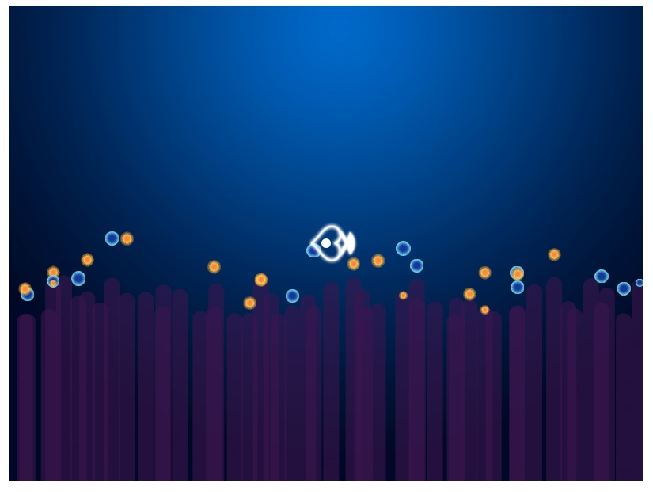

创建 fish-mother.ts 文件

这里我们先把鱼妈妈定位到画布的中心点，然后载入一下图片，使用`translate`定义一个相对定位的中心点，就像` relateive` 和` absolute` 一样。

```
import { ctx_one, cvs_height, cvs_width } from "./init";

// 鱼妈妈

class FishMonther{
  x: number = cvs_width / 2; // 坐标轴 x
  y: number = cvs_height / 2 ; // 坐标轴 y
  bigEye = new Image(); // 眼睛
  bigBody = new Image(); // 身体
  BigTail = new Image(); // 尾巴

  constructor(){
    this.bigEye.src = 'assets/img/bigEye0.png';
    this.bigBody.src = 'assets/img/bigSwim0.png';
    this.BigTail.src ='assets/img/bigTail0.png';
  }

  draw(){

    ctx_one.save();
    ctx_one.translate(this.x, this.y); // 定义相对定位的坐标中心点

    ctx_one.drawImage(this.bigEye, -this.bigEye.width / 2, -this.bigEye.height / 2); // 居中，所以向左移动宽度的一半，向上移动宽度的一半
    ctx_one.drawImage(this.bigBody, -this.bigBody.width / 2, -this.bigBody.height / 2);
    ctx_one.drawImage(this.BigTail, -this.BigTail.width / 2 + 30, -this.BigTail.height / 2); // 这里的尾巴，往右移动30像素，让它在身体的后面。

    ctx_one.restore();

  }
}

export default FishMonther;
```

在 init.ts 初始化一下。


```
import FishMother from "./fish-mother";

let anemones: Anemones , fruits: Fruits, fish_mother: FishMother;

fish_mother = new FishMother()

export { fish_mother }
```

在 game-loop.ts 里面调用绘制方法

使用`ctx_one.clearRect`方法避免重叠。

```
import { bgPic, cvs_width , cvs_height, ctx_two, ctx_one, anemones, fruits, fish_mother } from "./init";

// 清除画布上的东西，再进行绘制，要不然的话会多次绘制而进行重叠。
ctx_one.clearRect(0, 0, cvs_width, cvs_width);

// 绘制鱼妈妈
fish_mother.draw()
```



