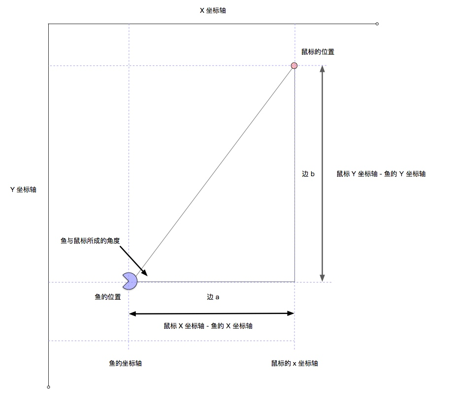

我们来看看原理图，注意一下，鱼头是向左的。

`鼠标x - 鱼儿 x` 等于 `边 a` 的长度，同样 `鼠标y - 鱼儿 y` 等于 `边 b` 的长度。




根据 `边 b` 与 `边 a` 我们可以通过 `Math.atan2` 算出鱼与鼠标所成的角度。

知道角度之后，我们旋转这个角度就是了，但是我们会发现，是鱼尾巴在跟着鼠标跑，这就很尴尬了。

这个时候我们应该旋转一个 180 度，而对应的数值就是 `Math.PI`。

* 同样我们要添加一个对于角度的缓冲的函数

在我们的 utils.ts 文件里面添加

```
function lerpAngle(aim: number, cur: number, ratio: number): number {
  var delta = cur - aim;
  // 当角度差超过一个 180 度的时候，也就是 PI，无论是正时针，还是逆时针。
  // 因为旋转超过 180 度，我们可以反方向旋转，这样旋转的角度会小一点。
  // 例如：当我们需要顺时针旋转 270 度的时候，我们可以反向旋转 90 度来解决问题。也就是 [ -90 = 270 - 360 ].
  if (delta > Math.PI) delta = delta - 2 * Math.PI;
  if (delta < -Math.PI) delta = delta + 2 * Math.PI;
  return aim + delta * ratio;
}

export default {
  lerpDistance,
  lerpAngle
}
```

原理跟前面的一样，只不过多了2行对于角度旋转优化的代码。

当你完成之后，你可以注释这俩行看一看，当你鼠标在快速画圈圈的时候，鱼儿旋转方向会异常。

* 添加角度属性与设置旋转


```
// 鱼妈妈
class FishMonther{
  x: number = cvs_width / 2; // 坐标轴 x
  y: number = cvs_height / 2 ; // 坐标轴 y
  bigEye = new Image(); // 眼睛
  bigBody = new Image(); // 身体
  BigTail = new Image(); // 尾巴
  angle: number = 0; // 鱼的角度
  constructor(){
    this.bigEye.src = 'assets/img/bigEye0.png';
    this.bigBody.src = 'assets/img/bigSwim0.png';
    this.BigTail.src ='assets/img/bigTail0.png';
  }

  draw(){

    this.x = utils.lerpDistance(mouse_x, this.x , .9)
    this.y = utils.lerpDistance(mouse_y, this.y , .9)


    let instance_X = mouse_x - this.x; // 边 a
    let instance_Y = mouse_y - this.y; // 边 b

    let ag = Math.atan2(instance_Y, instance_X) + Math.PI // [-PI, PI]

    this.angle = utils.lerpAngle(ag, this.angle, .9)

    ctx_one.save();
    ctx_one.translate(this.x, this.y); // 定义相对定位的坐标中心点
    ctx_one.rotate(this.angle);
    ctx_one.scale(.7, .7);
    ctx_one.drawImage(this.bigEye, -this.bigEye.width / 2, -this.bigEye.height / 2); // 居中，所以向左移动宽度的一半，向上移动宽度的一半
    ctx_one.drawImage(this.bigBody, -this.bigBody.width / 2, -this.bigBody.height / 2);
    ctx_one.drawImage(this.BigTail, -this.BigTail.width / 2 + 30, -this.BigTail.height / 2); // 这里的尾巴，往右移动30像素，让它在身体的后面。

    ctx_one.restore();

  }
}
```

到此你的鱼儿应该会按着你鼠标的方向旋转了，这些跟数学相关的算法，其实我是拒绝的，我相信大家也是拒绝的，但是，要是人人看一眼就懂的，怎能形成自身核心竞争力呢？

其实这些跟图形算法有关，感兴趣的可以自己深究下去，从学习 C++ 开始，然后去学习了解下 OpenCV，当然学之前你可能需要恶补数学知识了。


