## 为什么需要接口？

我们来看一下这个代码，对于眼神不好使的人来说简直就是遭罪，当然我这里只是简单的给了几个属性，假如有20个属性呢？20个使用这种结构的函数呢？

```
function somefunc1({ x = 0, y = 0 }: { x: number, y: number }) {
	// ...
}

function somefunc2({ x = 0, y = 0, z = 0 }: { x: number, y: number, z: number }) {
	// ...
}
```

一切需要复制粘贴的代码，都可以通过代码去解决。

于是我们有了接口，就像神说，要有光一样亮趟。

```
function somefunc1({ x = 0, y = 0 }: pointer2d) {
	// ...
}

function somefunc2({ x = 0, y = 0, z = 0 }: pointer3d) {
	// ...
}

interface pointer2d {
	x: number;
	y: number;
}

interface pointer3d extends pointer2d {
	z: number;
}
```

接口的作用就是去描述结构的**形态**。

我们可以把 interface 做为语文里面的总结。

```
interface pointer2d {
	x: number;
	y: number;
}
```

总结一下，其中二维坐标系点需要2个属性，一个是`number`类型的 x，一个是`number`类型的 y

```
function somefunc1({ x = 0, y = 0 }: pointer2d) {
	// ...
}
```

`somefunc1` 需要传入一个像二维坐标系点一样的对象。

连起来完整的就是，`somefunc1` 需要传入一个像二维坐标系点一样的对象，二维坐标系点需要2个属性，一个是`number`类型的 x，一个是`number`类型的 y

而 extends 就是总结的总结了。

```
interface pointer3d extends pointer2d {
	z: number;
}
```

读作，总结一下，`pointer3d`首先要像`pointer2d`一样，需要2个属性，一个是`number`类型的 `x`，一个是`number`类型的 `y`。同时还需要一个新的属性 `z`

也可以理解为在阐述的基础上继续阐述，`pointer2d`是论点一，比如说，`吃蔬菜的好处`在这个论点给你说清楚了之后，继续升入讲`pointer3d`也就是，`什么样的蔬菜包含什么样的维生素`，就像这样由浅入深的阐述你的变量的结构形态。


## 描述类
上面的例子描述了函数传入对象，必须拥有的字段，这一次我们来正经的描述一下对象。

```
interface Db{
	host: string;
	port: number;
}
```
这个Db接口描述了，必须要有2个属性，一个是`string`的 `host` 和 `number` 的 `port`

此时我们把接口理解为合同，而`implements`就是履行。

```
interface -> 合同
Db	-> 合同名称
implements -> 履行
```

因为 `MySQL` 类 履行了 Db 合同，是不是要执行里面的条款呀？

这里我们没有执行我们合同里面的条款，所以这里报错了，提示你的`host`条款上哪去了？
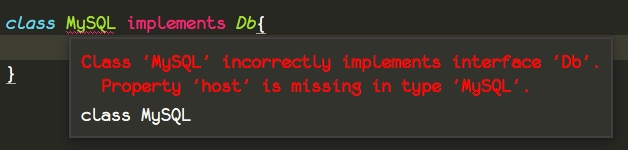

当我们做好 `host` 之后，编译器检测到你还有条框没有执行，所以又报错了，这里它又发问了，你的 `port` 上哪去了？会不会写程序！！自己写的规定都没实现。

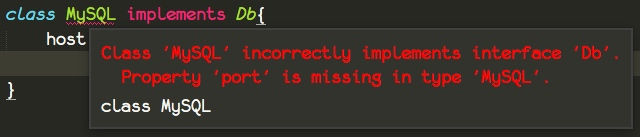


完善一下我们的代码

```
interface Db {
	host: string;
	port: number;
}

class MySQL implements Db {
	host: string;
	port: number;

	constructor(host: string, port: number) {
		this.host = host;
		this.port = port;
		console.log('正在连接 ' + this.host + ":" + this.port + " 的数据库....")
	}
}

let mysql = new MySQL('localhost', 3306);
```

**结果**

```
正在连接 localhost:3306 的数据库....
```

## 属性修饰符

修饰符就想形容词一样，表示对属性的一些修饰，比如好看的，和难看的，以及夹在中间好难看的。

### readonly
当我们去描述一个类的时候，我们想要让某一个字段，只能被读取，而不能被修改，就像宪法一样，可看不可改。

同样你也可以把它理解为属性常量。

```
interface Person{
	readonly IdCard: string; // 身份证号
}


class Person implements Person{
	readonly IdCard: string = "42xxxxxxxxxxxxxxx";
	constructor(){}
}
```

像只读属性，我们初始化的时候就必须要给它赋值。

从下面编译好的`js`代码里面可以看出，`interface`并不会产生任何实际代码

```
var Person = (function () {
    function Person() {
        this.IdCard = "42xxxxxxxxxxxxxxx";
    }
    return Person;
}());
```

当然我们不仅可以用`interface`去描述带有构造器的`class`，我们还可以直接描述通过字面量`{}`构造的类变量；

```
interface Person{
	readonly IdCard: string; // 身份证号
}

let person: Person =  { IdCard:'43xxxxxxxxx' }
```
而生成的代码依旧不含有任何与`interface`相关的东西。

```
var person = { IdCard: '43xxxxxxxxx' };
```


### private 与 protected

`private` 表示私有的变量，不能被其他任何访问，只归自己管。
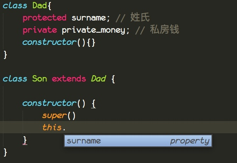

从这里可以看到，父亲的私房钱，只归自己管，哪怕儿子继承了父亲也不行，在儿子的构造器里面，仅仅可以取得到`surname`姓氏。

同时我们可以看到，在`Son`中可以访问得到`protected`的`surname`，也就是说被`protected`修饰的是可以被继承的。

### public 和 默认的

修改一下我们的代码，增加一个`public`的属性，和一个没有任何修饰的属性。
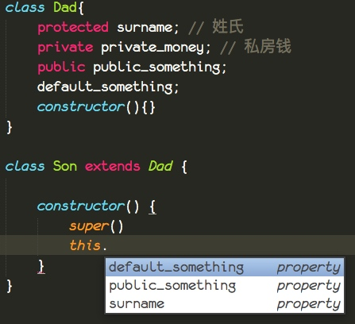

从结果可以看出，继承，可以继承除了`private`的所有。

而对于通过`new`创建的实例来说。

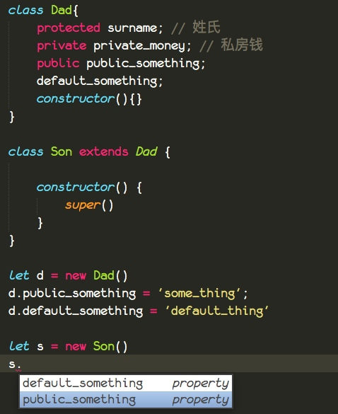

我们可以看到，实例只能访问`public`和默认的属性，同时也说明了默认就是`public`，所以`public`可以省略不写。

完整的代码如下

```
class Dad{
	protected surname; // 姓氏
	private private_money; // 私房钱
	public public_something;
	default_something;
	constructor(){}
}

class Son extends Dad {
	constructor() {
		super()
	}
}

let d = new Dad()
d.public_something = 'some_thing';
d.default_something = 'default_thing'

let s = new Son()
s.public_something = 'some_thing';
s.default_something = 'default_thing'
```

记得继承`Dad`的`Son`必须要先调用`super()`，`super()`表示父类的构造器，先有父亲，后有儿子。

对于属性修饰符你可以这么理解。

`class` 代表着一个家族成员，`extends` 表示血缘关系，就像上面的父亲与儿子。

`private` 是属于家族成员的私有物品，私人空间，别人是不能看到的，除非自己告诉别人，通过**方法返回**。

`protected` 表示家族资产，比如姓氏，某一宝物，古董。

`public` 表示共有资产，谁想拿，去问`class`的示例拿就好了。


### 可选属性
这个比较简单，就是一个`?`就行，表示可传，可不传。

它的语义就是强制需要传递这个参数吗？不强制需求。

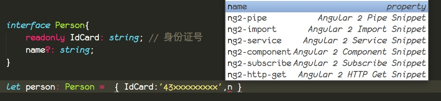

这里我们定义了一个可选的`name`属性，当我们在`IdCard`后面的属性，继续加的时候，编辑器自动提示了有一个`name`的`property`（属性）。

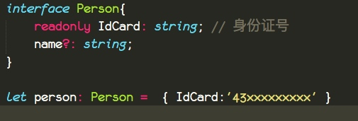

哪怕我们不传也是不会报错的。

这些修饰符，既然可以修饰类，那必然可以修饰接口上面的属性。

## 假如我们需要一个可以添加属性的 interface 怎么办呢？

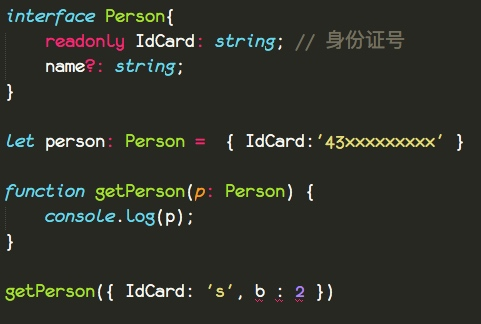

`getPerson` 这个函数要求我们传入的对象需要符合`Person`合同，当我们添加一些其他没有在合同里面定义的条款的时候，就会报错。

所以我们需要修改一下我们的合同，给它定义一下对于新增的条款，有些什么限制。

```
interface Person{
	readonly IdCard: string; // 身份证号
	name?: string;
	[propName : string]: any;
}

let person: Person =  { IdCard:'43xxxxxxxxx' }

function getPerson(p: Person) {
	console.log(p);
}

getPerson({ IdCard: 's', b : 2 })
```

我们在`js`语言中，访问一个对象的属性可以通过`.`去访问，还可以通过`['属性名']`这样的形式去访问。

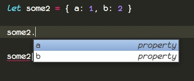
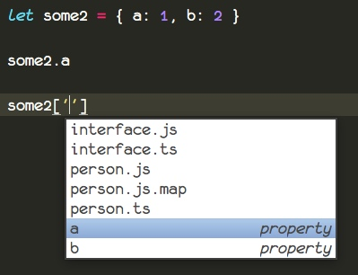

我们可以看到，这2种都是有代码提示的，说明都是可行的。
再看一看我们`interface`里面的`[propName : string]: any;`

他们之间存在着`[]`的联系，放心这不是卡巴斯基与巴基斯坦的*巴基*联系，而是很大的联系。

`[propName : string]: any;`

`[]` 里面就限定了属性名的类型，而后面的`any`就限定了属性值的类型。

这个`propName`是可以随意修改的。

## 接下来我们看看不正经的代码。
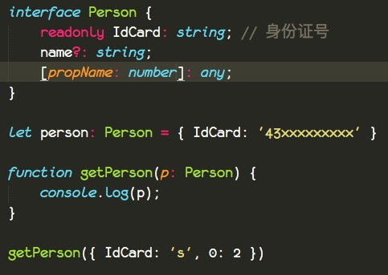

这是不是没有问题？这个还算正常吧，限定了为 `number`，也没报错。

但是得到的结果是`'0'`，不要大惊小怪这是正常的。

```
{ '0': 2, IdCard: 's' }
```

我们在 Chrome 里面测试一下 JS

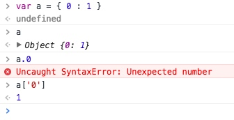

其实 js 对象是不允许你设置属性名为`number`的，他会自动转换为字符串。

此时我们再添加一个属性，这报错了。非常正常是吧。

interface 仅仅只是在 ts 层面起了作用。

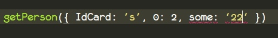

接下来我们看看这个
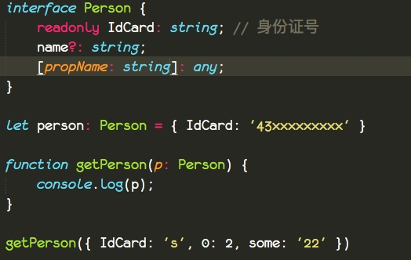

诶，这就很奇怪了，我明明给的是`number`为什么不报错呢？

并且装换出来的 js 代码还是原样。
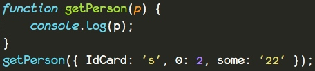

其实答案就是隐身转换。数字可以转换成字符串，而字符串不一定能转换成数字，比如`'xx1'`怎么转成数字，请问 `x`该转成几？

也就是说，你所给的类型只要可以转换成合同里面的类型，我就认为你是对的，我比较明智，是个老司机，我懂你各种隐含意思。

还有一点就是，对于你声明的属性，假如你不用字符串的`''`去包裹起来，js 编译器会帮你去做，从下面的代码你可以看出来。

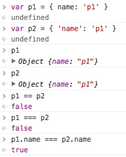

## 描述函数

描述函数，我们只能使用一个变量接受匿名函数的引用，而不能通过`function`去创建一个具体有名称的函数。

```
interface Db {
	host: string;
	port: number;
}

interface InitFunc{
	(options: Db) : string;
}


let myfunc : InitFunc = function (opts: Db) {
	return '';
}
```

有了前面的经验，理解这个应该不难。

我们之前提到过`()`代表函数调用，对于这个 `interface`，我们这样读。

`InitFunc`接口规定，它的函数调用需要传递一个`Db`合同、约束的`options`对象，返回一个`string`类型的值。

同时你也可以看到`interface` 只是约束类型并不约束你的变量名。


## 描述可实例化

正常的理所当然的，我们会认为下面的代码是正确的。

这是初学者经常会犯的错误。

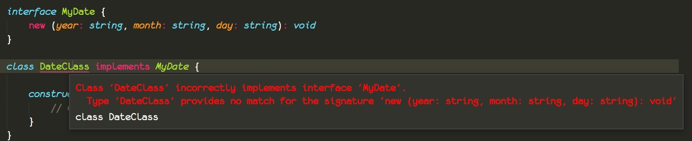

错误的代码我就不放上来了，免得误导大家，现在把正确的代码放在这里。

```ts
interface MyDateInit {
	new (year: string, month: string, day: string) : MyDate;
}

interface MyDate {
	year: string;
	month: string;
	day: string;
}

class DateClass implements MyDate {
	year: string;
	month: string;
	day: string;
	constructor(year: string, month: string, day: string) {
		this.year = year;
		this.month = month;
		this.day = day;
		return this;
	}
}

function getDate(Class: MyDateInit, { year, month, day }) : MyDate{
	return new Class(year, month, day);
}

getDate(DateClass, { year: '2017', month: '12',day: '1' });
```

通常描述一个类的构造器和字段方法是分开来的。

`MyDateInit` 描述的就是我们的构造器

`MyDate` 描述的就是我们的类

就像前面的描述函数一样，没法用`function somefunc(){}`去接受实现合同一样。同样我们没办法在`class someClass`上面去实现构造器的合同。

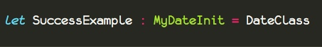

具体原因是，`interface`描述的是实例化后的类，也就是`{name:'some',age:22}`这样的类型。而 `constructor` 方法是属于静态方法。

你可以理解`new Class()`其实就是去调用了`Class.constructor()`方法，是的没错，是**方法**。

重点是方法2个字，`new (year: string, month: string, day: string) : MyDate;` 在这段代码里面是不是有`()`这个符号，这个代表着方法，而`new`则代表着可实例化的意思。

合起来就是， MyDateInit描述了一个可以实例化的对象，并且它的构造器需要一个`string`类型的`year`、`month`、`day`参数，返回一个实现了`MyDate`接口的类。


从 js 源码上可以看出，这个 `new()` 真正意义上面的描述的是以下代码，描述的是一个函数方法。

```
var DateClass = (function () {
    function DateClass(year, month, day) {
        this.year = year;
        this.month = month;
        this.day = day;
        return this;
    }
    return DateClass;
}());
```

同时我也尝试这么写，通过`function`去构造，我发现约束类型不对。

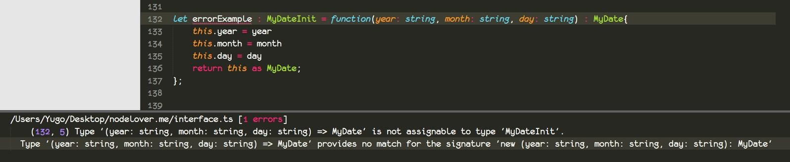

我写出来的类型签名是下面这个, 而 `=>` 代表着函数的返回值。

```
(year: string, month: string, day: string) => MyDate
```

相当于编译器告诉我，我描述的是类的构造器，你把一个函数给我是怎么个意思？是不是想打架！来啊，心平气和的干一架~ 二营长，把他x的意大利炮拉出来！！

经过这样修改之后，就可以正常运行了。也就是去掉`new`

```
interface MyDateInit2 {
	(year: string, month: string, day: string) : MyDate
}

let ExamplePlus : MyDateInit2 = function(year: string, month: string, day: string) : MyDate{
	this.year = year
	this.month = month
	this.day = day
	return this as MyDate;
};
```

哪怕你想通过限定`constructor`的参数，来限制构造器依旧是不行的。

```
interface test{
	constructor(year: string, month: string, day: string);
}

// 错误例子
// class a1 implements test{
// 	constructor(year: string, month: string, day: string){
// 	}
// }

// 错误例子
// let a2 : test = class test{
// 	constructor(year: string, month: string, day: string){
// 	}
// }

let a3 : test = {
	constructor(year: string, month: string, day: string){

	}
}

```

ts 虽然支持直接 new `function` 但是，`function` 必须是返回值为`void`的函数。

```
interface test{
	constructor(year: string, month: string, day: string): void;
}

let a3 : test = {
	constructor(year: string, month: string, day: string){

	}
}

let cc = new a3.constructor('', '', '')
```

其实关于`new()`最贴切与最精简的例子还行下面的代码。

```ts
let some : MyDateInit = class SomeDate implements MyDate {
	year: string;
	month: string;
	day: string;
	constructor(year: string, month: string, day: string) {

	}
}
```

## 描述混合类型
混合类型通常出现在第三方 js 库的 d.ts 文件上面，在我们写`d.ts`文件的时候可能需要。

```
interface Counter {
    (start: number): string;
    interval: number;
    reset(): void;
}

function getCounter(): Counter {
    let counter = <Counter>function (start: number) {console.log('start is ' + start)};
    counter.interval = 123;
    counter.reset = function () {console.log('do you want reset counter?')};
    return counter;
}

let c = getCounter();
c(10);
c.reset();
c.interval = 5.0;

console.dir(c)
```

我们把官网的代码拿下来，小小的修改了一下。

`Counter` 描述的是一个函数，并且它有静态的`interval`属性，和静态的`reset`方法。

`getCounter` 就是一个工厂函数，每次访问他，都可以得到一个被`Counter`接口修饰的函数。

并且我们通过`tsc -d`生成一下我们的`d.ts`文件。

```
interface Counter {
    (start: number): string;
    interval: number;
    reset(): void;
}
declare function getCounter(): Counter;
declare let c: Counter;
```

### 假如我们想要定义实例方法呢？
让 `counter` 函数返回一个我们定好的接口即可

```
interface couterInstance{
	start: number;
}

interface Counter {
    (start: number): couterInstance;
    interval: number;
    reset(): void;
}

function getCounter(): Counter {
    let counter = <Counter>function (start: number) {
    	console.log('start is ' + start)
    	this.start = start;
    };
    counter.interval = 123;
    counter.reset = function () {console.log('do you want reset counter?')};
    return counter;
}

let c = getCounter();
c(10);
c.reset();
c.interval = 5.0;

console.dir(c)
```
编译之后，新建一个`index.html`文件

```
<meta charset="utf-8">
<script src="./interface.js"></script>
```
用浏览器打开它，打开控制台，把鼠标移动到函数的上面，右键，选择`store as global variable`

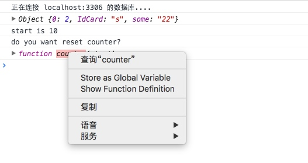

通过`new`去实例化这个函数，我们就可以看到有一个 `start`属性

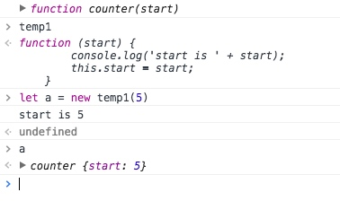


## 总结

我希望这个总结你来写，写与不写选择都在于你。

就像有的人会选择最坎坷的走向优秀的道路，而有的人不会。

最好把故事、场景都自己再阐述一篇，代码都读一篇。

故事： public 就是公共资产，private 就是私人物品，比如爸爸的私房钱，protected 就是家族资产。

读代码：

```
new (year: string, month: string, day: string) : MyDate
```

表示可以实例化的对象，并且它的构造器需要一个`string`类型的`year`、`month`、`day`参数，返回一个实现了`MyDate`接口的类。

