枚举是为了让程序可读性更好，比如用来描述用户的角色，普通的会员、付费的会员等，同时也限定了用户角色的种类，保证安全性，不会出现上帝角色这种乱入的东西。

## 枚举的类别与写法

默认值从0开始，依次递增，这个你应该还记得。

### 普通的枚举

```
let str = 'something'

enum test{
	test01,
}

enum FileAccess {
    None,
    Read    = 1 << 1,
    Write   = 1 << 2,
    ReadWrite  = Read | Write,
    Test = test.test01,
    O = str.length
}
```

对于前面这几种，是常理属性，因为它会直接计算出来，只要是使用了一元运算符号，或者使用了其他枚举的内容，都会计算出来。

```
None,
Read    = 1 << 1,
Write   = 1 << 2,
ReadWrite  = Read | Write,
Test = test.test01,
```

而

```
O = str.length
```

则不会，编译出来的 JS 代码会是这个样子。


```
var str = 'something';
var test;
(function (test) {
    test[test["test01"] = 0] = "test01";
})(test || (test = {}));
var FileAccess;
(function (FileAccess) {
    FileAccess[FileAccess["None"] = 0] = "None";
    FileAccess[FileAccess["Read"] = 2] = "Read";
    FileAccess[FileAccess["Write"] = 4] = "Write";
    FileAccess[FileAccess["ReadWrite"] = 6] = "ReadWrite";
    FileAccess[FileAccess["Test01"] = 0] = "Test01";
    FileAccess[FileAccess["O"] = str.length] = "O";
})(FileAccess || (FileAccess = {}));
```

它这个写法你可能看起来比较复杂。

你分开来看就行了。`FileAccess` 其实是一个对象。


```
FileAccess["None"] = 0
```

此时 `FileAccess.None` 就为 0 了

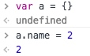

我们可以看到给属性赋值的时候，返回的是这个值。

接着就是


```
FileAccess[0] = "None"
```

把编译出来的代码加一个`console.log`然后放到 `html`中执行。

所以最后这个对象可能会是这样。

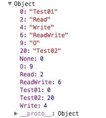

### 常量枚举

这个枚举只会存在`ts`文件中，编译成 `js`不会生成任何代码，全部都用它的值代替。

既然是常量枚举，那就在他前面加个 `const` 即可

```
const enum Enum {
    A = 1,
    B = A * 2
}

var arr = [Enum.A, Enum.B]
```

它编译出来之后就这么一句。

`var arr = [1 /* A */, 2 /* B */];`

直接把它的值给编译了出来，只不过加了一个注释而已。

## 自动推导

往兼容性最好，描述最准确（且不会报错）的地方推

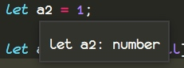

当我们给 `a2` 赋值为1的时候，编译器自动推导出为 `number`

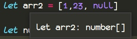

这个被推导成了数字数组，因为`number`可以接受为 `null`

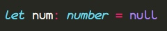

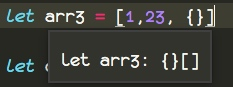

这个被推导成了对象数组，因为把 `2` 付给对象类型是不会报错的，从某种意义上说 `2` 也是 `Number` 对象的实例

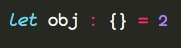

而当我们给`{}`，添加属性的时候，

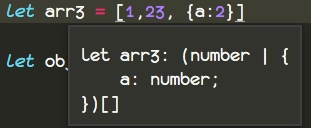

它会添加一个`|`表示或者的关系。

```
let a2 = 1;

let arr2 = [1,23, null]

let num: number = null

let arr3 = [1,23, {a:2}]

let obj : {} = 2
```

而对于类

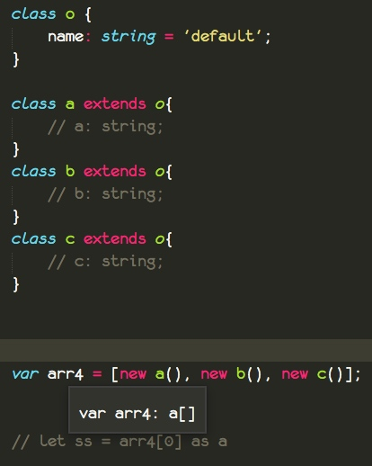


你会发现 `arr4` 被推导成了`a[]`类型，为什么呢？

因为 `ts` 判断一个类是否相等是会去看它的类型，而这里的三个类的类型都是`{}`空对象。所以编译器认为3个都是相等的，所以就用了第一个的名字，也就是 a。

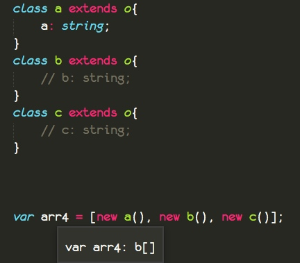

当我们打开 a 的属性的时候，我们发现 `arr4` 变成了 `b[]` 类型。

为什么呢？

a 的类型是什么呢？我们用内联的接口描述一下，`{a:string}`而 b 的类型是`{}`，假如我们 `arr4`的类型是 a 的类型的数组的话，b 就不符合规范。

而 `arr4`的类型是  b 的类型数组，那就全部合适，不会报错。

其实此时我们是已经丢失了类型的。

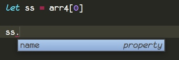

此时的a，根本就拿不到任何它自己的属性。

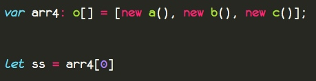

跟使用它们的父类去接受值是一样的，丢失了自己的属性。

当然我们可以这样处理，强制转换。

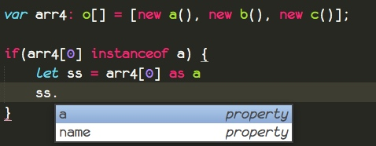

我们把其他的注释也解开

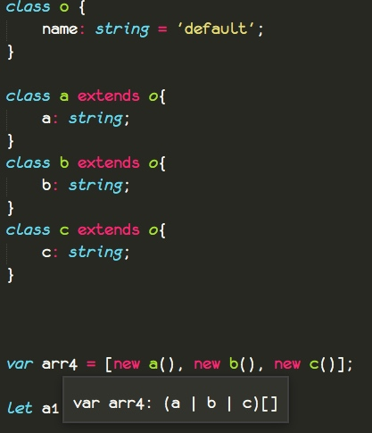

此时的 `arr4` 是`(a|b|c)[]`，表示一个可以放`a`/`b`/`c`实例化的数组。

所以我们取到的类型是
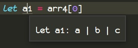

依旧还是需要强制转换，那就没有什么其他的办法保证数组里面每一个类的特征吗？

有，利用元组，不过这样就不能把它看做数组，往里面添加新的东西了。

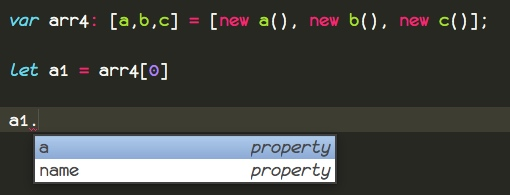

函数参数的自动推导

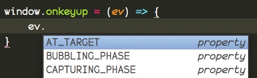

我们可以看到 此时的 ev 有代码提示，说明已经自动推导出了类型。

选择`onkeyup`按 `f12`，就可以看到以下声明，这是系统自带的类型。

```
onkeyup: (this: Window, ev: KeyboardEvent) => any;
```

第一个参数是指定 `this`。

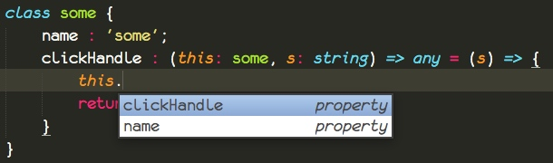

这个`this`就像这样，可以提供代码提示。

这种绑定 `this` 的做法只能在 `Class` 和 `Interface` 里面使用。


而`ev`就是我们函数的 `ev` 也就是`KeyboardEvent`类型，所以才有代码提示。

其实也就是从左边类型，推导出右边的类型。

## 类型之间的兼容性

之前我们提到过`ts`自动推导类型的时候，会推导出限制最低的类型。

而判断类型之间是否兼容，会通过类型的比较得出。


```
interface Named {
    name: string;
}

class Person{
    name: string;
}

let p: Named;
p = new Person();
```

这一段代码是正确没有报错的，我们用内联形式描述一下 `Person` `{name:string}`，恰好与接口`Named`所描述的是一直的。

也就是说，其实 `Person` 隐含的意义实现了 `Named` 接口。


当我们给 Person 添加一个属性的时候依旧没报错。

```
class Person{
    name: string;
    age: number;
}
```

但是此时的属性 `age`丢失了，因为 `Named`上面并没有`age`，

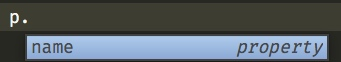


尽管我们知道，它一定有一个 `age`属性。

而此时为什么可以赋值，其实跟我们之前的数组保证类的特征类似。

此时 Person 的约束为`{name:string;age:number}`而 Named 的约束为`{name:string}`。

你可以看成解构 `{name} = {name,age}` 所以此时的 `age` 就丢失了，尽管在 js 层面是一定存在 age 这个属性的，但是在 `ts`层面来说，因为你抛弃了`age`,所以它是不记得有 `age`这个东西的。

当然假如反过来`{name,age} = {name} ` 就会报错，因为此时 `age` 拿不到任何值。

也就是说，约束少的可以得到约束多的一部分，也就是俩人都有的属性。

就像类型装换，`number` 可以转成 `string`，而并不是所有的 `string`都可以转成 `number`，只有存在一点不安全的东西，`ts`就不允许你这么做。

接下来我们看看函数之间的兼容。

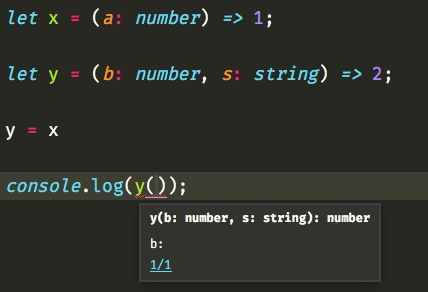

我们可以看到把 x 赋值给 y 并没有报错，而当我们再次调用 y 的时候，依旧需要我们传递2个参数。但是在 js 层面来说，假如我们打印一下 y 的话。


这里为什么可以把一个少参数的函数赋给一个多的参数函数呢？你可能会这样问。

那么我问你，请问函数的参数越多是否意味着约束越强？

答案肯定是的，相比较 x 来说，y 的约束性更强，当把 x 复制给 y 的时候，首先会去判断 x 的参数类型与 y 的参数类型匹配不匹配。

这里的匹配是有顺序的。

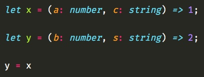

当我们增加一个参数，依旧正常。

当我们修改一下位置，立马就报错了。

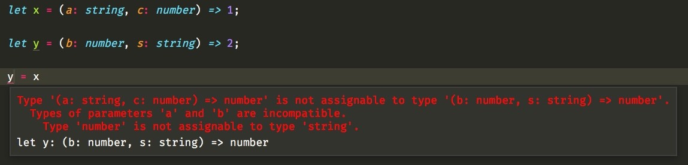

约束强的可以兼容约束弱的。


通过接口的兼容性来实现来实现 js 的一些特殊的回调方法。


```
enum mEventType { Mouse, Keyboard }

interface mEvent { timestamp: number; }
interface mMouseEvent extends mEvent { x: number; y: number }
interface mKeyEvent extends mEvent { keyCode: number }

function listenEvent(eventType: mEventType, handler: (n: mEvent) => void) {}

listenEvent(mEventType.Mouse, (e: mMouseEvent) => console.log(e.x + ',' + e.y));

listenEvent(mEventType.Mouse, (e: mEvent) => console.log((<mMouseEvent>e).x + ',' + (<mMouseEvent>e).y));
listenEvent(mEventType.Keyboard, <(e: mEvent) => void>((e: mKeyEvent) => console.log(e.keyCode)));
```

对于 `mMouseEvent` 和 `mKeyEvent` 来说， `mEvent` 相当于父类。

而 `listenEvent(eventType: mEventType, handler: (n: mEvent) => void) {}` 要求我们第二个参数传入的回调里面的一个参数是 `mEvent` 类型 因为 `mMouseEvent` 和 `mKeyEvent`都继承了` mEvent`，所有传入`mMouseEvent` 和 `mKeyEvent` 都是可以的。

当然上面的代码也用到了多次强制转换，一个是强制转换回调的类型，一个是强制转换参数的类型。


```
class Animal {
    feet: number;
    constructor(name: string, numFeet: number) { }
}

class Size {
    feet: number;
    constructor(numFeet: number) { }
}

let a: Animal;
let s: Size;

a = new Animal('123', 1);

s = new Size(2);

a = s;
```

而对于类来说，只会比较他们之间的实例变量。

当泛型并没有实际约束任何属性的时候，他们是兼容的。


```
interface Empty<T> {}

let x: Empty<number>;
let y: Empty<string>;

x = y;
```

而

```
interface Empty<T> {
    name: T;
}
```

这样就不行了，因为 ts 会去检测属性是否匹配。


## 类型之间的逻辑

在之前，我们描述一类具有多个特征，可能要通过 implement 来实现多个接口，而现在我们可以`&`与`|`来实现泛型、类型之间的逻辑。

比如 `Person & Serializable & Loggable` 意味着同时是 `Person` 和 `Serializable` 和 `Loggable`

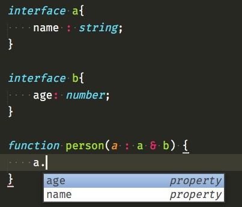

此时我们的 a 变量就具有了 a 接口和 b 接口的所以特征。

当然我们也可以等调用的时候再传


```
interface a {
    name: string;
}

interface b {
    age: number;
}

let some = <T, U>(a: T & U) => {

}

some<a, b>({ name: '123', age: 28 })
```

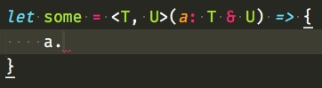

不过这样就不会有任何的代码提示，除非你强制转换。


假如我们的函数想要传递数字或者是字符串，你可能会用 `any` 不过这样对其他程序员不友好，看函数的类型，并不能理解得到需要具体传啥。


```
function some2(a : string | number) : any {
    if(typeof a === 'number') {
        a.toExponential()
    }
}
```

所以我们可以通过`|`来实现或者逻辑。

而对于接口的逻辑`|`来说。


```
interface Bird {
    fly();
    layEggs();
}

interface Fish {
    swim();
    layEggs();
}

function getSmallPet(): Fish | Bird {
    return { swim(){},layEggs(){} };
}

let pet = getSmallPet();

if((pet as Fish).swim) {
    (pet as Fish).swim()
}
```

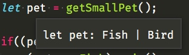

这时候我们类型还是`Fish | Bird`。

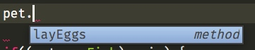

当我们去调用方法的时候，只能访问到他们共同的方法。

而想要判断是否某一类型，还是需要强转之后判断属性是否存在。

当然我们还可以写一个方法。

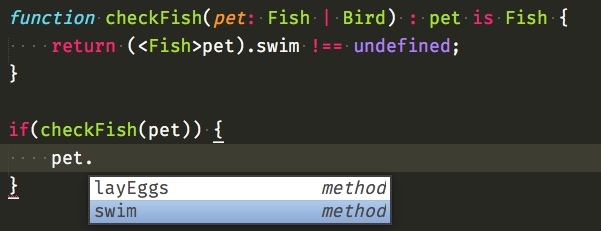

这里的代码提示是通过` pet is Fish`实现的，当然我们可以改成 boolean，尽管不会报错，但是这样我们就不会有代码提示了。

## 类型别名

你可以认为这种 `{new(name:string):Person;hello():void}`为内联类型描述，而 interface，认为 `class` 而类型别名，就好像把多个 `class` 或者内联的组合在一起。

当然类型别名是不再支持继承的，当你没法用接口描述类型的时候，你就应该尝试这种方式了。

```
interface a {
    name: string;
}

interface b {
    age: number;
}

type aAndB = a & b & {sayHello(name: string)};

function some3(a : aAndB) {
     a.age;
     a.name;
     a.sayHello('bob');
}
```

当然，你也可以给出具体的值，这样就有点类似枚举，也就是说，传入的值，必须是其中的某一项。


```
type Easing = "ease-in" | "ease-out" | "ease-in-out";
```


而对于类型来说，还有一种特殊的类型 `this`，这是为方便实现实现链式调用。


```
class BasicCalculator {
    public constructor(protected value: number = 0) { }
    public currentValue(): number {
        return this.value;
    }
    public add(operand: number): this {
        this.value += operand;
        return this;
    }
    public multiply(operand: number): this {
        this.value *= operand;
        return this;
    }
    // ... other operations go here ...
}

let v = new BasicCalculator(2)
            .multiply(5)
            .add(1)
            .currentValue();
```

就像这个 `add` 方法。

```
public add(operand: number): this {
   this.value += operand;
   return this;
}
```

实现链式调用的密码就是返回 `this`


