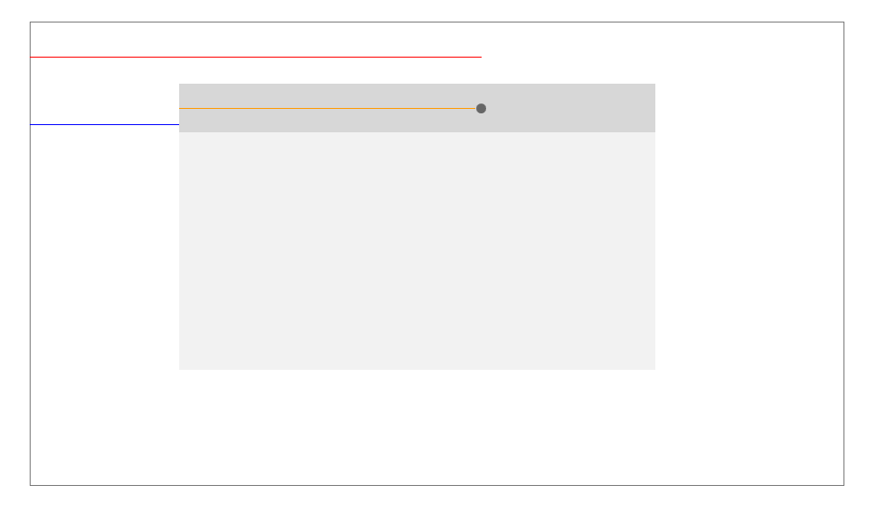

拖拽效果，和调整窗口大小其实差不多，首先我们来看一张图。



黑色的小圆点，是我们鼠标单击的点。

红线的距离，可以通过`e.pageX`获得。

蓝线的距离，可以通过可以移动的这个`Div`盒子的 `offsetLeft`拿到。

此时我们就可以拿到，黄线的长度，当鼠标，也就是小圆点往右移动的时候，黄线是不会变的，而红线会变长，我们再次通过`e.pageX`拿到这个红线的长，我们通过红线的长度，减去不变的黄线的长度，得到的就是新的蓝线长度，也就是元素需要设置的`left`的值。

1.首先准备HTML结构

```html
    <div class="dialog" id="canMove">
        <div class="dialog-title" id="canDrag">
            Title
        </div>
        <div class="content">

        </div>
    </div>
```

2.添加一些样式

```css
        *{
            margin: 0;
            padding: 0;
        }

        .dialog{
            width: 480px;
            height: 300px;
            background: #eee;
            position: absolute;
        }

        .dialog-title{
            width: 480px;
            height: 40px;
            background: #999;
            cursor: move;
            text-align: center;
            line-height: 40px;
        }
```

3. 加上我们的 JavaScript 逻辑

```js
        const dragEle = document.querySelector('#canDrag');
        const canMove = document.querySelector('#canMove');

        dragEle.onselectstart = canMove.onselectstart =  () => {
            return false;
        } // 禁止被选中

        let timer;

        const mouse = {
            x: 0,
            y: 0
        } // 记录当前鼠标移动的坐标点

        const distance = {
            topTop: 0,
            topLeft: 0
        } // 鼠标按下时候距离 CanMove 左上角的距离

        document.onmousemove = (e) => {
            mouse.x = e.pageX;
            mouse.y = e.pageY;
        } // 记录鼠标坐标

        document.onmouseup = document.ondrag = (e) => {
            clearInterval(timer);
            timer = null;
        } // 鼠标弹起，清空设置left的定时器

        dragEle.onmousedown = (e) => {
            distance.topLeft = e.pageX - canMove.offsetLeft;
            distance.topTop = e.pageY - canMove.offsetTop;

            timer = setInterval(setPosition, 10);
        }

        function setPosition(){
            const maxX = (document.body.clientWidth || document.documentElement.clientWidth) - canMove.offsetWidth;
            const maxY = (document.body.clientHeight || document.documentElement.clientHeight) - canMove.offsetHeight;

            canMove.style.left = Math.max(Math.min((mouse.x - distance.topLeft), maxX), 0) + 'px';
            canMove.style.top = Math.max(Math.min((mouse.y - distance.topTop), maxY), 0) + 'px';
        }
```

`maxX` 就是我们最多可以移动长度，它等于浏览器可视区的宽度，减去盒子的宽度。

`Math.min((mouse.x - distance.topLeft), maxX) ` 是为了让`left`不能超出可视区域右边

`Math.max` 是为了让 `left` 不能为负数，也就是不能超出可视区的左边。
