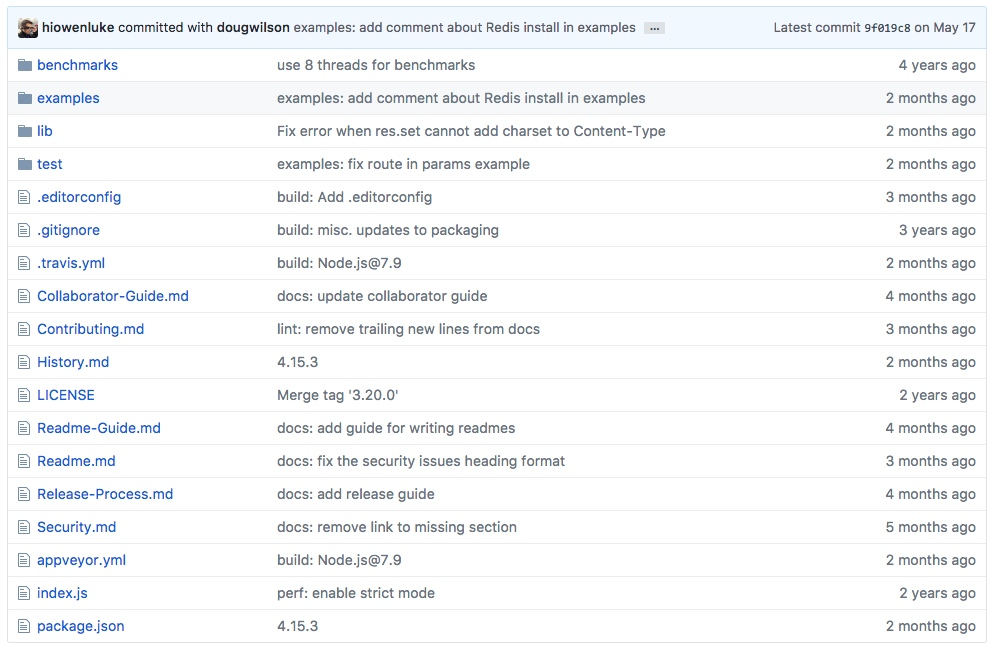
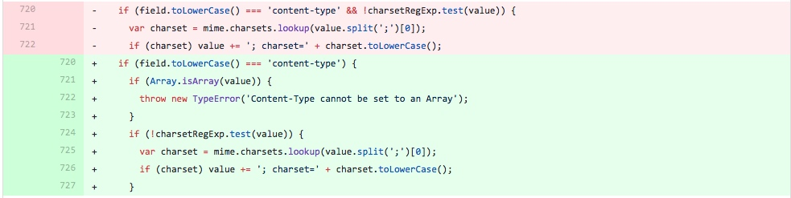
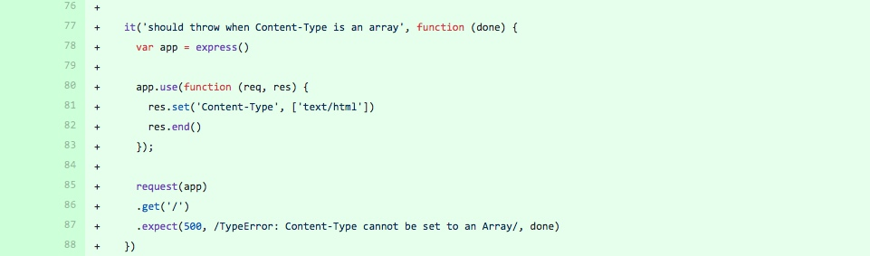
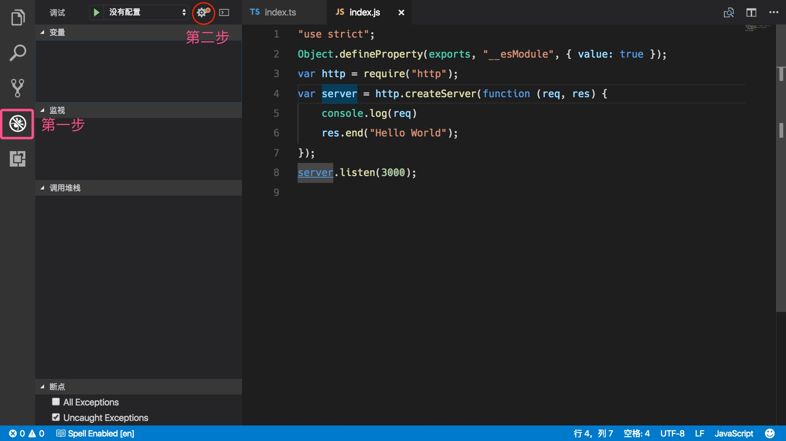
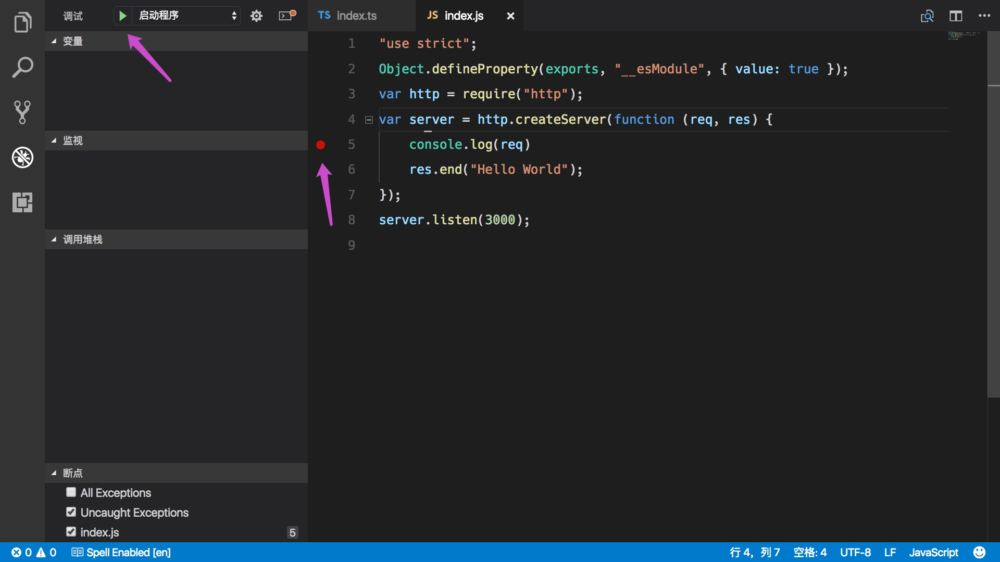
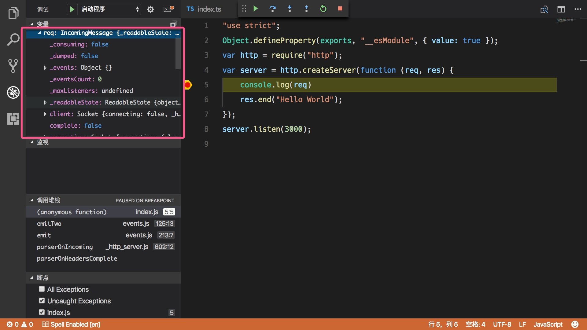
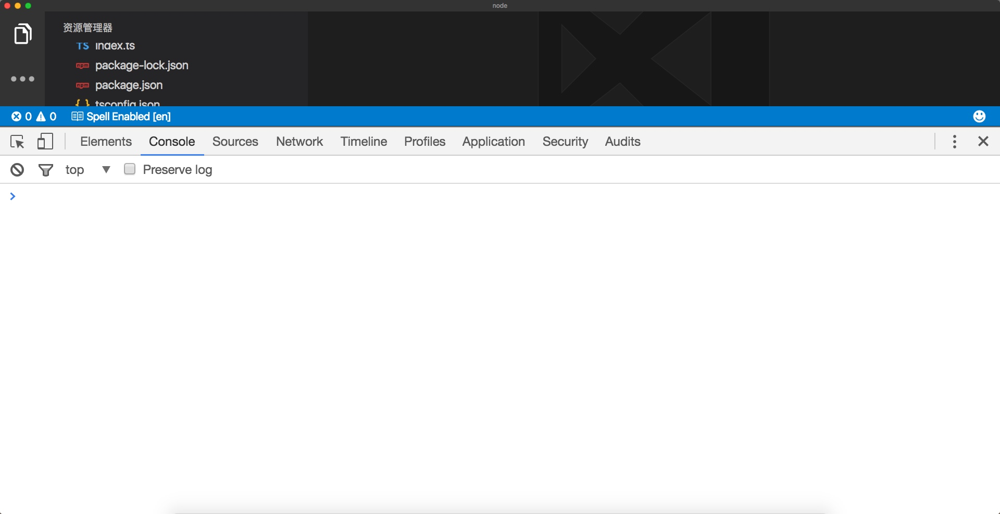
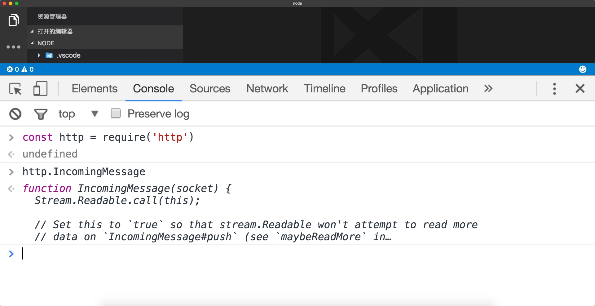
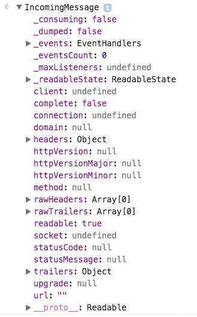

# Express 源码？So Easy！

## 一、实验介绍

**FAQ: 为什么会有这个课程？**

笔者最近一直想制作关于 Node 方面的教程书籍，于是笔者下载了非常多的关于 Node.js 的 PDF 书籍，了解一下其他人是如何教大家写 Node.js 的？看完之后我就满脸黑线，why？笔者发现带有**实战**字眼的书籍，90% 会出现 express，当我看到里面实现的一些功能的时候，我就瞬间斯巴达了。文章标题是制作一个微博，看见这个标题，笔者瞬间感觉书籍作者**牛逼闪闪**，产生我不如人的羞愧情绪反馈。结果他给出的代码发布一篇文章，而且数据库模型的名字还叫 Post，最后我得出结论他的这个微博与我所理解的微博不在一个时间线上，i know，全都怪我~ 怪我凭空捏造，我所理解的微博还是太超前了。

SO！为什么有那么多的 Express 用法？而没有人去看一看它的实现呢？

没时间解释更多了，带上你的爱机，我们出发！

### 1.1 实验内容

本实验会带着大家阅读 express 源码。

### 1.2 实验知识点

* 如何阅读一个开源项目？
* 函数式编程（函数柯里化）
* Node.js 的事件监听
* express 运行原理
* 混合 `mixin` 与 `__proto__` 原型继承区别
* 通过缓存提高运行效率
* 编写 express 插件
* 如何让函数兼容多种传值方式？
* VS Code 查看 Node 的黑科技

### 1.3 适合人群

* 有一定的 JavaScript 基础
* 想要了解 Express 原理的开发人员
* 想要提升 Node.js 基础的开发人员

### 1.5 代码获取

```bash
git clone https://github.com/expressjs/express.git
```

## 二、实验步骤

### 2.1 了解 Express 项目的近期 Commit 状况

[来到 Github express 项目的主界面下](https://github.com/expressjs/express/tree/master)



 Express 的源码目录是在 lib 目录，这是 node.js 开发者自发的约定。在目录的最右边可以看到修改时间，最近的一次 lib 源码目录下的修改时间是2个月前，说明这个框架已经是相当的稳定了。

 点击 `Fix error when res.set cannot add charset to Content-Type` 中间的链接便可以查看到 Commit 信息，了解修改了哪些文件。

 目前的 commitId 号码是 `ae0b630ac7e8f34e4ea37285f30db4b52adf8436` *（可能在你阅读的时候，express 又添加了新的 commit，所以这里我把 commitId 给粘贴了出来）*，代码修改如下：


 

增加了判断 value 不能是数组的一段逻辑（红色代表删除，绿色代表增加）。



之后又增加了一段测试用例，用于测试之前修改的逻辑是否正确运行。

##### So！目前我们 get 到了什么？

  我们 get 到了如何查看开源项目近期的状况，通常来说一个好的项目必须是要有人维护的，而项目越稳定，则源码目录修复 commit 就越少，至少在俩个月来，没有新的 Bug 需要修复。


### 2.2 了解全局与目录

#### 2.2.1 clone 源码。

```bash
git clone https://github.com/expressjs/express.git
```

#### 2.2.2 查看 package.json 文件

查看 package.json 文件是为了确定该项目的依赖，特别是 `dependencies` 里面的，这里面保存的是运行依赖，**你必须要把这些包是干什么用的弄清楚！**，而 `devDependencies` 通常是测试`test`文件夹下面的一些依赖，主要用于测试的。

 `devDependencies` 在发布 npm 包的时候是不会进行安装的，假如安装到`devDependencies` 里面，那么项目通过 npm 安装之后，就会缺少依赖导致运行出错。

##### 如何知道对应依赖 package 包的功能呢？

在`https://www.npmjs.com/`输入包的名称查询即可，so，我们又 get 到一个新技能。

#### 2.2.3 查看 lib 的目录结构

通过 `tree lib` 命令查看目录的结构，根据文件夹字面上的意思猜测功能。

```bash
⨉⪧ ~/D/express on master ⟩tree lib/
lib/
├── application.js
├── express.js
├── middleware
│   ├── init.js
│   └── query.js
├── request.js
├── response.js
├── router
│   ├── index.js
│   ├── layer.js
│   └── route.js
├── utils.js
└── view.js
```

### 2.3 查看 express.js 入口文件
先看导出了哪些
##### 2.3.1 createApplication

设置默认导出了一个`createApplication`方法，这个就是我们整个程序的入口。

```js
exports = module.exports = createApplication;

function createApplication() {
  var app = function(req, res, next) {
    app.handle(req, res, next);
  };

  mixin(app, EventEmitter.prototype, false);
  mixin(app, proto, false);

  // expose the prototype that will get set on requests
  app.request = Object.create(req, {
    app: { configurable: true, enumerable: true, writable: true, value: app }
  })

  // expose the prototype that will get set on responses
  app.response = Object.create(res, {
    app: { configurable: true, enumerable: true, writable: true, value: app }
  })

  app.init();
  return app;
}
```

首先我们看这段代码

```js
var app = function(req, res, next) {
  app.handle(req, res, next);
};
```

诶，这就有点奇怪了，app 是一个函数，为什么又可以调用 app.handle 方法呢？哪来的，不会报错吗？

**第一个问题：从哪来的 app.handle ？**

看到 mixin 没，虽然我不知道这个 mixin 从哪来的（当然，我也不想关心 mixin 具体用法，至少此刻来说是的），根据我以往的经验来说 mixin 就是混合合并的意思（懂什么作用就行），它这里的意思就是合并 app 与 proto、EventEmitter.prototype。现在 app 就具有他俩的方法，而这个 handle 方法就是在 proto 上面。

**第二个问题：不会报错吗？**

```js
var app = function(req, res, next) {
  app.handle(req, res, next);
};

app() // 报错
```

这样做确实是会报错，因为我们还没有 mixin 好，通常当我们调用的时候，mixin 已经混合完成，所以就不会报错。

当我们在实际项目中用起来就像这样，这个 app 与上面的 app 相同。

```js
var createApplication = require('express');
var app = createApplication()
```

接下来看 app.request 与 app.response

```js
  // expose the prototype that will get set on requests
  app.request = Object.create(req, {
    app: { configurable: true, enumerable: true, writable: true, value: app }
  })

  // expose the prototype that will get set on responses
  app.response = Object.create(res, {
    app: { configurable: true, enumerable: true, writable: true, value: app }
  })
```

Object.create() 指定原型对象和属性来创建一个新的对象。 [更多细节点击这里查看](https://developer.mozilla.org/zh-CN/docs/Web/JavaScript/Reference/Global_Objects/Object/create)


也就是说上面的这一行实现了以下功能

* app.request.__proto__ = req
* app.request.app = app。

这个是属于原型链继承，众所周知，当一个 js 对象找不到属性的时候，它会往它的`__proto__`属性上面去寻找该属性，一直找，直到没有`__proto__` 为止。

**你可能会好奇 mixin 与 create 有什么区别呢？**

我们来看看 mixin 的 merge-descriptors 的源码。

```js
function merge(dest, src, redefine) {

  if (redefine === undefined) {
    redefine = true
  }

  Object.getOwnPropertyNames(src).forEach(function forEachOwnPropertyName(name) {
    if (!redefine && hasOwnProperty.call(dest, name)) {
      // dest 已经有 name 属性了
      // redefine = true 覆盖掉 dest 的 name 属性
      // redefine = false 保持原来 dest 的 name 属性
      return
    }

    // Copy descriptor
    var descriptor = Object.getOwnPropertyDescriptor(src, name)
    Object.defineProperty(dest, name, descriptor)
  })

  return dest
}
```

* Object.prototype.hasOwnProperty() -- 返回一个布尔值 ，表示某个对象是否含有指定的属性，而且此属性非原型链继承的。 [更多细节请点击](https://developer.mozilla.org/zh-CN/docs/Web/JavaScript/Reference/Global_Objects/Object/hasOwnProperty)

* Object.getOwnPropertyDescriptor() -- 方法返回指定对象上一个自有属性对应的属性描述符。[更多细节请点击](https://developer.mozilla.org/zh-CN/docs/Web/JavaScript/Reference/Global_Objects/Object/getOwnPropertyDescriptor)

* Object.defineProperty() -- 给对象添加一个属性并指定该属性的配置， [更多细节点击这里查看](https://developer.mozilla.org/zh-CN/docs/Web/JavaScript/Reference/Global_Objects/Object/defineProperty)。


所以说，mixin 是在原来的对象上面 copy 属性进行继承，而 create 是以原型链的方式继承。so 我们又 get 到继承的2种方式。

之后再调用了 app.init() , 这是我们进一步阅读的入口。

##### 2.3.2 其他细枝末节

```js
/**
 * Expose the prototypes.
 */

exports.application = proto;
exports.request = req;
exports.response = res;
```

它这里给出的注释是导出原型，紧接着我们来查看 proto 到底是什么？

移动到最上面, 发现这都是从其他文件里面导入的。现在我们暂时不看其他文件，先把入口文件给看完。

```js
var proto = require('./application');
var Route = require('./router/route');
var Router = require('./router');
var req = require('./request');
var res = require('./response');
```

以及以下这些导出。

```js
exports.Route = Route;
exports.Router = Router;

/**
 * Expose middleware
 */

exports.query = require('./middleware/query');
exports.static = require('serve-static');
```

这里的 Route 与 Router 、query 都是从其他文件导入的，而 static 是从 node_modules 依赖里面导入的。

```js
[
  'json',
  'urlencoded',
  'bodyParser',
  'compress',
  'cookieSession',
  'session',
  'logger',
  'cookieParser',
  'favicon',
  'responseTime',
  'errorHandler',
  'timeout',
  'methodOverride',
  'vhost',
  'csrf',
  'directory',
  'limit',
  'multipart',
  'staticCache',
].forEach(function (name) {
  Object.defineProperty(exports, name, {
    get: function () {
      throw new Error('Most middleware (like ' + name + ') is no longer bundled with Express and must be installed separately. Please see https://github.com/senchalabs/connect#middleware.');
    },
    configurable: true
  });
});
```


这里有一个数组，通过 forEach 遍历它，为 exports 定义这些 name 属性，设置它的 getter 方法，当调用这个name 属性的时候抛出一个错误，告诉开发者，现在 express 里面已经不包含这些模块了，你需要自己去安装。

### 2.4 application.js

#### 2.4.1 app.init

首先找到 `app.init` 方法, cache、settings、engines 是存放缓存、设置、以及引擎的对象，具体这个引擎是啥，目前来说我们是不知道的。当然这里的 this 其实就是 app 对象。并且 app 也是我们导出的一个空对象，之后再在 app 对象上面添加方法，添加了方法之后，app 当然就不会是空的了。

```
var app = exports = module.exports = {};

app.init = function init() {
  this.cache = {};
  this.engines = {};
  this.settings = {};

  this.defaultConfiguration();
};
```
#### 2.4.2 app.defaultConfiguration

再转到 defaultConfiguration 方法，我们先忽略 onmount 方法。

```js
app.defaultConfiguration = function defaultConfiguration() {
  var env = process.env.NODE_ENV || 'development';

  // default settings
  this.enable('x-powered-by');
  this.set('etag', 'weak');
  this.set('env', env);
  this.set('query parser', 'extended');
  this.set('subdomain offset', 2);
  this.set('trust proxy', false);

  // trust proxy inherit back-compat
  Object.defineProperty(this.settings, trustProxyDefaultSymbol, {
    configurable: true,
    value: true
  });

  debug('booting in %s mode', env);

  this.on('mount', function onmount(parent) {
    // inherit trust proxy
    if (this.settings[trustProxyDefaultSymbol] === true
      && typeof parent.settings['trust proxy fn'] === 'function') {
      delete this.settings['trust proxy'];
      delete this.settings['trust proxy fn'];
    }

    // inherit protos
    setPrototypeOf(this.request, parent.request)
    setPrototypeOf(this.response, parent.response)
    setPrototypeOf(this.engines, parent.engines)
    setPrototypeOf(this.settings, parent.settings)
  });

  // 创建 locals 变量
  this.locals = Object.create(null);

  // 浏览器首页的URL
  this.mountpath = '/';

  // 默认在 locals 上面保存 setting
  this.locals.settings = this.settings;

  // 默认配置
  this.set('view', View); // View 是从 view.js 导入
  this.set('views', resolve('views')); // 指定视图目录的路径
  this.set('jsonp callback name', 'callback');

  if (env === 'production') {
    this.enable('view cache'); // 正式上线时，开启模板缓存
  }

  // 增加 app.router 已经删除的提示消息
  Object.defineProperty(this, 'router', {
    get: function() {
      throw new Error('\'app.router\' is deprecated!\nPlease see the 3.x to 4.x migration guide for details on how to update your app.');
    }
  });
};
```

`process.env.NODE_ENV` 可以拿到系统环境变量 `NODE_ENV` , 在 linux、unix 系统中可以通过 `SET NODE_ENV=production` 来指定。拿到当前的环境，好判断是否开启 debug 调试模式，默认是开发环境 `development`.

```
var env = process.env.NODE_ENV || 'development';
```

#### 2.4.3 set 与 setting

上面所调用的 enable 与 set 等都是跟配置对象 setting 有关的方法，所以再来看看 set 方法。

```
app.set = function set(setting, val) {
  if (arguments.length === 1) {
    // app.get(setting)
    return this.settings[setting];
  }

  debug('set "%s" to %o', setting, val);

  // set value
  this.settings[setting] = val;

  // trigger matched settings
  switch (setting) {
    case 'etag':
      this.set('etag fn', compileETag(val));
      break;
    case 'query parser':
      this.set('query parser fn', compileQueryParser(val));
      break;
    case 'trust proxy':
      this.set('trust proxy fn', compileTrust(val));

      // trust proxy inherit back-compat
      Object.defineProperty(this.settings, trustProxyDefaultSymbol, {
        configurable: true,
        value: false
      });

      break;
  }

  return this;
};
```

判断参数的个数，只有一个说明是获取的，直接就返回对象里面的值就好。

```
arguments.length === 1
```

正常运行的话，也就是2个参数的是，在 setting 对象里面设置相应的值即可。

```
this.settings[setting] = val;
```

而 `switch (setting)` 就是为了让 settings 里面的等于特定的值，例如 `etag`、`query parser` 、`trust proxy`的时候，触发一下各自的 fn 方法，并且把返回值再继续存在 setting 上面。

再看依赖于 set 的一些便捷方法

```
// 启动某一配置项
app.enable = function enable(setting) {
  return this.set(setting, true);
};
// 关闭某一配置项
app.disable = function disable(setting) {
  return this.set(setting, false);
};
// 是否启动了某一配置项
app.enabled = function enabled(setting) {
  return Boolean(this.set(setting));
};
// 是否关闭了某一配置项
app.disabled = function disabled(setting) {
  return !this.set(setting);
};
```

#### 2.4.4 回到 defaultConfiguration 方法的 onmount

```js
  this.on('mount', function onmount(parent) {
    // inherit trust proxy
    if (this.settings[trustProxyDefaultSymbol] === true
      && typeof parent.settings['trust proxy fn'] === 'function') {
      delete this.settings['trust proxy'];
      delete this.settings['trust proxy fn'];
    }

    // inherit protos
    setPrototypeOf(this.request, parent.request)
    setPrototypeOf(this.response, parent.response)
    setPrototypeOf(this.engines, parent.engines)
    setPrototypeOf(this.settings, parent.settings)
  });
```

这里之所以可以使用事件的 on 方法，是因为在 express.js 文件中

```js
mixin(app, EventEmitter.prototype, false);
mixin(app, proto, false);
```

在混合 app 与 proto 之前，先与事件监听 EventEmitter.prototype 进行了混合。并且这个函数主要是进行了以下作为。

```
setPrototypeOf(this.request, parent.request)
setPrototypeOf(this.response, parent.response)
setPrototypeOf(this.engines, parent.engines)
setPrototypeOf(this.settings, parent.settings)
```

[setPrototypeOf](https://www.npmjs.com/package/setprototypeof) 是 [Object.setPrototypeOf()](https://developer.mozilla.org/zh-CN/docs/Web/JavaScript/Reference/Global_Objects/Object/setPrototypeOf) 的 polyfill，就是降级叠片处理库（兼容到 IE8）。

相当于 `this.request.__proto__ = parent.request`。 也就是说 mount 是触发更换原型链的一个事件，通过触发 mount 我们可以安装和增加一些属性。


#### 2.4.5 app.lazyrouter

现在呢，我们从上往下阅读，看看哪些我们是没有看到的方法。

```js
app.lazyrouter = function lazyrouter() {
  if (!this._router) {
    this._router = new Router({
      caseSensitive: this.enabled('case sensitive routing'),
      strict: this.enabled('strict routing')
    });

    this._router.use(query(this.get('query parser fn')));
    this._router.use(middleware.init(this));
  }
};
```

这其实是一个单例设计模式，也可以理解为缓存某一个对象。

在注释上面，给出了这是一个私有方法，也是一个缓存路由的方法，假如不存在 this._router 就根据配置项新建它，，这个 Router 是 router/index.js 文件而不是 Router/route.js 文件，然后调用 use 把 query 与 middleware 传递进去。 query 和 middleware 都是 middleware文件夹里面的模块，也就是 express 默认的路由中间件，现在暂不赘述中间件里面的模块。

#### 2.4.6 app.handle

finalhandler 是一个处理请求错误的函数，它的返回值为 done，当我们调用 done 的时候就会返回 404，或者从 head、body 里面提取的其他错误。router.handle 先放一放。

```js
app.handle = function handle(req, res, callback) {
  var router = this._router;

  // final handler
  var done = callback || finalhandler(req, res, {
    env: this.get('env'),
    onerror: logerror.bind(this)
  });

  // no routes
  if (!router) {
    debug('no routes defined on app');
    done();
    return;
  }

  router.handle(req, res, done);
};
```

#### 2.4.6 app.route

用来指定一个路径的函数，它会放回一个 router/route.js 文件里面的 Route 对象，代理的 this._router.route 方法。

```js
app.route = function route(path) {
  this.lazyrouter();
  return this._router.route(path);
};
```


#### 2.4.7 app.engine

app.engine 用于指定，视图模板的后缀名，与进行处理的回调 fn

```js
app.engine = function engine(ext, fn) {
  if (typeof fn !== 'function') {
    throw new Error('callback function required');
  }

  // get file extension
  var extension = ext[0] !== '.'
    ? '.' + ext
    : ext;

  // store engine
  this.engines[extension] = fn;

  return this;
};
```

#### 2.4.8 app.param

代理的 this._router.param , name 参数支持传递数组的形式。

```js
app.param = function param(name, fn) {
  this.lazyrouter();

  if (Array.isArray(name)) {
    for (var i = 0; i < name.length; i++) {
      this.param(name[i], fn);
    }

    return this;
  }

  this._router.param(name, fn);

  return this;
};
```

#### 2.4.9 app.path

假如有 this.parent 就把它的 path 给加上。

```
app.path = function path() {
  return this.parent
    ? this.parent.path() + this.mountpath
    : '';
};
```

#### 2.4.10 绑定路由方法


```js
methods.forEach(function(method){
  app[method] = function(path){
    if (method === 'get' && arguments.length === 1) {
      // app.get(setting)
      return this.set(path);
    }

    this.lazyrouter();

    var route = this._router.route(path);
    route[method].apply(route, slice.call(arguments, 1));
    return this;
  };
});
```

methods 的源码其实非常简单，就是 `http.METHODS` 里面支持的方法全部转成小写。给 app 里面添加所有 Node 支持的 http 方法函数，假如是 get 且只有一个参数，说明调用的是 app.set 拿到配置项，否则通过 this._router.route 设定 path ，再调用 route 对应的方法。

类似于这样( _ 以下划线开头的说明都是私有方法，我们不应该直接调用，这里只是为了说明)：

```
app.get('/user', function(){.....})

app._router.route('/user').get(function(){...})
```


```
app.all = function all(path) {
  this.lazyrouter();

  var route = this._router.route(path);
  var args = slice.call(arguments, 1);

  for (var i = 0; i < methods.length; i++) {
    route[methods[i]].apply(route, args);
  }

  return this;
};
```

这个就比较霸道了，给所以支持的方法上面，为这个 path 路径添加相同的回调处理函数。

```js
app.del = deprecate.function(app.delete, 'app.del: Use app.delete instead');
```

假如使用的是 app.del 会给出彩色提示，叫你用 app.delete 替换掉，尽管有提示（警告提示），但是可以正常运行。

#### 2.4.11  app.render

这个就是渲染模板的函数。

```js
app.render = function render(name, options, callback) {
  var cache = this.cache;
  var done = callback;
  var engines = this.engines;
  var opts = options;
  var renderOptions = {};
  var view;

  // support callback function as second arg
  if (typeof options === 'function') {
    done = options;
    opts = {};
  }

  // merge app.locals
  merge(renderOptions, this.locals);

  // merge options._locals
  if (opts._locals) {
    merge(renderOptions, opts._locals);
  }

  // merge options
  merge(renderOptions, opts);

  // set .cache unless explicitly provided
  if (renderOptions.cache == null) {
    renderOptions.cache = this.enabled('view cache');
  }

  // primed cache
  if (renderOptions.cache) {
    view = cache[name];
  }

  // view
  if (!view) {
    var View = this.get('view');

    view = new View(name, {
      defaultEngine: this.get('view engine'),
      root: this.get('views'),
      engines: engines
    });

    if (!view.path) {
      var dirs = Array.isArray(view.root) && view.root.length > 1
        ? 'directories "' + view.root.slice(0, -1).join('", "') + '" or "' + view.root[view.root.length - 1] + '"'
        : 'directory "' + view.root + '"'
      var err = new Error('Failed to lookup view "' + name + '" in views ' + dirs);
      err.view = view;
      return done(err);
    }

    // prime the cache
    if (renderOptions.cache) {
      cache[name] = view;
    }
  }

  // render
  tryRender(view, renderOptions, done);
};
```

```
  if (typeof options === 'function') {
    done = options;
    opts = {};
  }
```

这是为了支持第二个参数为回调的时候，让 opts 默认为 `{}`。接下来还 merge 了几个选项而已，而这个 View 就是导入的 view.js 模块了，暂时先放一放。缓存选项打开的话，就保存到缓存 cache 选项上面去，假如缓存上面有的话，就直接拿不用再 new 了。假如路径啥的出错了，通过 done(err) 交给回调就是了，这个回调 done 是我们自己传递的。

这一段的代码缓存比较清楚，是不是我们又 get 到了一个技能呢？

tryRender 就是用 try/catch 包裹了一下 render

#### 2.4.12 app.listen


```
app.listen = function listen() {
  var server = http.createServer(this);
  return server.listen.apply(server, arguments);
};
```

之前这个我就没细说，我感觉大家应该会懂，毕竟已经用过 express了，这里我稍微提一下，arguments 就是 listen 所有的参数，它是一个数组，`server.listen.apply(server, arguments);` 通过这种方式可以把所有的参数直接传给 server.listen。

**你可能会问，诶，app 不是对象吗，怎么可以作为 http.createServer 的参数。**

是的，app 是一个对象，还是一个函数对象，可能你忘记了，在 express.js 里面有这么一段代码。

```js
var app = function(req, res, next) {
  app.handle(req, res, next);
};
```

#### 2.4.13 app.use

这个 app.use 我为什么放到最后面说呢，因为相对其他的来说，这个算是 express 最核心的功能了，它是扩展 express 的方法。

首先我们看一下flatten 是干嘛用的，readme 给出下面一段示例，非常明显，通过它可以把数组的维度降低。

```
> flatten([1, [2, 3], [4, 5, 6], [7, [8, 9]], 10])
[ 1,
  2,
  3,
  4,
  5,
  6,
  7,
  8,
  9,
  10 ]
> flatten([1, [2, [3, [4, [5]]]]], 2)
[ 1,
  2,
  3,
  [ 4, [ 5 ] ] ]
```

```
app.use = function use(fn) {
  var offset = 0;
  var path = '/';

  // default path to '/'
  // 以这种方式传递 app.use([fn])
  if (typeof fn !== 'function') {
    var arg = fn;

    while (Array.isArray(arg) && arg.length !== 0) {
      arg = arg[0]; // 拿到数组第一个项保存为 arg
    }

    // 第一个 arg 是路径  app.use('some', fn)
    if (typeof arg !== 'function') { // 假如 arg 还不是函数，而是 path 路径
      offset = 1; // 设置 偏移量为1
      path = fn; // path 就等于我们参数的第一项 fn
    }
  }

  var fns = flatten(slice.call(arguments, offset)); // 先把第一项 path 忽略掉，降低数组维度

  if (fns.length === 0) { // 参数传递不正确
    throw new TypeError('app.use() requires middleware functions');
  }

  // 启动一下路由
  this.lazyrouter();
  var router = this._router;

  fns.forEach(function (fn) {
    // 假如 fn 并不符合一个插件规范，则说明是注册路由
    if (!fn || !fn.handle || !fn.set) {
      return router.use(path, fn);
    }

    debug('.use app under %s', path);
    fn.mountpath = path; // 当前插件挂载路径
    fn.parent = this; // 保存当前插件上一次 app 的实例

    // restore .app property on req and res
    router.use(path, function mounted_app(req, res, next) {
      var orig = req.app; // 先拿到 当前 req 上面的 app 实例
      fn.handle(req, res, function (err) { // 给 fn.handle 传入 req，res，插件会给 req res 添加方法、属性等。
        setPrototypeOf(req, orig.request) // 把修改后的 req 的 __proto__ 设置为当前 request
        setPrototypeOf(res, orig.response)
        next(err); // 假如有 err 传递下去即可，最后会被 finalHandle 捕获的
      });
    });

    // mounted an app
    fn.emit('mount', this); // 触发 mount 时间，更新 request、response、settings、engines 对象
  }, this);

  return this;
};
```

要想更清楚的了解 use 的参数，我们可以看一下[app.use API](http://www.expressjs.com.cn/4x/api.html#app.use)

#### 2.4.14 cookie-parser 是如何工作的

之后，我们再来查看一个插件是如何写的 `cookie-parser`

```js
module.exports = cookieParser

function cookieParser (secret, options) {
  return function cookieParser (req, res, next) {
    if (req.cookies) {
      return next()
    }

    var cookies = req.headers.cookie
    var secrets = !secret || Array.isArray(secret)
      ? (secret || [])
      : [secret]

    req.secret = secrets[0]
    req.cookies = Object.create(null)
    req.signedCookies = Object.create(null)

    // no cookies
    if (!cookies) {
      return next()
    }

    req.cookies = cookie.parse(cookies, options)

    // parse signed cookies
    if (secrets.length !== 0) {
      req.signedCookies = signedCookies(req.cookies, secrets)
      req.signedCookies = JSONCookies(req.signedCookies)
    }

    // parse JSON cookies
    req.cookies = JSONCookies(req.cookies)

    next()
  }
}
```

cookieParser 其实是一个柯里化函数，利用了 js 的闭包特性。简单点说就是2层函数，好处就是，我们可以在第二层函数里面使用 secret 与 options ，提前传递这2个变量，这属于函数编程的范畴。

```js
if (req.cookies) {
  return next()
}
```

假如 req 上面已经有了 cookies 说明该中间件已经执行过了，直接跳出函数且执行 next 即可。`var cookies = req.headers.cookie` 首先拿到 headers 上面的 cookie 请求头，之后。


```
 var secrets = !secret || Array.isArray(secret)
      ? (secret || [])
      : [secret]
```

secret 不存在或者是一个数组，就返回 空数组 或者 secret，否则用数组包裹一下。


```
    req.secret = secrets[0]
    req.cookies = Object.create(null)
    req.signedCookies = Object.create(null)

    // no cookies
    if (!cookies) {
      return next()
    }
```

给 req 上面添加一些初始化变量，再次判断 headers 上面是否有 cookies 请求头，没有同样跳出函数，并执行 next。


```
   req.cookies = cookie.parse(cookies, options)

   if (secrets.length !== 0) {
      req.signedCookies = signedCookies(req.cookies, secrets)
      req.signedCookies = JSONCookies(req.signedCookies)
    }
```
cookie 是导入的一个叫 cookie 的 package 包，通过 parse 方法解析 headers 上面的 cookies 请求头，解析为 js 对象。然后判断签名秘钥 secrets 不为空，通过 signedCookies 验证 req.cookies，保证不被篡改，被篡改了之后就删除该属性，并赋给req.signedCookies，之后通过 JSONCookies 编码一下 req.signedCookies，转为 JS 对象。


```
req.cookies = JSONCookies(req.cookies)
```

就是解析普通的不加密的 cookie。所以说这个插件非常的简单，假如有设置加密串secrets， 则为 req 添加一个signedCookies，没有设置则添加一个 cookies 的功能。

照着这个插件一改，是不是又 get 到一个 express 插件编写的能力呀~


### 2.5 自己动手写一个日志中间件

当我们的网站运行在线上的时候，我们可能希望记录一下访问者的 IP 地址，以及一些其他操作，比如说敏感操作。这一小节，我们就来完成它，不过我这里完全是抛砖引玉，这里存储日志的地方是本地的文件夹，你大可以存放到数据库中，或者其他服务器提供商存储空间里面，比如 LeanCloud、FireBase 等等。

#### 2.5.1 初始化项目

```
mkdir ep && cd ep
npm init -y

npm i -S express
```

#### 2.5.2 新建 app.js

```bash
vim app.js
```

```
const express = require('express');
const app = express();

app.get('/', function (req, res, next) {
  res.send("Hello World")
});

app.listen(3000);
```

`:wq` 进行保存。

#### 2.5.3 运行

```bash
node app.js
```

打开 [localhost:3000](http://localhost:3000)，此刻我们的 helloworld 已经成功的运行了。

#### 2.5.4 新建 log.js

一共30几行代码，这个中间件非常的简单。

```js
const fs = require('fs');
const path = require('path');


const createFolderIfNotExists = (dir) => {
  try{
    fs.statSync(dir);
  }catch(e){
    fs.mkdirSync(dir);
    console.log("日志文件夹创建成功");
  }

}

module.exports = function(opts = {}){
  return (req, res, next) => {
    const outPutDir = opts.output || path.resolve(__dirname, 'logs');
    const nowDate = new Date();

    if (opts.close) {
      return next();
    }

    const logMsg = `${nowDate.toLocaleDateString()} ${nowDate.toLocaleTimeString()} => ${req.ip} \n`;

    createFolderIfNotExists(outPutDir)

    fs.createWriteStream(outPutDir + '/' + nowDate.toLocaleDateString() + '.log', {
      flags: 'a+'
    }).write(logMsg);

    return next();
  }
}
```

createFolderIfNotExists 是当不存在目录的时候进行创建，并且可以通过 opts.close 可以关闭该中间件。fs.createWriteStream 创建一个可写流，第一个参数是路径，第二个参数是配置项，之后给流 write 写入数据即可。这都是使用了 node.js 的一些 简单的 api。

#### 2.5.5 在 app.js 使用 log 中间件

```js
const express = require('express');
const app = express();
const log = require('./log');

app.use(log());

app.get('/', function (req, res, next) {
  res.send("Hello World")
});

app.listen(3000);
```

运行之后，访问网站，之后看看有没有 logs 文件夹，里面有没有数据。

### 2.6 路由

#### 2.6.1 router/index.js

##### 2.6.1.1 全局变量

声明了一些全局变量，objectRegExp 是一个正则表达式，toString 之后用来判断是否是对象。其他的就是保存了一下函数引用。

```
var objectRegExp = /^\[object (\S+)\]$/;
var slice = Array.prototype.slice;
var toString = Object.prototype.toString;
```

##### 2.6.1.2 设置导出

默认导出的是一个函数，并且调用这个函数可以得到 router，且用 proto 保存一下这个函数。router 函数代理的 router.handle 方法，并且设置 router 的原型链为 proto，然后初始化 router 上面的一些变量。

```
var proto = module.exports = function(options) {
  var opts = options || {};

  function router(req, res, next) {
    router.handle(req, res, next);
  }

  // mixin Router class functions
  setPrototypeOf(router, proto)

  router.params = {};
  router._params = [];
  router.caseSensitive = opts.caseSensitive;
  router.mergeParams = opts.mergeParams;
  router.strict = opts.strict;
  router.stack = [];

  return router;
};
```

##### 2.6.1.3 param 参数方法

在阅读此方法之前，大家可以先看一下 param 的 API 文档，看一下它是如何工作的，这样便于我们理解函数的功能，进而理解函数的逻辑。[点我跳转](http://www.expressjs.com.cn/4x/api.html#router.param)

查看一个函数，我们以理解他的功能为优先。

```
proto.param = function param(name, fn) {
  // 假如第一个参数是一个函数，说明是自定义函数，直接放到 this._params 数组里面。
  if (typeof name === 'function') {
    deprecate('router.param(fn): Refactor to use path params');
    this._params.push(name);
    return;
  }

  // 函数的全局变量，用 params 保存一下 this._params
  var params = this._params;
  var len = params.length;
  var ret;

  if (name[0] === ':') { // 假如 name 以 ：冒号开头，则去掉
    deprecate('router.param(' + JSON.stringify(name) + ', fn): Use router.param(' + JSON.stringify(name.substr(1)) + ', fn) instead');
    name = name.substr(1);
  }

  for (var i = 0; i < len; ++i) { // 执行 params（this._params） 里面的每一个函数，以 name 与 fn 传递进去，假如有返回值，则返回值做为新的 fn 作为参数传递。
    if (ret = params[i](name, fn)) {
      fn = ret;
    }
  }

  // ensure we end up with a
  // middleware function
  if ('function' !== typeof fn) { // 确保 fn 是一个 middleware 函数
    throw new Error('invalid param() call for ' + name + ', got ' + fn);
  }

  (this.params[name] = this.params[name] || []).push(fn); // 当 this.params[name] 不为空的时候，直接push fn 否则就等于 [fn]
  return this;
};
```


##### 2.6.1.4 handle 方法

handle 方法是 router 里面的入口函数。下面我将解释注释在代码中。

```
proto.handle = function handle(req, res, out) {
  var self = this; // 保存 this

  debug('dispatching %s %s', req.method, req.url);

  var idx = 0;
  var protohost = getProtohost(req.url) || '' // 从 url 中拿到协议
  var removed = '';
  var slashAdded = false;
  var paramcalled = {};

  // store options for OPTIONS request
  // only used if OPTIONS request
  var options = []; // 配置项目

  // middleware and routes
  var stack = self.stack;

  // manage inter-router variables
  var parentParams = req.params; // 保存一些 req 上面的参数
  var parentUrl = req.baseUrl || '';
  var done = restore(out, req, 'baseUrl', 'next', 'params'); // 保存一下变量，方法如下


function restore(fn, obj) {
  var props = new Array(arguments.length - 2); // 长度为3 的空数组
  var vals = new Array(arguments.length - 2); // 长度为3 的空数组

  for (var i = 0; i < props.length; i++) {
    props[i] = arguments[i + 2]; // 此时 props = ['baseUrl', 'next', 'params'];
    vals[i] = obj[props[i]]; // 此时 vals = [req['baseUrl'], req['next'], req['params']];
  }

  return function () { // 返回一个函数，调用即可恢复
    // restore vals
    for (var i = 0; i < props.length; i++) {
      obj[props[i]] = vals[i]; // 恢复之前保存的引用
    }

    return fn.apply(this, arguments); // 恢复之后再调用一下 fn (out)，并且参数照原样传递。
  };
}

  // setup next layer
  req.next = next; // 保存一下 next 方法， next 方法在下面

  // for options requests, respond with a default if nothing else responds
  if (req.method === 'OPTIONS') {
    done = wrap(done, function(old, err) {
      if (err || options.length === 0) return old(err); // 假如有错，抛出err. old -> done -> out (next)
      sendOptionsResponse(res, options, old); // 返回一个 options 的响应，告诉前端，我支持 post 等等方法
    });

    function wrap(old, fn) { //  把 old 作为 fn 的第一个参数，调用 fn
    return function proxy() { // 返回一个函数
      var args = new Array(arguments.length + 1); // 新建一个数组，长度等于参数长度 + 1

      args[0] = old; // 把 index 为 0 的位置放置 old

      for (var i = 0, len = arguments.length; i < len; i++) {
        args[i + 1] = arguments[i]; // 从 1 开始报错参数传递过来的值
      }

      fn.apply(this, args); // 调用 fn 并且把所有的参数传给 fn
    };
  }

  }

  // setup basic req values
  req.baseUrl = parentUrl; // 保存一些引用到 req 上面去。
  req.originalUrl = req.originalUrl || req.url;

  next(); // 执行 next 方法

  function next(){.....}
  }
};
```

##### 2.6.1.5 next 方法

我们可以忽略掉 process_params，（嵌套太深，不易阅读，了解其功能就行，处理一些参数的） [关于 setImmediate 更多请阅读这里](http://blog.csdn.net/hkh_1012/article/details/53453138)

```
  function next(err) {
    var layerError = err === 'route'
      ? null
      : err; // 保存一下错误

    // 移除斜线 /
    if (slashAdded) {
      req.url = req.url.substr(1);
      slashAdded = false;
    }

    // 保存一些改变了的参数到 req
    if (removed.length !== 0) {
      req.baseUrl = parentUrl;
      req.url = protohost + removed + req.url.substr(protohost.length);
      removed = '';
    }

    // 假如出错就在下一次事件循环之前调用 done(next) 方法
    if (layerError === 'router') {
      setImmediate(done, null)
      return
    }

    // 没有匹配到响应的
    if (idx >= stack.length) {
      setImmediate(done, layerError); // 下一次事件循环之前调用
      return;
    }

    // 从 req 上面拿到 path
    var path = getPathname(req);

    if (path == null) {
      return done(layerError); // 拿不到，抛出错误
    }

    // 寻找路由匹配
    var layer;
    var match;
    var route;

    while (match !== true && idx < stack.length) {
      layer = stack[idx++]; // stack 是 this.stack
      match = matchLayer(layer, path); // 路径与该 layer 是否匹配
      route = layer.route; // 拿到该 layer 的 route 对象

      if (typeof match !== 'boolean') { // 不匹配
        // hold on to layerError
        layerError = layerError || match;
      }

      if (match !== true) { // 不匹配继续下一次循环
        continue;
      }

      if (!route) {
        // process non-route handlers normally
        continue; // 没有 route 对象，同样继续下一次循环
      }

      if (layerError) {
        // routes do not match with a pending error
        // 出错了，继续下一个循序
        match = false;
        continue;
      }

      var method = req.method; // 从 req 上拿到该请求所使用的方法
      var has_method = route._handles_method(method); // 判断 route 上面是否有该方法

      // build up automatic options response
      if (!has_method && method === 'OPTIONS') { // 假如不存在，且是 options 方法，则添加一个 options 方法
        appendMethods(options, route._options());
      }

      // don't even bother matching route
      if (!has_method && method !== 'HEAD') { // 假如没有匹配且方法不等于 head 继续下一次循环
        match = false;
        continue;
      }
    }

    // no match
    if (match !== true) {
      return done(layerError); // 没有匹配到
    }

    // store route for dispatch on change
    if (route) {
      req.route = route; // 假如拿到了 layer 上上面的 route，则保持到 req 对象上面去。
    }

    // Capture one-time layer values
    // 判断是否需要对 params 进行参数合并 self.mergeParams 是 router 构造器的一个选项参数 opts.mergeParams 传递进来的
    req.params = self.mergeParams
      ? mergeParams(layer.params, parentParams)
      : layer.params;
    var layerPath = layer.path;

    // 调用 process_params 函数，处理当前 layer 的所有参数
    self.process_params(layer, paramcalled, req, res, function (err) {
      if (err) {
        return next(layerError || err);
      }

      if (route) {
        return layer.handle_request(req, res, next); // 假如有 route 直接调用该 layer 处理该路由的逻辑
      }

      trim_prefix(layer, layerError, layerPath, path); // 假如没有 route，说明还要通过 trim_prefix 做一些处理，处理完之后，再调用 layer.handle_request
    });

  }
```
##### 2.6.1.6 为 router 代理 route 的请求（all、get、post、options等等）方法

```
methods.concat('all').forEach(function(method){
  proto[method] = function(path){
    var route = this.route(path)
    route[method].apply(route, slice.call(arguments, 1));
    return this;
  };
});
```

##### 2.6.1.7 use 方法

我们再来看一下 router 暴露出来的公共方法 use，它返回 this，也就是 router 对象，而且它也是一个中间件。

```
proto.use = function use(fn) {
  var offset = 0;
  var path = '/';  // 默认值

  // default path to '/'
  // disambiguate router.use([fn])
  if (typeof fn !== 'function') { // 假如 fn 不是一个函数，说明 fn 传递的是 path 参数
    var arg = fn;

    while (Array.isArray(arg) && arg.length !== 0) { // 是一个非空数组
      arg = arg[0]; // arg 保存数组第一项
    }

    // first arg is the path
    if (typeof arg !== 'function') { // 假如 arg 还不是函数， 说明是路径
      offset = 1; // use(['get','post'], function cal(){});
      path = fn; // 取到 path = ['get','post']
    }
  }

  var callbacks = flatten(slice.call(arguments, offset)); // [cal()]

  if (callbacks.length === 0) {
    throw new TypeError('Router.use() requires middleware functions'); // 没有回调
  }

  for (var i = 0; i < callbacks.length; i++) { // 循序处理 回调
    var fn = callbacks[i];

    if (typeof fn !== 'function') {
      throw new TypeError('Router.use() requires middleware function but got a ' + gettype(fn));
    }

    // add the middleware
    debug('use %o %s', path, fn.name || '<anonymous>')

    var layer = new Layer(path, { // 为该 path 新建一个 layer 层，并且传入 fn
      sensitive: this.caseSensitive,
      strict: false,
      end: false
    }, fn);

    layer.route = undefined; // 设置一个 route 默认值

    this.stack.push(layer); // 放到 this.stack 里面去
  }

  return this;
};
```

##### 2.6.1.8 route 方法

同样也是新建 layer 的一种方式，不过它返回的是 route 对象。

```
proto.route = function route(path) {
  var route = new Route(path);

  var layer = new Layer(path, {
    sensitive: this.caseSensitive,
    strict: this.strict,
    end: true
  }, route.dispatch.bind(route));

  layer.route = route;

  this.stack.push(layer);
  return route;
};
```

##### 2.6.1.9 从 API 来看一看两种路由区别。

app.route 代理的 router.route ，以这样的形式返回 route，这样可以以链式调用的方式指定相同 path 处理不同的方法，这样我们就非常容易实现 RESTful API 的路由模式。

```
app.route('/book')
  .get(function(req, res) {
    res.send('Get a random book');
  })
  .post(function(req, res) {
    res.send('Add a book');
  })
  .put(function(req, res) {
    res.send('Update the book');
  });
```

express.Router() 的返回值是 this，也是一个中间件，所以，我们可以通过 app.use 指定路由中间件，并且指定在何种 path 下才执行这些中间件。这样我们就可以把路由文件给分开。

```
var express = require('express');
var router = express.Router();

// 该路由使用的中间件
router.use(function timeLog(req, res, next) {
  console.log('Time: ', Date.now());
  next();
});
// 定义网站主页的路由
router.get('/', function(req, res) {
  res.send('Birds home page');
});
// 定义 about 页面的路由
router.get('/about', function(req, res) {
  res.send('About birds');
});

module.exports = router;
```


```
var birds = require('./birds');
...
app.use('/birds', birds);
```


#### 2.6.2 router/layer.js

解析 path之后，调用 fn

##### 2.6.2.2 path-to-regexp 库

这个文件依赖了一个外置库 `path-to-regexp`，它的简单使用如下所示。通过这个模块可以非常方便的实现路由参数匹配的功能。

```
var re = pathToRegexp('/:foo/:bar', keys)
// keys = [{ name: 'foo', prefix: '/', ... }, { name: 'bar', prefix: '/', ... }]

re.exec('/test/route')
//=> ['/test/route', 'test', 'route']
```

##### 2.6.2.2 构造器

```
function Layer(path, options, fn) {
  if (!(this instanceof Layer)) {
    return new Layer(path, options, fn);
  }

  debug('new %o', path)
  var opts = options || {};

  this.handle = fn;
  this.name = fn.name || '<anonymous>';
  this.params = undefined;
  this.path = undefined;
  this.regexp = pathRegexp(path, this.keys = [], opts);

  // set fast path flags
  this.regexp.fast_star = path === '*'
  this.regexp.fast_slash = path === '/' && opts.end === false
}
```

把传入的路由处理函数 fn 保存到 handle 上面，顺便保存一下 fn 的名字。声明一个 params 和一个 path，通过 pathRegexp 解析 path， 存储 keys 到 this 上面去。


##### 2.6.2.3 handle_request

handle_error 就是处理错误的方法，这个忽略掉，先看 handle_request，非常简单调用 fn 即可

```
Layer.prototype.handle_request = function handle(req, res, next) {
  var fn = this.handle;

  if (fn.length > 3) {
    // not a standard request handler
    return next();
  }

  try {
    fn(req, res, next);
  } catch (err) {
    next(err);
  }
};
```

##### 2.6.2.4 match

解析 path，将得到的 params 保持到 this.params 上面去。

```
Layer.prototype.match = function match(path) {
  var match

  match = this.regexp.exec(path) // 匹配路径

  this.params = {};
  this.path = match[0]

  var keys = this.keys;
  var params = this.params;

  for (var i = 1; i < match.length; i++) {
    var key = keys[i - 1];
    var prop = key.name;
    var val = decode_param(match[i]) // 对参数进行解码 （decodeURIComponent）

    if (val !== undefined || !(hasOwnProperty.call(params, prop))) {
      params[prop] = val; // this.params 上保存 match 匹配到的变量。
    }
  }

  return true;
};
```


#### 2.6.3 router/route.js

##### 2.6.3.1 导出了什么

导出了 Route，Route 上面有3个实例属性，path 路径，stack 数组（用来保存 layer），methods 方法对象。

```
module.exports = Route;

function Route(path) {
  this.path = path;
  this.stack = [];

  debug('new %o', path)

  // route handlers for various http methods
  this.methods = {};
}
```

##### 2.6.3.2 dispatch 方法


```
  var idx = 0;
  var stack = this.stack;
  if (stack.length === 0) { // 没有回调函数
    return done(); // 直接跳出该路由
  }

  var method = req.method.toLowerCase();
  if (method === 'head' && !this.methods['head']) { // 假如 method 为 head 请求，但系统不支持 head，则转换为 get 请求
    method = 'get';
  }

  req.route = this;

  next();
```

在 req.route 上面挂载了 this， 紧接着调用 next 方法。next 方法里面除去一些判断的逻辑，其主要逻辑是从 stack 拿出 layer 然后调用了 layer.handle_request 方法。


```
var layer = stack[idx++];
if (err) {
 layer.handle_error(err, req, res, next);
} else {
 layer.handle_request(req, res, next);
}
```


##### 2.6.3.3 all 方法

把一些无关紧要的代码删除掉之后，看起来也非常简单，handles 保存了所有回调，把这些回调包装成 layer 推进 stack。

```
Route.prototype.all = function all() {
  var handles = flatten(slice.call(arguments));
  for (var i = 0; i < handles.length; i++) {
    var handle = handles[i];
    var layer = Layer('/', {}, handle);
    this.stack.push(layer);
  }
  return this;
};
```

##### 2.6.3.4 其他方法（get、post、delete 等等）

功能与上面的 all 方法一样，只不过是给 Route 的实例上添加的 get、 post、delete 等等方法而已。

```
methods.forEach(function(method){
  Route.prototype[method] = function(){
    var handles = flatten(slice.call(arguments));

    for (var i = 0; i < handles.length; i++) {
      var handle = handles[i];

      var layer = Layer('/', {}, handle);
      layer.method = method;
      this.methods[method] = true;
      this.stack.push(layer);
    }
    return this;
  };
});
```


#### 2.6.4 总结

我们来总结一下路由的逻辑。

##### 2.6.4.1 功能汇总

* layer.js 用于解析 path 对应的 params 参数，与保存处理请求的回调 fn。

* route.js 用于绑定 Http 方法与对应的 path 路径，route 里面有一个 stack 数组，保存了许多 layer 实例。通过 dispatch 可以调用 layer 的处理请求 handle_request 方法。


##### 2.6.4.2 路由添加的区别
Router 添加路由有2种方式

* use
* route

当使用 use 的时候，会创建一个 layer，解析 path 参数与 保存 fn，并放到 router.stack 数组里面，返回一个中间件其实就是 router 本身。

当使用 route 的时候，会新建一个 route，与 layer 。这个 route 不是一个中间件。但是可以通过它的 get/post/options 等等方法，给 route.stack （这里的 stack 是 route 里面的）添加 layer。

**也就是说 router.stack 是保存 layer 的，route.stack 也是保存 layer 的，那么有什么区别呢？**

我们拿以下这个例子来说， `app.route('/book')` 会放到 **router** 里面去，后面的 `.get` / `.post`  会放到 **route** 里面去。

```
app.route('/book')
  .get(function(req, res) {
    res.send('Get a random book');
  })
  .post(function(req, res) {
    res.send('Add a book');
  })
  .put(function(req, res) {
    res.send('Update the book');
  });
```

而在代码上的区别就是，router.js 里面的 layer 有一个 `route` 属性。


```
// router.js - route 方法
var layer = new Layer(path, {
sensitive: this.caseSensitive,
strict: this.strict,
end: true
}, route.dispatch.bind(route));

layer.route = route;
```

route.js 里面的 layer 则有一个 method 属性。

```
// route.js
var layer = Layer('/', {}, handle);
layer.method = method;

this.methods[method] = true;
this.stack.push(layer);
```


##### 2.6.4.4 Router 以中间件的形式是如何被用起来的呢？

可以回顾一下 2.6.1.4 小节的内容。

其实是在构造器里面调用了 router.handle，而又在 handle 方法中通过 path 去匹配 router 的 stack 里面所有的 layer（一个请求是可以匹配多个layer），命中之后再调用 process_params 处理参数，把参数添加到 req.params 上面去。只有当处理完参数之后，才在 process_params 回调里面调用 layer 的 handle_request 方法继而执行用户自定义的逻辑。


```
     ┌────────────────┐               ┌──────────────────────────────┐
     │    Request     │               │  Layer                       │
     └────────────────┘               │                              │
              │                       │                              │
              │                       │                              │
              ▼                       │     ┌───────────────────┐    │
    ┌──────────────────┐              │     │fn(req, res, next) │    │
    │  Router handle   │              │     └───────────────────┘    │
    └──────────────────┘              │               ▲              │
              │                       │               │              │
              │                       │               │              │
              ▼                       │               │              │
    ┌──────────────────┐   callback   │     ┌──────────────────┐     │
    │  process_params  │──────────────┼────▶│  handle_request  │     │
    └──────────────────┘              │     └──────────────────┘     │
                                      └──────────────────────────────┘
```

图由 [monodraw](https://monodraw.helftone.com/) 软件所画。

### 2.7 内置中间件

#### 2.7.1 init

该中间件是初始化中间件，在 header 头里面增加一个 X-Powered-By 字段，然后在 req，res 上面互相保存一下，让 req 的原型链设置为 app.request，以及初始化 locals 变量 。

```
exports.init = function(app){
  return function expressInit(req, res, next){
    if (app.enabled('x-powered-by')) res.setHeader('X-Powered-By', 'Express');
    req.res = res;
    res.req = req;
    req.next = next;

    setPrototypeOf(req, app.request)
    setPrototypeOf(res, app.response)

    res.locals = res.locals || Object.create(null);

    next();
  };
};
```

#### 2.7.2 query

query 依赖 package 包 qs、parseurl。qs 是一个解析 querystring 的包，querystring 就是 URL 后面，`?username=yugo&gender=mail&year=22` 这样类似的一段字符串，它会解析成一个键值对的对象保存到 req.query 上面去。

```
module.exports = function query(options) {
  var opts = Object.create(options || null);
  var queryparse = qs.parse;

  if (typeof options === 'function') {
    queryparse = options;
    opts = undefined;
  }

  if (opts !== undefined && opts.allowPrototypes === undefined) {
    // back-compat for qs module
    opts.allowPrototypes = true;
  }

  return function query(req, res, next){
    if (!req.query) {
      var val = parseUrl(req).query;  // parseUrl 的功能与 Node 核心模块的 url.parse 相同，不过多了一个缓存功能。
      req.query = queryparse(val, opts);
    }

    next();
  };
};
```


### 2.8 剩余的其他文件


#### 2.8.1 借助 VScode 调试查看 API

通过调试来查看 API，显得更加的直观。请自行下载 VScode 代码编辑器，VSCode 是支持3大主流平台的编辑器。

##### 2.8.1.1 debug 调试

* 创建一个新的 project

```
mkdir node && cd node

npm init -y

vim index.js
```

* 写一个最简单的服务器，这个 req 就是 IncomingMessage 的实例

```js
var http = require("http");
var server = http.createServer(function (req, res) {
    console.log(req);
    res.end("Hello World");
});
server.listen(3000);
```

* 用 VSCode 打开这个项目文件夹



第一步先点击 debug 的小图标，第二步点击小齿轮，选择 Node.js 环境配置，保存配置。




在代码里面打上断点，**点击绿色的开始按钮**便可以开始调试。用浏览器访问 localhost:3000 端口。




##### 2.8.1.2 Console 选项卡里面查看

点击菜单的 帮助 -> 切换开发人员工具，打开如下图所示的终端。



输入以下测试代码



我们可以这样来查看相关的方法，因为 IncomingMessage 是一个构造器，所以我们可以 new 一下。




从 `__proto__` 可以看出，这个 IncomingMessage 是继承了 Readable 的。可能你会发现这里大多数参数都是为空的，那是因为我们的构造器需要传递一个 socket，而我们没有传递，所以很多东西都是空的。


##### 2.8.1.3 其他

request 多数为操作一些 header 头字段，对于 HTTP header 里面的一些字段 [点我了解更多信息](https://developer.mozilla.org/zh-CN/docs/Web/HTTP/Headers)。request 里面大多数的方法都是代理 jshttp 里面包的功能，关于 jshttp [请点击这里](https://jshttp.github.io/)，这里都是一些基于 node http API 封装的一些方法。

response 提供了一些常用的响应函数。根据不同的响应方式，设置不同的 content-type 以及一些特殊字段，返回内容即可。

view.js 用于加载视图引擎，渲染视图模板，根据 setting 里面的配置，加载对应的模板引擎供 res.render 调用。

util.js 一些辅助方法

## 三、实验总结

你可能还是比较好奇 express 是怎么跑起来的？next 到底是什么东西，http.createServer 里面并没有 next 这个东西啊！

在以前，我有录制过一份关于 Koa 源码阅读的视频，记得是第五小节哦，[点击这里了解洋葱圈模型](http://nodelover.me/course/deep-into-koa/5) 。除此之外，我们再次回顾一下，其实 next 函数在里面，只是被我们忽略掉了而已。


```
       ┌────────────────────────┐
       │   createApplication    │
       └────────────────────────┘
                    │
                    ▼
       ┌────────────────────────┐
       │       app.handle       │
       └────────────────────────┘
                    │
                    ▼
    ┌───────────────────────────────┐     ┌────────────────────────────────────┐
    │  router.handle(req,res,done)  │ ◀───│ done = finalHandle(req, res, opts) │                                            Λ
    └───────────────────────────────┘     └────────────────────────────────────┘                                           ╱ ╲
                    │                                                                                                     ╱   ╲
                    ▼                                                                  match router.stacks layer         ╱     ╲
       ┌────────────────────────┐          ┌───────────────────────────────────┐                                        ╱       ╲
       │         next()         │ ────────▶│              while()              │─────────────────────────────────────▶ ▕  layer  ▏
       └────────────────────────┘          └───────────────────────────────────┘                                        ╲       ╱
                    ▲                                                                                                    ╲     ╱
                    │                                                                                                     ╲   ╱
                    │                                                                                                      ╲ ╱
                    │                                                                                                       V
                    │                                                                                                       │
                    │                                                                                                       │
                    │                                                                                                       │
                    │                                                                                                       │
                    │                                                                                                       │
                    │                                                                                                       ▼
                    │                                                                       ┌────────────────────────────────────────────┐
                    │                                                                       │   layer.handle_request(req, res , next)    │
                    │                                                                       └─────────────────────────────────────┬──────┘
                    │                                                                                                             │
                    │                                                                                                             │
                    │                                                                                                             │
                    │           if on your function call next function ,they will be back next and enter next while loop.         │
                    │                                                                                                             │
                    └─────────────────────────────────────────────────────────────────────────────────────────────────────────────┘
```

因为不支持中文，所以就用了英文，意思就是假如在你自定义的函数里面调用 next 方法，这个 next 方法其实就是 router.handle 里面的方法 next，这里是把 next 当做引用传递了进去，当我们每次调用 next 就又回到 router.handle 里面的 next 方法，这样就形成了递归。


我们自己来写一段简化的代码，具体看你希望如何运行 arr 里面的 fn，我这里直接用的循环，即有平行也有串联，如下：


```
const testFunc = (str) => {
  return (next) => {
    if (str == 2) {
      console.log("2 号要加任务量哦~");

      console.log("==============");

      next([testFunc(3), testFunc(4), testFunc(5)])

      console.log("==============");

      return ;
    }
    console.log(str);
    next(); // 传递空的时候代表不需要在运行了
  }
};


function run (arr){

  if (!arr) {
    console.log("已经运行完啦！")
    return; // 递归的出口
  }

  arr.forEach(fn => {
    fn(run)
  });
}


run([testFunc(1), testFunc(2), testFunc(3)])
```

express 里面有一段匹配 layer 的 while 我给省略掉了，req 与 res 也省略掉了。留一个回调 next 作为接口，当每一次调用 next 又可以回到 run 方法。（这让我想起了一句话，在用递归函数之前，一定要考虑好出口），假如实在是难理解，就去看视频吧。觉得 => 箭头函数看起来费劲可以自己改成 function 的形式。

## 四、课后习题

自己写一个简单的中间件服务吧~

我的理解就是，一个 stacks 数组存放函数，通过递归消耗数组里面的函数。

以下是我给出的答案，代码是基于 TypeScript 的，target 的版本是 es6。中间件传递的时候不要使用箭头函数哦，要不然会丢失 this。看不懂可以看下面 js 的版本。


```ts
import * as http from "http";

interface Request extends http.IncomingMessage{
  body?: {
    name?: string
  }
}

class App {
  private stacks: Function[] = [];
  public request: Request;
  public response: any;
  private index : number = 0;

  constructor() {}

  use(fn: (req: Request, res: any) => any) {
    this.stacks.push(fn.bind(this));
  }

  next(err?: Error){
      const index = this.index++;
      if (this.stacks.length <= index) {
        this.index = 0;
        return;
      }else{
        this.stacks[index](this.request, this.response);
      }
  }

  init(){
    this.request.body = {};
  }

  callback(req: http.IncomingMessage, res: http.ServerResponse){
    this.request = req;
    this.response = res;

    this.init();

    this.next();
  }

  start(port: number, fn: Function){
    const serve = http.createServer(this.callback.bind(this));
    return serve.listen(port, fn);
  }
}


let app = new App();

app.use(function(req, res){
  req.body.name = "yugo";
  return this.next();
});

app.use(function(req, res) {
  res.end(req.body.name);
});

app.start(3000, () => {
  console.log("app stared on http://localhost:3000");
});
```


编译好的 js 文件代码为

```
"use strict";
exports.__esModule = true;
var http = require("http");
var App = (function () {
    function App() {
        this.stacks = [];
        this.index = 0;
    }
    App.prototype.use = function (fn) {
        this.stacks.push(fn.bind(this));
    };
    App.prototype.next = function (err) {
        var index = this.index++;
        if (this.stacks.length <= index) {
            this.index = 0;
            return;
        }
        else {
            this.stacks[index](this.request, this.response);
        }
    };
    App.prototype.init = function () {
        this.request.body = {};
    };
    App.prototype.callback = function (req, res) {
        this.request = req;
        this.response = res;
        this.init();
        this.next();
    };
    App.prototype.start = function (port, fn) {
        var serve = http.createServer(this.callback.bind(this));
        return serve.listen(port, fn);
    };
    return App;
}());
var app = new App();
app.use(function (req, res) {
    req.body.name = "yugo";
    return this.next();
});
app.use(function (req, res) {
    res.end(req.body.name);
});
app.start(3000, function () {
    console.log("app stared on http://localhost:3000");
});
```


