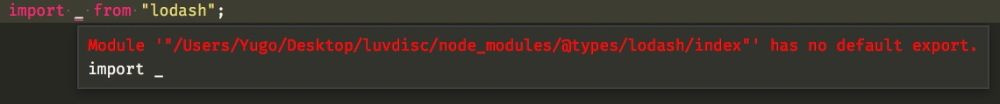
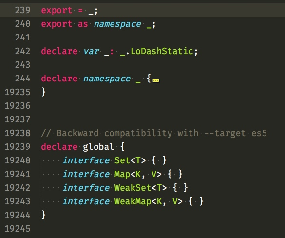

首先要感谢美女 Daisy ，该项目是 Daisy大姐 的 [《HTML5小游戏---爱心鱼》](http://www.imooc.com/learn/515) TS 重构版本。

建议对照源码看教程，假如你要自己写的话，可能你需要很强的 debug 能力。

[源码点我](https://github.com/MiYogurt/luvdisc)

* 首先创建文件夹

```
mkdir luvdisc
```

* 创建存放资源的文件夹


```
mkdir luvdisc/assets
mkdir luvdisc/assets/img
mkdir luvdisc/assets/css
```

* 初始化


```
npm init -y

tsc --init
```

* 安装依赖

```
npm install -D typescript rollup rollup-watch rollup-plugin-node-resolve rollup-plugin-commonjs live-server npm-run-all
```


* 创建 rollup.config.js

关于更多 rollup 的视频，你可以在本站找到。

```
import commonjs from 'rollup-plugin-commonjs'
import nodeResolve from 'rollup-plugin-node-resolve'

export default {
  entry: 'dist/main.js',
  dest: 'bundle.js',
  format: 'iife',
  plugins: [
    nodeResolve({
      jsnext: true,
      main: true,
      browser: true
    }),
    commonjs(),

  ],
  sourceMap: true
}
```

* 修改我们的 package.json 的启动脚本


```
  "scripts": {
    "watch:ts": "tsc -w",
    "watch:bundle": "rollup -c -w",
    "watch": "npm-run-all --parallel watch:ts watch:bundle",
    "serve": "live-server .",
    "dev": "npm-run-all --parallel watch serve"
  },
```

* 修改 tsconfig.json 的编译选项

```
{
  "compilerOptions": {
    "module": "ES6",
    "target": "ES6",
    "noImplicitAny": false,
    "sourceMap": false
  }
}
```

* 新建 dist 目录

* 新建 index.html


```
<!DOCTYPE html>
<html lang="zh-CN">
<head>
  <meta charset="UTF-8">
  <title>Luvdisc</title>
</head>
<body>

  <script src="bundle.js"></script>
</body>
</html>
```

* 新建`src/main.ts`文件


```
console.log('init');
```

* 在终端里面运行


```
npm run dev
```

假如启动失败，`Ctrl+c` 结束再运行就可以了，第一次运行报错是因为没有找到` dist/main.js`导致的。

之后修改一下 main.ts，看是否自动更新。


当我们导入 lodash 的时候，会报错。



这是因为`d.ts`文件太老了，我们修改更新一下，把鼠标移动到 `lodash` 上面按 F12。



我们看到这里是 `export = _`，这种语法已经被抛弃了，把`=`改成 `default` 即可。

如下完成我们的代码。

```
import _ from "lodash";

console.log(_.add( 2, 5))
```

控制台的输出


到这里，环境搭建已经完成了，我们看到，我并没有使用 rollup 的 typescript 编译插件，是因为这个插件在报错之后就失效了，需要我们手动重启，非常麻烦。

而 rollup 的 livereload 监听 dist 下面的文件也存在一定的瑕疵，所以改成了 live-server，直接监听整个项目文件。

最后，项目文件夹会是这样。

```
$ tree -L 1
.
├── assets
├── bundle.js
├── bundle.js.map
├── dist
├── index.html
├── node_modules
├── package.json
├── rollup.config.js
├── src
└── tsconfig.json
```


