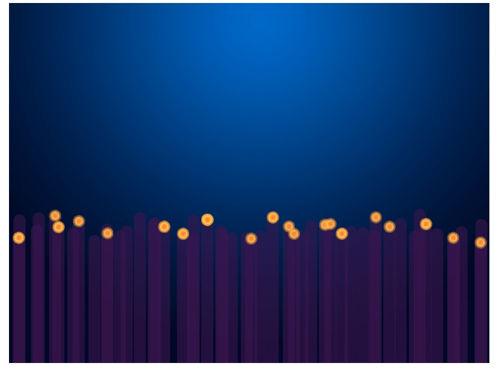

创建 `fruits.ts`，果实是由海葵生成的，所有果实应该出现在海葵


```
import ane from "./anemones";
import { cvs_height, ctx_two } from "./init";

class Fruits{
  num: number = 30; // 绘画果实的数量
  alive: boolean[] =[];  // 判断果实是否存活
  x : number[]= []; // 果实的 x 坐标数组
  y :number[] = []; // 果实的 y 坐标数组
  orange = new Image(); // 黄色果实
  blue = new Image(); // 蓝色果实

  init(){
    for (let i = 0; i < this.num; ++i) {
      this.alive[i] = false;
      this.born(i);
    }
    this.orange.src = 'assets/img/fruit.png';
    this.blue.src = 'assets/img/blue.png';
  }

  // 绘制果实
  draw(){
    for (let i = 0; i < this.num; ++i) {
      // 把果实绘制出来，为了让果实居中，所以要减去图片高度一半，宽度一半
      // 就像实现水平居中一样 left: 50px; margin-left: -(图片宽度 / 2);
      ctx_two.drawImage(this.orange, this.x[i] - this.orange.width / 2, this.y[i] - this.orange.width / 2);
    }
  }

  // 初始化果实的坐标
  born(i){
    let aneId = Math.floor( Math.random() * ane.num ) // 随机拿到一个果实的 ID
    this.x[i] = ane.x[aneId]; // 设置果实的 x 坐标为海葵的 x 坐标
    this.y[i] = cvs_height - ane.height[aneId]; // 设置果实的 y 坐标，为海葵高度的顶点坐标
  }
}

let fruits = new Fruits()

export default fruits;
```

```
// init.ts
import ane from "./anemones";

function init() {
  ane.init()
}
```


```
// game-loop.ts
import ane from "./anemones";

function gameLoop() {
	ane.draw()
}
```

此时我们来重构一下我们的项目，我们发现，每一个绘制累都有一个 init，其实构造器就是一个 init，为什么我们还要多此一举去写一个 init 呢？

所以我们把 init 的内容提到 constructor 里面去，在全局 init 函数里面去 new，然后再导出。

所有需要初始化的，都应该从 init.ts 文件里面导出。

`anemones.ts`


```
import { ctx_two, cvs_height } from "./init";

class Anemones{
  x: number[] = [];  // x 轴的坐标
  height: number[] = []; // 高度

  num = 50; // 绘制数量

  /**
   * 其实就跟在 PS 里面画一样，只不过都是通过代码进行操作，不能通过鼠标进行操作。
   *
   * save() - restore() 做作用就是只对他们之间的代码应用这些画笔样式
   *
   * save() 就相当于暂存一下画笔的状态。开启一个快照，可以对这个快照进行任何操作
   *
   * restore() 恢复之前画笔的状态
   */
  draw(){

    ctx_two.save() // 暂存画笔状态
    // 设置画笔样式
    ctx_two.globalAlpha = 0.6 // 设置透明度
    ctx_two.strokeStyle = '#3b154e' // 设置画笔颜色
    ctx_two.lineWidth = 20; // 画笔的宽度
    ctx_two.lineCap = "round" // 圆角的线

    for (let i = 0; i < this.num; ++i) {
      ctx_two.beginPath() // 开始绘画
      ctx_two.moveTo(this.x[i], cvs_height) // 把画笔移动到 x 点，画布的最下方出，从下往上画海葵
      ctx_two.lineTo(this.x[i], cvs_height - this.height[i]) // 画到 cvs_height - this.height[i] 的地方为止
      ctx_two.stroke() // 确认，开始渲染
    }
    ctx_two.restore() // 恢复之前暂存的画笔状态

  }
  /**
   * 初始化海葵的 x 坐标和高度
   */
  constructor(){
    for (let i = 0; i < this.num; ++i) {
      this.x[i] = i * 16 + Math.random() * 20;
      this.height[i] = 200 + Math.random() * 50;
    }
  }
}

export default Anemones;
```

`fruits.ts`


```
import { cvs_height, ctx_two, anemones } from "./init";

class Fruits{
  num: number = 30; // 绘画果实的数量
  alive: boolean[] =[];  // 判断果实是否存活
  x : number[]= []; // 果实的 x 坐标数组
  y :number[] = []; // 果实的 y 坐标数组
  orange = new Image(); // 黄色果实
  blue = new Image(); // 蓝色果实
  constructor(){
    for (let i = 0; i < this.num; ++i) {
      this.alive[i] = false;
      this.born(i);
    }
    this.orange.src = 'assets/img/fruit.png';
    this.blue.src = 'assets/img/blue.png';
  }

  // 绘制果实
  draw(){
    for (let i = 0; i < this.num; ++i) {
      // 把果实绘制出来，为了让果实居中，所以要减去图片高度一半，宽度一半
      // 就像实现水平居中一样 left: 50px; margin-left: -(图片宽度 / 2);
      ctx_two.drawImage(this.orange, this.x[i] - this.orange.width / 2, this.y[i] - this.orange.width / 2);
    }
  }

  // 初始化果实的坐标
  born(i){
    let aneId = Math.floor( Math.random() * anemones.num ) // 随机拿到一个果实的 ID
    this.x[i] = anemones.x[aneId]; // 设置果实的 x 坐标为海葵的 x 坐标
    this.y[i] = cvs_height - anemones.height[aneId]; // 设置果实的 y 坐标，为海葵高度的顶点坐标
  }
}

export default Fruits;
```

`init.ts`


```
import Anemones from "./anemones";
import Fruits from "./fruits";


let cvs_one: HTMLCanvasElement,
  cvs_two: HTMLCanvasElement,
  ctx_one: CanvasRenderingContext2D,
  ctx_two: CanvasRenderingContext2D;

let cvs_width: number,
  cvs_height: number;

let anemones: Anemones , fruits: Fruits;

const bgPic = new Image();

function getCanvasAndContextById(id: string): [HTMLCanvasElement, CanvasRenderingContext2D] {
  const dom = <HTMLCanvasElement>document.querySelector('#' + id);
  const ctx = dom.getContext('2d');

  return [dom, ctx];
}

function init() {
  [cvs_one, ctx_one] = getCanvasAndContextById('one');
  [cvs_two, ctx_two] = getCanvasAndContextById('two');

  bgPic.src = 'assets/img/background.jpg';

  cvs_width = cvs_one.width;
  cvs_height = cvs_one.height;

  anemones = new Anemones()
  fruits = new Fruits()

}

export default init;

export {
  bgPic,
  cvs_width,
  cvs_height,
  cvs_one,
  cvs_two,
  ctx_one,
  ctx_two,
  anemones,
  fruits
};
```

`game-loop.ts`


```
import { bgPic, cvs_width , cvs_height, ctx_two, anemones, fruits } from "./init";

let lastTime: number = Date.now(), // 记录上一次绘制的时间
    deltaTime: number = 0; // requestAnimationFrame 执行完成所用的时间 = 当前时间 - 上一次绘制的世界

function gameLoop() {
  const now = Date.now()
  deltaTime = now - lastTime;
  lastTime = now;

  console.log(deltaTime);

  drawBackbround()

  anemones.draw()
  fruits.draw()
  requestAnimationFrame(gameLoop);
}


function drawBackbround() {
  ctx_two.drawImage(bgPic, 0, 0, cvs_width, cvs_height)
}

export default gameLoop;
```

重构搞定，这样看起来是不是并不复杂，假如全写在一个文件里面，我们绝对会头皮发麻。




