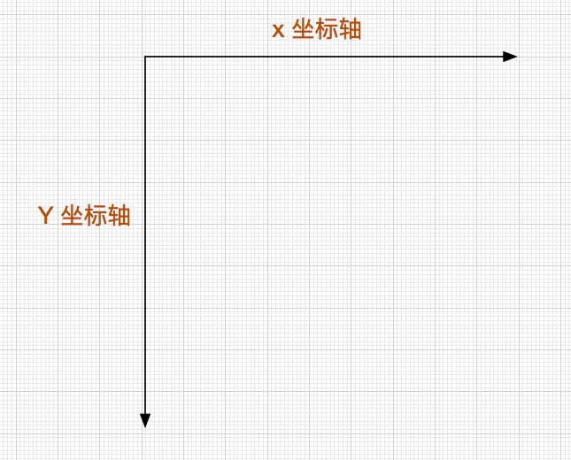
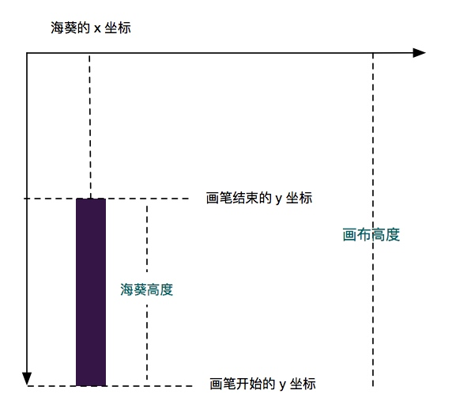
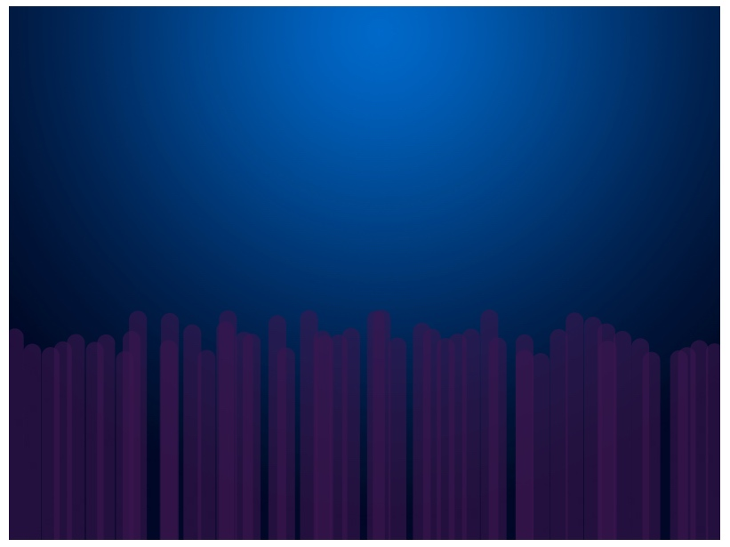

创建 `anemones.ts` 文件

canvas 里面的坐标轴体系。



这里的海葵我们从下往上画。



而对于如何计算，看这幅图，聪明的你应该能理解。


```
import { ctx_two, cvs_height } from "./init";

class Anemones{
  x: number[] = [];  // x 轴的坐标
  height: number[] = []; // 高度

  num = 50; // 绘制数量

  constructor(){

  }
  /**
   * 其实就跟在 PS 里面画一样，只不过都是通过代码进行操作，不能通过鼠标进行操作。
   *
   * save() - restore() 做作用就是只对他们之间的代码应用这些画笔样式
   *
   * save() 就相当于暂存一下画笔的状态。开启一个快照，可以对这个快照进行任何操作
   *
   * restore() 恢复之前画笔的状态
   */
  draw(){

    ctx_two.save() // 暂存画笔状态
    // 设置画笔样式
    ctx_two.globalAlpha = 0.6 // 设置透明度
    ctx_two.strokeStyle = '#3b154e' // 设置画笔颜色
    ctx_two.lineWidth = 20; // 画笔的宽度
    ctx_two.lineCap = "round" // 圆角的线

    for (let i = 0; i < this.num; ++i) {
      ctx_two.beginPath() // 开始绘画
      ctx_two.moveTo(this.x[i], cvs_height) // 把画笔移动到 x 点，画布的最下方出，从下往上画海葵
      ctx_two.lineTo(this.x[i], cvs_height - this.height[i]) // 画到 cvs_height - this.height[i] 的地方为止
      ctx_two.stroke() // 确认，开始渲染
    }
    ctx_two.restore() // 恢复之前暂存的画笔状态

  }
  /**
   * 初始化海葵的 x 坐标和高度
   */
  init(){
    for (let i = 0; i < this.num; ++i) {
      this.x[i] = i * 16 + Math.random() * 20;
      this.height[i] = 200 + Math.random() * 50;
    }
  }
}

const ane = new Anemones();

export default ane;
```


```
// init.ts
import ane from "./anemones";

function init() {
  ane.init()
}
```


```
// game-loop.ts
import ane from "./anemones";

function gameLoop() {
	ane.draw()
}
```



此时你的游戏应该像这样。

