Symbol 就像一个箱子，哪怕里面装的东西是一样的，也是没法相等的，这是因为每一个箱子都是唯一的。

Symbol 产生主要跟`for of`循环有关，而`for of`与`for in`的区别就是，`in` 遍历的是对象的`key`, 而 `of` 则是遍历 `value`。

只要实现了 `Symbol.iterator` 这个接口，就可以通过`for of`遍历。

最简单的例子就是

```
let list = [4, 5, 6];

for (let i in list) {
    console.log(i); // "0", "1", "2",
}

for (let i of list) {
    console.log(i); // "4", "5", "6"
}
```

# 模块导入与导出

我们知道，基本上任何语言的都有相应管理代码导包的机制，不如 java 的 package，php 的 include 和 require 等。

而我们的 js 当可以运行在后端的时候，所以必须要有一种模块加载机制，于是就有了 `cjs` 规范。

而对于前端浏览器环境来说，我们引入 script 是通过标签进行引入的，而我们加载好的库，通常会在全局变量上面挂载某一个变量，比如我们熟知的`$`，然而就是应该这样的方式容易导致模块的命名冲突，假如 `a.js` 和 `b.js` 都想往 `window` 上面挂载一个 `$`对象，这样我们就没法确定这个`$`从哪来的。

所以说我们不得不重视模块的重要性。

在 `ts` 中，我们想要让别人使用的方法就`export`导出。想要使用别人的方法就用`import`导入。

创建我们的 `a.ts` 文件。

```
export function whatsYourName(name: string) {
  console.log(name);
}

export interface StringValidator {
    isAcceptable(s: string): boolean;
}

export const numberRegexp = /^[0-9]+$/;

class ZipCodeValidator implements StringValidator {
    isAcceptable(s: string) {
        return s.length === 5 && numberRegexp.test(s);
    }
}

export { ZipCodeValidator };
export { ZipCodeValidator as mainValidator };
```

其实 ts 跟 es6 的导出基本是一致的。

假如我们像上面这样导出，我们新建一个 `b.ts` 来导入 a 导出的东西。

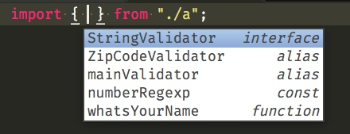

这里就提示了我们所有导出的方法。我们可以看到我用了一个`{}`，其实这就是解构。

我们可以把导出了看做为一个对象`{}`，`export function whatsYourName`，其实就是在导出的对象上面挂载一个`whatsYourName`引用。

当然我们的`export`可以直接写在声明的前面，或者使用先声明后导出的模式。

`export { ZipCodeValidator };` 这种先声明后导出，都需要用 `{}` 包裹起来。

`ZipCodeValidator as mainValidator` 这里的 as 并不是类型转换，而且给导出的取一个别名。


```
export default {
  name: 'a'
}
```

当我们使用这样的 `default` 关键字的好处就是，我并不需要具体知道你类里面有哪些方法，我直接拿，就是拿到的一个默认导出， 也就是`default` 后面的东西，导入的时候不用加`{}`。

`export` 可以多次导出，不过取的时候要用`{}`和它具体的名称，因为只有对应了才能解构。

而`export default`则不需要`{}`，而且你可以给它取任何名称，并且一个模块只能有一个默认导出。


```
import a from "./a";
```

比如这里拿到的 `a`就是`{name:'a'}`

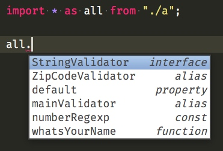

当然我们也可以使用`* as` 这样的语法，把 `a` 模块里面所有 export 导出的都挂载到 all 这个变量上面去。

此时我们再修改一下我们`b.ts`


```
export * from './a';

export const name = 'b.ts';
```

`export * from './a';` 就是把 a 文件里面所有 export 的，再导出一次。

再次新建一个` c.ts` 文件

同样可以得到提示。

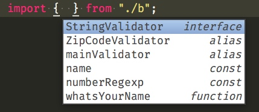

这样是不包含默认导出的。

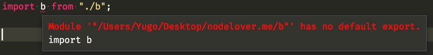

假如想导出 a 的默认导出。

```
import a from './a';

export { a };
```

我们只能这样导出，没人任何其他的简写形式。

我们通过命令

```
tsc --module commonjs a.ts
```

编译得到`commonjs`规范的 js 文件


```js
exports.mainValidator = ZipCodeValidator;
exports.__esModule = true;
exports["default"] = {
    name: 'a'
};
```

多有的 `export` 导出的变成了`exports`上面的属性。而默认导出的挂载到了`default`属性上面。


```
tsc --module amd a.ts
```

而 amd


```
define(["require", "exports"], function (require, exports) {
    "use strict";
    function whatsYourName(name) {
        console.log(name);
    }
    exports.whatsYourName = whatsYourName;
    exports.numberRegexp = /^[0-9]+$/;
    var ZipCodeValidator = (function () {
        function ZipCodeValidator() {
        }
        ZipCodeValidator.prototype.isAcceptable = function (s) {
            return s.length === 5 && exports.numberRegexp.test(s);
        };
        return ZipCodeValidator;
    }());
    exports.ZipCodeValidator = ZipCodeValidator;
    exports.mainValidator = ZipCodeValidator;
    exports.__esModule = true;
    exports["default"] = {
        name: 'a'
    };
});
```

就是在外面加了一个大的 `define` 函数而已，这个函数来自 `require.js`，前端的一个异步加载 js 解决方案。

假如你通过`node`运行会报错，因为此时没有 `define` 函数

以及` umd`，这是一种兼容 `amd` 与 `commonjs` 的做法。通过` node`依然可以运行。

不信你可以自己打印点东西看下。

```
tsc --module amd a.ts
```

```
(function (dependencies, factory) {
    if (typeof module === 'object' && typeof module.exports === 'object') {
        var v = factory(require, exports); if (v !== undefined) module.exports = v;
    }
    else if (typeof define === 'function' && define.amd) {
        define(dependencies, factory);
    }
})(["require", "exports"], function (require, exports) {
    "use strict";
    function whatsYourName(name) {
        console.log(name);
    }
    exports.whatsYourName = whatsYourName;
    exports.numberRegexp = /^[0-9]+$/;
    var ZipCodeValidator = (function () {
        function ZipCodeValidator() {
        }
        ZipCodeValidator.prototype.isAcceptable = function (s) {
            return s.length === 5 && exports.numberRegexp.test(s);
        };
        return ZipCodeValidator;
    }());
    exports.ZipCodeValidator = ZipCodeValidator;
    exports.mainValidator = ZipCodeValidator;
    exports.__esModule = true;
    exports["default"] = {
        name: 'a'
    };
});
```

还有 System


```
tsc --module system a.ts
```

```
System.register([], function (exports_1, context_1) {
    "use strict";
    var __moduleName = context_1 && context_1.id;
    function whatsYourName(name) {
        console.log(name);
    }
    exports_1("whatsYourName", whatsYourName);
    var numberRegexp, ZipCodeValidator;
    return {
        setters: [],
        execute: function () {
            exports_1("numberRegexp", numberRegexp = /^[0-9]+$/);
            ZipCodeValidator = (function () {
                function ZipCodeValidator() {
                }
                ZipCodeValidator.prototype.isAcceptable = function (s) {
                    return s.length === 5 && numberRegexp.test(s);
                };
                return ZipCodeValidator;
            }());
            exports_1("ZipCodeValidator", ZipCodeValidator);
            exports_1("mainValidator", ZipCodeValidator);
            exports_1("default", {
                name: 'a'
            });
        }
    };
});
```

而这个 System 的导出是通过`exports_1("ZipCodeValidator", ZipCodeValidator);`导出的。

第一个参数是导出名称，第二个参数是导出的引用。

现在，你应该都清楚，每一种模式转换之后的 js都是如何导出的了。

其实这些导出，都是挂载到某一个变量下面，集中管理，或许是对象，或许是数组，等需要用的时候，再去根据名字拿就是了。


## 外部模块与内部模块

外部模块，顾名思义，外，表示不属于内部的，对于 ts 语言来说，内部就是 ts 文件，此时的外代表着 js 文件。

我们知道引用 JS 文件，需要为它写 `d.ts` 文件，此时拥有` d.ts`的文件，我们可以把它看做` js + d.ts = .ts`。

而引用 js 或者 ts 文件需要 `import`，我们把所有需要` import`的都叫做引用外部模块。因为模块是基于文件的导入导出的，需要导入的就是来自外部的。


而**内部模块**就代表着 ts 内部的，同时它有一个别名叫做命名空间。命名空间的作用就是把一份代码分割到多个文件。


## 模块的寻找

其实跟 node 寻找模块一样，这里简单的说一下。

它会根据你写的相对路径去找文件。ts 因为需要代码提示，所以它通常会找` d.ts`和`.ts` 文件。

假如你写的是绝对路径，比如` import $ from 'jquery'`这种，我们知道 jquery 并没有`.ts `版本的，但是有人提供了` jquery`的 `d.ts`文件。

在 ts2.0 版本之后，我们直接直接通过` npm install @types/xxx`安装`d.ts`文件。

当我们通过  `npm install @types/jquery` 安装之后，会在我们的` node_modules`里面有个`@types`文件夹，里面存放着我们的` d.ts`文件。

当 `ts` 找不到的时候会来这个目录找，再找不到就报错了，当然你可以定一些它需要寻找的特定目录，比如说你创建一个专门存放` d.ts`的文件夹，然后在` tsconfig.json`配置一下。


`tsconfig.json` 就是我们编译` ts`文件的编译选项。


## 小实验

首先创建一个文件夹` ts-modules`

通过`tsc --init` 生成 `tsconfig.json`

通过`npm init -y` 生成 `package.json`

再安装` jquery`

```
mkdir ts-modules

cd ts-modules

tsc --init

npm init -y

npm install jquery @types/jquery -S
```

创建 `src` 目录，进入再创建我们的` main.ts`

```
mkdir src

cd src

touch main.ts
```

你一定要清楚 ` @types/jquery` 是 `d.ts` 而`jquery` 是 `js`，只有这俩样合起来才能被正常使用。

还有一点你必须要明白，`tsc` 并不会打包代码。

在你的 `main.ts` 里面输入


```
import * as $ from "jquery";

$(document).html("Hello World!");
```

来到` tsconfig.json`，添加一行。

```
"outDir": "./dist"
```

在你的终端里面

```
tsc
```

我们可以看到`dist/main.js`


```
"use strict";
var $ = require("jquery");
$(document).html("Hello World!");
```

此时的 jquery 并没有打包到该文件里面。

此时新建我们的`modules.ts` 和 `namespace.ts`


```
// modules.ts
export const modules_a = 123;
```

```
// namespace.ts
namespace OwnSpace{
  export let var_a = 'own_space';
}
```

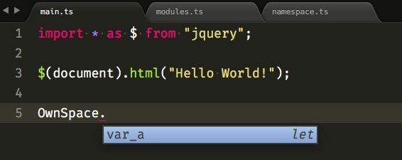

当我们在` main.ts`里面输入 `OwnSpace`的时候，我们发现出现了代码提示。

而` modules.ts` 里面导出的`modules_a`则不会，这是模块与命名空间的一个小区别。

当我们给`namespace.ts`添加一个导出的时候，立刻就报错了。

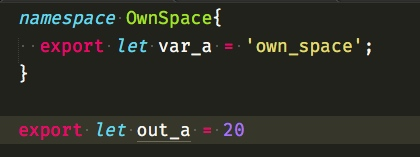

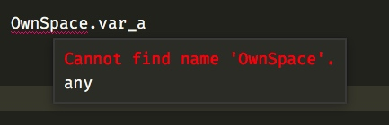

所有我们知道，包含 `namespace` 的外层不应该有 `export`，要不然就变成模块了。

当然` namespace` 里面的变量只有导出才能被访问。

`tsc` 编译一下

来看看我们编译出来的命名空间

```
var OwnSpace;
(function (OwnSpace) {
    OwnSpace.var_a = 'own_space';
})(OwnSpace || (OwnSpace = {}));
```

其实他就是自执行函数，然后给他挂载一些变量而已。

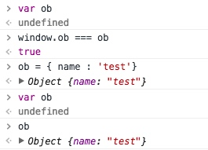

其实就跟这里演示的一样，通过` var`其实就是挂载到了` window`变量上面。

而多次通过` var`声明并不会报错。

修改一下` namespace.ts`


```
namespace OwnSpace{
  export let var_a = 'own_space_b';
}

namespace OwnSpace{
  export let var_b = 'own_space_b';
  let inner_b = '123';
}
```

编译出来的会像这样。


```
var OwnSpace;
(function (OwnSpace) {
    OwnSpace.var_a = 'own_space_b';
})(OwnSpace || (OwnSpace = {}));

(function (OwnSpace) {
    OwnSpace.var_b = 'own_space_b';
    var inner_b = '123';
})(OwnSpace || (OwnSpace = {}));
```

只有 `export` 出来的变量才会挂载到`OwnSpace`变量上面。

此时我们再新建一个` name2.ts`


```
namespace OwnSpace{
  export let var_c = 'own_space_c';
}
```

编译之后，在 `dist`目录新建一个 `index.html`


```
<meta charset="utf-8">

<script src='namespace.js'></script>
<script src='name2.js'></script>

<script>
  console.log(OwnSpace);
</script>
```

用浏览器打开它，并打开控制台

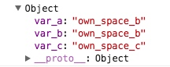

`namespace.js` 挂载了`var_a ` 和 `var_b`
`name2.js` 挂载了 `var_c`

我们看到所有的命名空间下面的东西都是通过`.`来访问的，我们可以认为命名空间就是一个对象。

**所以 namespace 有什么作用呢？**

其实非常明显他就是往 `window` 上面挂载某些变量，就像 `jquery`。

当你在 html 中引入` <script src='xxxxxxx/jquery.js'></script>` 它就会往window 上面挂载一个`$`

其实这样非常鸡肋，容易造成全局命名空间污染，而且现在都有打包工具了，没必要这么干，之所以会有 `namespace` 可能是为了方便为已有的` js`库写` d.ts`。

所以大多数时候你是用不到 `namespace` 的。

# 配置 d.ts

typescript 的代码核心就是` d.ts`，所以说只要` d.ts`写的好，走遍天下都不怕。


## 继续小实验

在之前的小实验里面，再新建俩个文件，`some.d.ts`、`some.js`


```
// some.d.ts
declare const name : string;
export default name;
```


```
// some.js
export defalt const name = 'hello world';
```

在` main.ts` 文件里面


```
import name from './some';
```

这里我们使用的是相对路径。这样是正确无误的。

创建`test.d.ts`,定义一个外部模块。外部模块是不是需要 import 的啊？

我们发现这里有一个双引号


```
declare module "lodash"{
  export let version : string;
  let _ : any;

  export default _;
}
```

在 `main.ts`中

```
import { version } from "lodash";
```

这里的双引号就和之前的对应，你会发现这里没有相对路径，而是直接 `"lodash"`。

这里之所以能找到是因为它们在同一个目录。

而这寻找，他会遍历你项目里面的文件，你不信可以把这个文件移动到项目根目录下。

其实编译器会在 `main.ts`文件的头部会自动添加一个这样的编译指令，尽管现在你是看不到它的。

这个指令会告诉编译器去哪寻找` d.ts`文件，表示这个文件使用了`d.ts`里面声明的名字； 并且，这个包要在编译阶段与声明文件一起被包含进来

```
/// <reference path="../test.d.ts" />
```

在你的 `tscofig.json` 里面配置这一项。

```
"listFiles": true
```

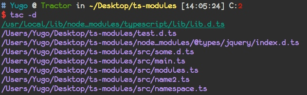


而且还可以配置去哪找，分别是 `typeRoots`和 `types` 选项。

所有的选项都在这


```
https://www.tslang.cn/docs/handbook/compiler-options.html
```

而关于编译器怎么遍历`.d.ts`目录。

在你的 `tscofig.json` 里面配置这一项。

```
"traceResolution": true
```

再次编译你就可以看到打印出了寻找路径。

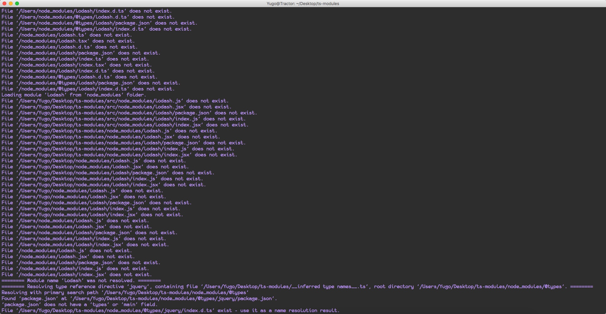


里面还有非常多的配置选项，自己去尝试一下，算是留给大家的课后作业。

学习的最好办法就是尝试。


