## 函数声明

首先新建你的`func.ts`文件

函数声明有俩种方式，一种是拥有具体函数名字的，一种是没有名字的。

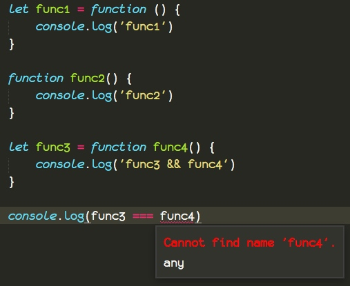

从这段例子我们可以看到。

* `func1` 是一个匿名函数，因为`function`关键字后面没有跟着名字，而是使用一个变量来保存这个匿名函数的引用。

* `func2`是一个拥有具体名称的函数

* `func3` 和 `func4` 是俩种的混合，这里报了一个错误，说没有找到`func4`，说明匿名函数的优先级要比具体名称的函数高。

## 函数修饰与函数类型

对于函数来说，我们修饰它们什么东西呢？

参数类型，返回值类型。它们2个合起来就修饰了函数的类型。

```
let add1 = function(x: number, y: number) : number {
	return x + y;
}

function add2(x: number, y: number) : number {
	return x + y;
}
```

以上就是我们函数的俩种写法，修饰参数，在参数名后面加`:`修饰类型即可，而修饰返回值`() : ` 则在方法`()`的后面加`:`即可，因为这个值需要在方法调用之后才会有，所以要写在后面。

具体怎么读，就不再赘述，根据前面的经验，你应该知道。

我们知道，尽管我们没有描述 `a`的类型，`let a = 2` 这样的代码是不会报错的，因为编译器已经推断了 `a`的类型。

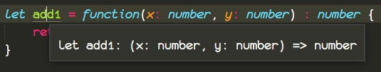

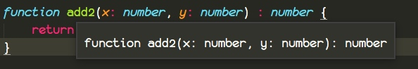

把你的鼠标放在`add1` 和 `add2`上面，就可以看到函数的类型，我们发现匿名函数与具名函数的类型是有一定差异的。

在 `ES6` 中 `() => {}` 代表着匿名函数，这是一种新语法，`ts`同样兼容它。

```
let add3 = (x, y) => x + y

let add4 = (x, y) => { return x + y }

let add5 = (x, y) => { x + y }
```

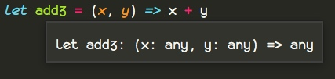

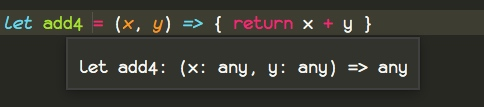

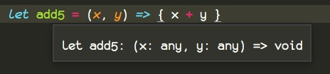

我们可以看到`ts`都帮我们把函数的类型给推导了出来，同时从上面的例子我们可以看出有没有`{}`的区别，没有`{}`的时候，会把这一条语句的值作为函数的返回值。

所有我们完整的，拥有函数类型的推导一个像这样。

```
let add1 : (a: number, b: number) => number = function(x: number, y: number) : number {
	return x + y;
}
```

而具名函数我们是没法通过这种语法修饰的，我们可以看到上面的代码，我们用了`a`、`b`，这里只是一个名字而已，`ts`仅仅只会去匹配参数的类型，而不会限定你参数名具体叫什么。

假如我们强行修饰的话！我只能说强行装逼会进医院的。

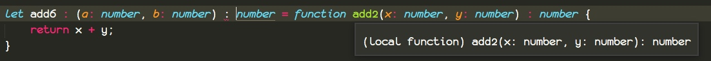

就会像这样，尽管`add2`自动推断出来的类型是`(x: number, y: number) : number` , 当我们使用 ` = ` 接受这个类型的时候，还是个匿名函数，所以我们这里`() :` 会报错，这样做会忽略掉 `add2` 推断出来的类型，这种做法没有任何意义。

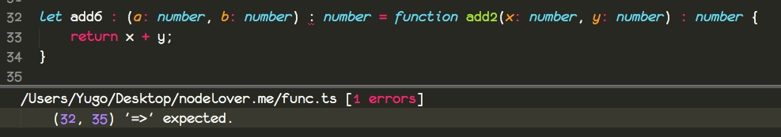

错误提示我们应该把`:`改成`=>`

这里我们把 `=>` 读作流出，他就像流程图里面的流程。

`(x: number , y: number) => number`

读作，当我们访问需要传递一个 `number` 的`x` 和 `y` 参数的匿名函数时候，会流出一个一个`number`的返回值。

 哎，我邪恶了，想到了不好的东西。流鼻涕好邪恶。

假如你真的需要修饰语描述具名函数，你应该用`interface`

```
interface Add{
	(x: number, y: number) : number
}

let add6 : Add

add6 = function add2(x: number, y: number) : number {
	return x + y;
}
```

对于函数的修饰来说，我们可以写在左边，也可以写在右边


```
let add7 : (x: number, y : number) => number = function (x, y) {
	return x + y;
}
```

```
let add8  = function (x: number, y : number) : number {
	return x + y;
}
```

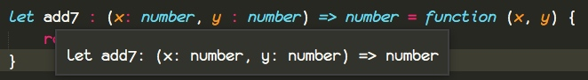

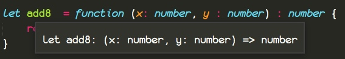

类型都是可以正常推断出来的。

## 参数的可选与默认值

可选的参数是不能放在第一个的,除非你所有参数都是可选的。
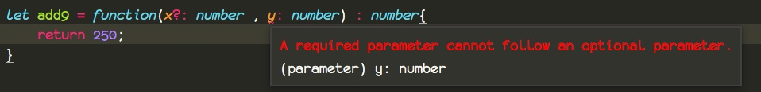

给参数添加默认值，直接写`=`即可，同时因为直接就赋值了，所以`ts`是可以推断出类型的，`number`是可以省略的。
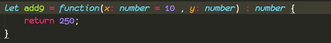


## 剩余参数

你应该记得我们的`...`大招，一波全部带走。

系统默认是给我们推断成限制最小的 `any[]`

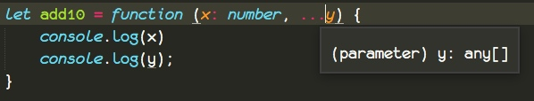

贴上代码

```
let add10 = function (x: number, ...y) {
	console.log(x)
	console.log(y);
}

add10(1,2,3,5,9,6,8)
```

打印出结果

```
1
[ 2, 3, 5, 9, 6, 8 ]
```

这是没有问题的吧，我们再来学点关于`...`的新内容，循序渐进。

`...` 还可以展开数组和展开对象，这样我们就可以实现拷贝数组和对象

```
const arr = [1,2,3]

const copyArr1 = [...arr , 4 , 5]
const copyArr2 = [ 4 , 5 , ...arr]

const obj = { a : 1 , b : 2 };

const copyObj1 = { c: 3 , a : 5, ...obj}
const copyObj2 = { c: 3 , ...obj ,  a : 5 , d : 20}

console.log(copyArr1)
console.log(copyArr2)

console.log(copyObj1)
console.log(copyObj2)
```

```
...arr = 1,2,3
...obj = a: 1, b: 2
```

```
[ 1, 2, 3, 4, 5 ]
[ 4, 5, 1, 2, 3 ]
{ c: 3, a: 1, b: 2 }
{ c: 3, a: 5, b: 2, d: 20 }
```

当`...`面对的是一个数组的时候，把`...arr`写在前面，它的值就位于数组的前面，而写在后面，它的值也就位于数组的后面。

当`...`面对的是一个对象的时候，把`...obj`写在后面，假如存在相同的属性名称，`obj`就会覆盖前面的属性。

属性覆盖的原理非常的简单，后面覆盖前面请看下图。

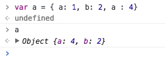

## 作用域

我们知道`TS`的使用者大多数都是后端语言开发者，所以通常会对`this`产生困惑，而`this`理解不理解意味着你的`js`有没有入门。

在将 `this` 之前，我们先看一看作用域。

通常我们所知的作用域有全局作用域，也就是我们的文件，你可以把文件看成一个被`{}` 包裹的代码。块作用域，有`function(){}` `if(){}`等等包含`{}`的，其中每一个`{}`都是一个作用域。

接下来我们写下这么一段代码，它会报错，因为在外层的作用域里面找不到`b`变量。

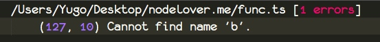


```
{
	// 我
	let a = 1;
	{
	   // 敌人
		let b = a;
	}

	let c = b;
}
```

敌暗我明，对待这样的敌人，我们需要特别的谨慎。

敌人在暗处，可以看到我们所有的变量，但是我们却不知道敌人是怎么个情况。


## This

`this` 语义就是这，在编程中表示自己。

在`js`中，你只需要记住谁调用的，`this`就指向谁，也就是`.`前面的对象，假如没有`.`，默认补一个`window.`;

对于`()=>{}`的匿名函数来说，`this` 会提前绑定，看此刻是谁调用的它。而不是等调用的时候，去看谁调用的它，在去指定`this`

讲道理`()=>{}`里面是没有`this`的，它的 `this` 是从上一个作用域（父作用域）里面拿到的。

### 小实验

**代码**

```ts
let someObj = {
	a() {
		console.log(this);
	},

	b: () => {
		console.log(this);
	}
}

let w1 = someObj.a
let w2 = someObj.b

w1()

w2()

someObj.a()
someObj.b()

let someObj2 = {
	name: 'yugo',
	a: () => { }，
	b: () => { },
}

someObj2.a = someObj.a
someObj2.a()

someObj2.b = someObj.b
someObj2.b()
```

把编译好的代码，嵌入到 `html` 文件里面去，打开控制台，这样便于观察。

结果如下

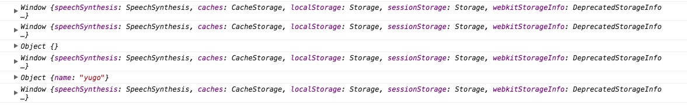


* w1() 打印出了`window`

	这其实非常的正常`w1`拿到的是 `a`函数的引用，根据我们的没有`.`加上`window.`。 此时就是`window.w1()`，也就是 `window` 调用的 `w1` 所以理所应当也是打印出`window`

* w2() 打印出`window`

  你以为原理和w1一样是吗？其实并不是,对于 `()=>{}`，我们来看此时，是谁调用的`b`,相当于，抛弃本身的作用域，查找`b`的父级作用域。

 此时情况变成了

 ```
 windos.someObj = {
  	  // 找 this
 }
```

`someObj`的`this`是谁？此时`this`理所应当的指向了`window`


* someObj.a()
	打印了对象自己,也就是`someObj`，根据上面的，这是理所当然的。

* someObj.b()
	打印了`window`，因为`()=>{}`在声明的时候就绑定了`this`，而这个声明时候的`this`指向的是 `window`

	对于`()=>{}`的`this`指向，我们看一看编译出来的`js`就瞬间明白了。

	```
	var _this = this;

	....

	var someObj = {
	    a: function () {
	        console.log(this);
	    },
	    b: function () {
	        console.log(_this);
	    }
	};
	```

	其实`ts`是声明了一个临时变量去保存这个`this`。

	而没有`.`的默认添加`window.`,所以默认`this`就是`window`

* someObj2.a()

	 打印`someObj2`，这个应该咩问题吧！


* someObj2.b()

	无论 `b` 怎么赋值，`b` 函数里面的`this`都被替换成了`_this`变量，而`_this`都指向`window`


## 函数重载

当我们一个函数可以接受多种类型的参数的时候怎么办？这个时候就要用到我们的函数重载了。

简单的来说就是，把每一种特定的函数声明写出来，最后实现一个能够处理所有参数类型的函数。这样有点拗口。

那就通俗来说，实现一个可以可以煮很多东西的电器，然后在使用说明书上面说明，支持煮哪些东西。

代码如下

```
// 我可以处理传入 string 类型的 food
function cookingSomeThing(food: string) : void;

// 我可以处理传入 string 数组类型的 foods
function cookingSomeThing(foods: string[]): void ;

// 我是如何处理的
function cookingSomeThing(food) : void{
	if(typeof food === 'string') {
		console.log('food is string');
	}

	if(Array.isArray(food)) {
		console.log('food is array');
	}
}

cookingSomeThing('chicken')
cookingSomeThing(['chicken','beef'])
```

我们需要实现一个万能的函数，可以处理所有状况。

自己写一个煮菜函数吧，对于传入 `class Chicken` 该怎么处理，而对于传入`class Beef`怎么处理你自己决定，还可以添加一些你想要的功能。

试一试这样的写法，联合类型

```
function cooking( food: Chichen | Beef ) : any {

}
```

这样是不是避免了很多声明代码，更多细节以后再谈。

答案在这里

```
class Chicken{}
class Beef{}

function cooking(c : Chicken) : any ;
function cooking(b : Beef) : any ;

function cooking(food) : any{
	if(food instanceof Chicken) {
		console.log("第一步： 杀鸡取卵");
		console.log("煮鸡肉呀~ 我最喜欢吃~");
	}

	if(food instanceof Beef) {
		console.log("牛肉不能煮太久，要不然不好吃了")
		console.log("哎呀~ 这肉被我煮黑了。");
	}
}

let c = new Chicken()
let b = new Beef()

cooking(c)
cooking(b)
```

这是 pro plus 版本

```
class Chicken{}
class Beef{}

function cooking(food : Chicken | Beef ) : any {
	if(food instanceof Chicken) {
		console.log("第一步： 杀鸡取卵");
		console.log("煮鸡肉呀~ 我最喜欢吃~");
	}

	if(food instanceof Beef) {
		console.log("牛肉不能煮太久，要不然不好吃了")
		console.log("哎呀~ 这肉被我煮黑了。");
	}
}

let c = new Chicken()
let b = new Beef()

cooking(c)
cooking(b)
```

你还可以尝试，在俩个 class 里面添加一些属性，看看在`cooking`里面的 food 的代码提示是怎么样的。

答案就是，`food instanceof Chicken` 里面的会提示 `chicken` 的属性，外面则不会，同样`food instanceof Beef` 里面的会提示 `beef` 的属性，

## 自我总结

接下来看你的了。

讲道理，我已经都会了，还每一段代码我都会自己写出来，我一点都没有偷懒，你们都还没懂其中的门道，那就更需要练习了，连我都没偷懒，你们就更不应当偷懒了。


