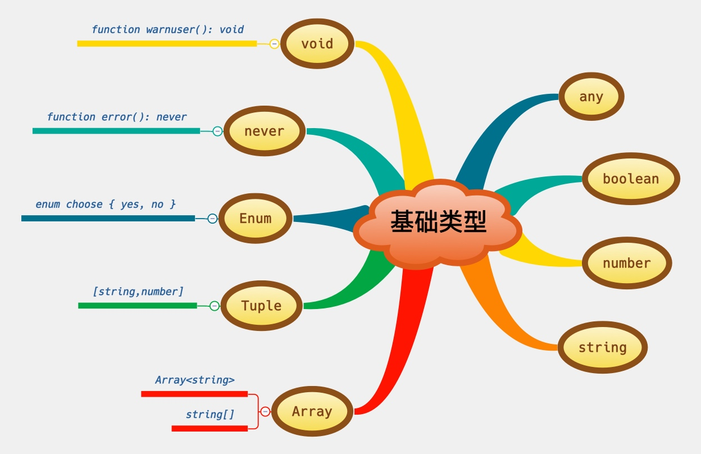
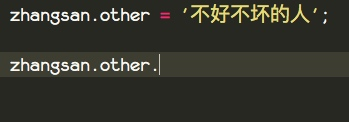
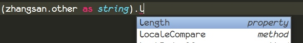
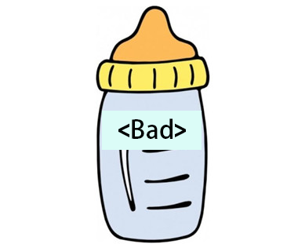
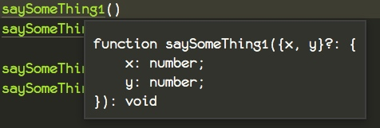
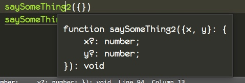
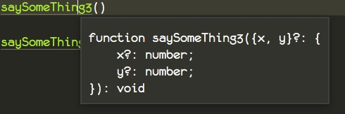

新建我们的`person.ts`，我们通过这一个文件，使用所有的基础类型。
## 实验

### 实验一

#### 代码
```
enum Choose { Wife = 1, Mother = 2} // 选择 妻子 还是 妈妈

function question(choose: Choose) : void{
    console.log('你老婆和你妈妈同时掉进水里你先救哪个?');
    console.log('你的选择是： ' + choose);
}

question(Choose.Mother)
```
#### 解释
首先用关键字 `enum`声明了一个 `Choose` 的枚举，可以选择的是救落水的妈妈还是妻子。

在枚举`enum`中，我们可以对里面的选项赋值，假如不赋值的话，默认从0开始，一直自动递增。

#### 结果
编译运行之后，我们发现 `choose.Mother` 的值其实是 2

```
你老婆和你妈妈同时掉进水里你先救哪个?
你的选择是： 2
```


### 实验二

#### 代码
```
class Person{
    name: string; // 名字
    age: number; // 年龄
    labels: Array<string>; // 标签组
    wives: string[]; // 妻子们
    contact: [string, number]; // 元组 联系[联系地址，联系电话]
    other: any; // 备注
    saveMonth: boolean = true; // 是否救落水的妈妈
    constructor(){}
    answer() : Choose{
        if (this.saveMonth === false){
           return Choose.Wife;
        }
        return Choose.Mother;
    }
    hello() : void{
        console.log('hello~ i\'m ' + this.name);
        // return undefined;
        // return null;
    }
    empty(){}
    down() : never {
        while (true){}
        // throw new Error('error')
    }
}

let zhangsan = new Person();

zhangsan.name = "张三";
zhangsan.age = 28;
zhangsan.labels = ["颜值逆天", "年轻多金"];
zhangsan.wives = ["一号","二号","三号"];
zhangsan.contact = ["北京xxxxxxx别墅", 2];
zhangsan.saveMonth = false;
zhangsan.other = '不好不坏的人';

let len = (<string>zhangsan.other).length;

console.log(len);
question(zhangsan.answer());

zhangsan.hello();

console.log(zhangsan.empty());
```
#### 解释
这里我们声明了一个 `Person` 的类，包含了一下属性。

* `name` 名称
* `age` 年龄
* `labels` 标签数组，每一个人都可以打上一些标签，代表一个人的特点
* `wives` 妻子数组，可以是一个，也可以是很多个，取决于个人的道德
* `contact` 联系方式，这是一个元组，语法跟数组类似，只不过提前规定了数组里面每一项的类型，所以说我们只能按照规定传入。
* `saveMother` 是否救妈妈
* `other` 备注，这是一个 `any` 类型表示任意类型

和以下方法

* `answer` 根据 `saveMother` 这个属性去回答之前的问题。
* `hello` 打招呼，我们限定了返回值是 `void` ，你可以解开注释，你会发现 `void` 可以接受 `null` 和 `undefined` 的返回值。
* `empty` 这是一个空的方法，用来查看函数的默认返回值
* `down` 方法返回 `never`，表示不会结束，或者出错。（非常不常用）


这里我们构造了一个虚拟的年少多金的张三，给他赋值了一些属性。

**为什么需要`any`类型？**
> 假如我们需要用户输入一段值，它可以是数字还可以是字符串，请问我们该把它定义成什么类型呢

当我们去访问 `any`类型的 `other` 的时候，`ts` 并不知道此时的`other`是 `string` 类型，所以它不会提示 `string` 的相关方法。


**当我们已经知道 any 的变量，具体为什么类型的时候怎么办？**
答案是，强制转换。

第一种方法

```
<string>zhangsan.other
```

第二种方法

```
zhangsan.other as string
```

此时我们随便选一种方法进行测试，我们发现，代码编辑器立刻就显示了`string`上面可以操作的一些方法。



#### 结果
编译之后。我们可以得到一下结果

```
6
你老婆和你妈妈同时掉进水里你先救哪个?
你的选择是： 1
hello~ i'm 张三
undefined
```

说明 `empty` 默认方法返回的是 `undefined`


## 定义变量

```
let zhangsan = new Person();
```

这里我们使用 `let` 定义变量，而不是 `var`，因为`var`存在一些缺陷，所以被废弃掉了。

## 定义常量

```
const PI = '3.1415926'
```

不变的值就用 `const` ， 声明变量之前，请先问自己一句，这个值需要修改吗？

## 声明类型

```
let 变量名称 : 变量类型 = 变量的值
let word : string = 'how'
```

`:`冒号这个标点符号，在语义中的作用就是，对冒号之前的东西进行解释和阐述。

比如

```
 let 我： 宇宙超级无敌大帅哥 = DevOps
```

同样我们可以这样来读

```
宇宙超级无敌大帅哥的我是一个 DevOps
```

同理

```
string 类型的 word 是 'how'
```

变量类型可以是

* number
* string
* 某类型数组 -> `某类型[]`   `Array<某类型>`
* boolean
* 元组
* any

同样对于方法来说

```
hello() : void
```

在编程的世界里面`()`常常跟函数，方法一起出现，所以我们这里把它读作方法

同时`:`对方法和函数的解释就是告诉你它的返回值

```
hello 方法 返回 空
```

```
hello -> hello
() -> 方法
: -> 返回值
void -> 空
```

读起来就是，hello方法的返回值是空

## 类型转换

```
<string>zhangsan.other
```

`<string>` 我把它看做为 `zhangsan.other` 打上一个标签。

我给你打上什么类型的标签，你就是什么类型。

就像这幅图一样，宝宝在尝了一口这个奶瓶里面的奶之后，立马给它打了一个`<Bad>`标签，表示不好喝，同时再给宝宝喂的时候，宝宝极力的晃脑袋。




```
zhangsan.other as string
```

而这个方式则比较简单， `as` 的中文意思就是作为，如同什么一样。

我让你作为是 string 就是 string，就是要让你像 string 一样。

```
zhangsan.other 如同 string 一样
```

同理我们来改一下套马杆的`飞驰的骏马像疾风一样`

```
飞驰的骏马 as 疾风
```

这是不是很程序员！！


## 变量解构

小小的解构里面大学问，很有讲究。

相亲讲究个门当户对，解构讲究个对称。

#### 增加你的代码
```
let [ a, b, c] = [2, 8 , 16]

console.log(a, b , c)
```

**结果**

```
2 8 16
```

`=` 就像镜子一样，let 的这一边放什么变量，就可以得到右边的值。

#### 栗子一


这一次我们以非诚勿扰为例，公开约~，刺激奔放。

此时我们的男嘉宾`Alex`上场了，他是来自.........，

此时我们跳过所有无关情节，最终16号为他留灯。

此时 `Alex` 就像这样

```
let [ , , Alex ] = [ 2, 8, 16 ]
```

 结果 `Alex` 成功把 16 号带走了，回家生猴子去了。


#### 修改你的代码

```
let [ Alex, ...X ] = [ 5, 7, 12, 18 ];

console.log(Alex)
console.log(X)
```

```
5
[ 7, 12, 18 ]
```

#### 栗子二

男嘉宾 Alex 因为房钱谁给的原因，跟女嘉宾打起来了，立刻就闹掰了，或许这是预谋好的，谁又知道呢？Alex 继续联系导演，导演决定让年少多金的 Alex 再次上场。

....

 5号，7号，12号，18号为 Alex 留灯了。

Alex 直接走向了 5 号，对于其他的看都没看一眼，成功带走。

此时神秘嘉宾 X 先生发动大招 （...）操作符，把剩余亮灯的女嘉宾全带走了。

记住 ... 后面要跟上变量的名字，这种好用的流氓大招，你应该要记住。

#### 修改你的代码

这样的定律对于对象是同样适用的，记得是修改你的代码，要不然重复定义变量会报错的。

```
let { a, ...b } = { a:'string a', b: 'string b',c: 'string c' };

console.log(a)
console.log(b)
```

```
string a
{ b: 'string b', c: 'string c' }
```

假如我们想换一个名字呢？


```
let { a, ...b } = { a:'string a', b: 'string b',c: 'string c' };

let x = a;
```
假如像上面这样，就感觉特别麻烦，所以我们可以像下面这样解构。

```
let { a: x, ...b } = { a:'string a', b: 'string b',c: 'string c' };

console.log(x)
console.log(b)
```


当然我们还可以放到函数中去，当做函数的 **默认值**。

```
function somefunc({ a: x, ...b } = { a:'string a', b: 'string b',c: 'string c' }) {
    console.log(x)
    console.log(b)
}
```

还可以这样，在调用的时候再传

```
function somefunc({ a: x, ...b }) {
    console.log(x)
    console.log(b)
}

somefunc({ a:'string a', b: 'string b',c: 'string c' })
```

其实原理还是对称，理他就是这个理，话操理不操。

#### 小实验
##### 代码

```
function saySomeThing1({ x , y } = {x : 0, y: 0}) {
    console.log(x, y)
}

function saySomeThing2({ x = 0 , y = 0 }) {
    console.log(x, y)
}

function saySomeThing3({ x = 0 , y = 0 } = {x:2,y : 2}) {
    console.log(x, y)
}

saySomeThing1()
saySomeThing1({ x: 3 , y: 3 })

saySomeThing2({})
saySomeThing2({ x: 3 , y: 3 })

saySomeThing3()
saySomeThing3({})
```

##### 解释
你可以看到这3种是不一样的，`saySomeThing2`要求我们必须传递参数，其他的则不会。

把鼠标移动到`saySomeThing1`和`saySomeThing2`、`saySomeThing3`上面，它会出现这个函数的定义。






这里我们只做简单的说明，更多信息放到后面说，`?`代表的意思就是可选的意思。

因为第一个函数是一个默认对象，所以导致对象可以不传，第二个函数是有默认的属性，所以导致属性可传可不传。第三个就是前俩个的合体。

##### 结果

```
0 0
3 3
0 0
3 3
2 2
0 0
```
## 总结

这节完成之后，你应该明白了 Typescript 的基本类型，和如何声明变量，以及变量的解构。关于`...`的更多用法后面会再次讲解。

