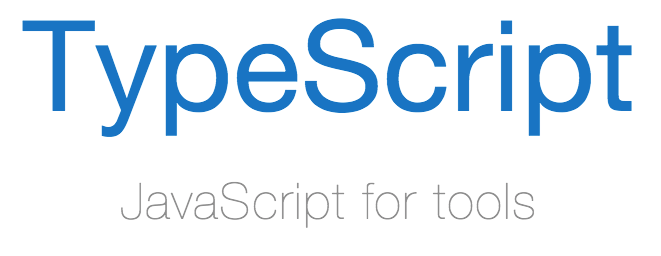
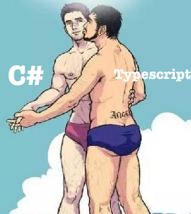
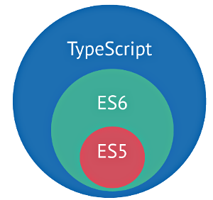
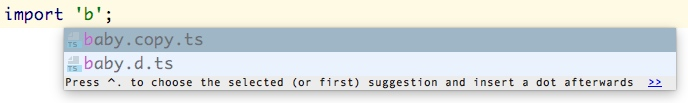
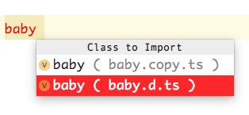
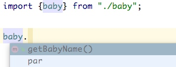

让我们带着问题，去寻找答案。

我们的目标是玩烂`ts`。

> 需要一定的 JS 基础，或者后端面向对象语言（JAVA、PHP、C#等都行）的基础


##  ts 安装与更新
首先我们安装我们的`typescript`命令行工具，同样你也可以使用该命令更新版本。

```bash
npm install -g typescript
```

它会给我们安装`tsc`这个命令，它是`typescript compile`的缩写

## 婴儿的第一声啼哭
切换到你的工作目录，创建一个`nodelover.me`的文件夹，再在文件夹里面创建`baby.ts`文件

```ts
class Baby {
	constructor() {
		console.log('小宝贝正在哭泣，哇哇哇哇哇~~~')
	}
}

let baby = new Baby();
```

这段代码非常的简单，声明了一个叫`Baby`的类，每次通过`new`实例化的时候，会自动调用`constructor`方法，也就是小孩的第一声啼哭。

编译`ts`文件，你会得到一个`js`文件

```bash
tsc baby.ts
```


> 你需要记住的是，ts 文件是不能直接运行的，能运行的是 js 文件，无论你的 js 文件是运行在浏览器中，或者是 node 环境中，也就是说 ts 的编译器并不关心你编译之后的 js 文件运行在哪。


运行的的`baby.js`文件

```bash
node baby.js
```
你会得到这样的显示

```
小宝贝正在哭泣，哇哇哇哇哇~~~
```

## 哪儿来的 typescript
看看我们的 `js` 文件

```js
var Baby = (function () {
    function Baby() {
        console.log('小宝贝正在哭泣，哇哇哇哇哇~~~');
    }
    return Baby;
}());
var baby = new Baby();
```

对于很多后端语言的开发者来说，`function Baby(){}` 就是一个类，这非常令人难以理解，简直就是破坏宇宙的和平。


在 `typescript` 之前，还有一种语言叫`coffeescript`。


于是微软公司的员工就想，能不能我也搞一个像`coffeescript`这样的，把自己的语言文件编译成`js`再运行呢？所以微软为了维护宇宙的正义与和平，创造出了`typescript`语言。




因为微软主推的是`C#`语言，所以 `typescript`的语法，基本上与`C#`的差异不大，简直海尔兄弟。



慢慢的`js`升级换代了，出了个`es6`，微软波澜不惊的抽了根烟，淡淡的说：
“好吧，你升级换代了我也不怕，我针对你的`es6`，不仅吸收你的新特性，我还可以编译成`es6`的样子，分分钟秒杀你。”

所以说在 `typescript` 里面直接写 `es6` 语法的 `js` 基本是没有什么问题的。




于是微软公司的员工又开始想了，写 `js`没有代码提示，开发效率简直就是战斗力为五的渣渣，所以 `typescript`就沿用了`C#`那套代码提示，于是问题来了。

假如我要引入的代码是`js`文件而不是`ts`文件，那代码提示怎么办？

## 代码提示的秘密 d.ts

给我们的`baby.ts`添加一些代码

```
export class Baby{
	private _name: string;
	constructor(name: string){
		this._name = name;
		console.log('小宝贝正在哭泣，哇哇哇哇哇~~~')
	}

	static smile(){
		console.log('O(∩_∩)O哈！')
	}

	public getBabyName() : string{
		return this._name;
	}
}

export let baby = new Baby('Nico');
```
代码非常的简单，导出了一个 `Baby` 类，和一个叫 `baby` 的 `Baby`实例。

`Baby` 包含一个私有的字段`_name`，静态的方法`smile`，公开的方法 `getBabyName`,
在通过`new`调用`constructor`的时候，会初始化我们的`_name`，而`getBabyName`就是拿到我们私有的`_name`，之所以需要`getBabyName`，是因为通过`private`关键字指定的私有字段和方法，在实例中是无法访问的。


再次编译`ts`文件，这次我们加上`-d`选项

```bash
tsc baby.ts -d
```

你会发现我们多出了一个`baby.d.ts`文件

> 大多数 ts 初学者会这样问：
> 请问一下各位，如何在 ts 文件里面，引入已经写好的 js 文件呢？

答案就在这里，`d.ts`文件，

```
export declare class Baby {
    private _name;
    constructor(name: string);
    static smile(): void;
    getBabyName(): string;
}
export declare let baby: Baby;
```

我们发现`baby.ts`里面所有的方法声明都被导入到了`d.ts`文件里面，而我们的 `typescript`恰恰就是通过这个`d.ts`文件进行代码提示的。

因为我们的`ts`文件可以直接通过`-d`进行生成，而其他的`js`库呢？只有我们自己去看着 API 去写`d.ts`文件了。


### 实验

* 重命名一下我们的`baby.ts`，把它改成`baby.copy.ts`

```
mv baby.ts baby.copy.ts
```

此时我们只剩下`baby.js`，`baby.d.ts`文件了了。

* 新建`main.ts`文件
当使用`import`导入的时候，`webstorm`会自动提示你的`baby.d.ts`;



* 输入 `baby`,他会提示你要导入哪一个文件里面的，这里我们选择`baby.d.ts`;



此时我们立刻就看到了 `getBabyName` 方法的提示


完整的代码应该像这样

```
import {baby} from "./baby";

console.log(baby.getBabyName())
```

* 编译`main.ts`

```
tsc main.ts
```

* 查看并运行`main.js`

```
"use strict";
var baby_1 = require("./baby");
console.log(baby_1.baby.getBabyName());
```

```
node main.js
```

```
小宝贝正在哭泣，哇哇哇哇哇~~~
Nico
```

## 总结

这一节我们了解了

### typescript 的特点

> 跟好兄弟 C# 类似，是静态类型的，拥有代码提示，ts 并不能运行，只有编译成 js 文件后，运行 js 文件

### typescript 的起源

> 因为后端人员写 js，简直反人类，所以微软搞出了 ts

### typescript 代码提示

> 秘密在于 d.ts 文件


