TS 玩的顺溜不顺溜，就看你的 d.ts 文件写的溜不溜。

在学如何书写声明文件之前，我们先来看看声明相关的一些东西。

## 接口合并

当我们多次使用 interface 定义的时候，会合并接口

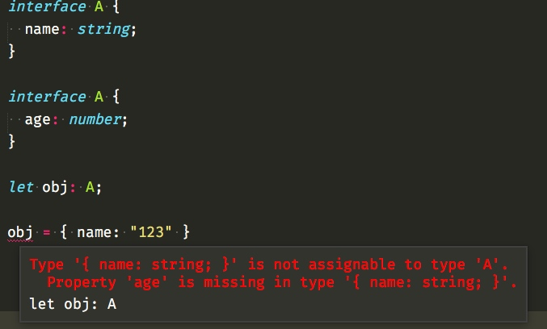

这里报错的原因是，我们并没有完全的实现 A 接口。

错误提示告诉我们，还有一个 age 属性没有。

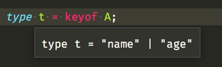

假如你使用的 2.1 版本的 ts，那么你可以用 keyof 关键字拿到 A 的所有属性值类型。

## 命名空间的合并

此时必须要导出，不导出哪怕合并了，外面也访问不到。

真相只有一个，如下图。

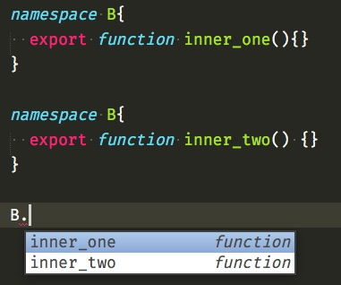

## 命名空间与其他的合并。

命名空间与类，实现内部类。

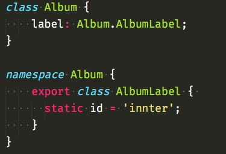

此时有一个有意思的小问题

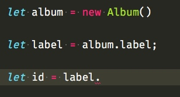

你会发现实例化后的 label 并不能访问它的 id 属性。

而直接访问却可以。

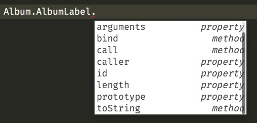

so？ 哪出了问题？💻是不是骗我？

别着急，我们来看一看类型。

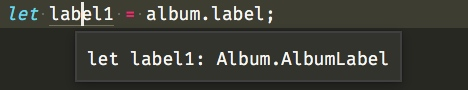

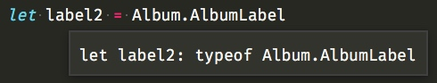

假如你认为 typeof 出问题了，于是你会花大量的时间去搜索关于它的资料。

其然不是，而是它们本身就不一样。

`label: Album.AlbumLabel;` 表示的是`Album.AlbumLabel`的实例，我们此时没有声明任何实例属性。

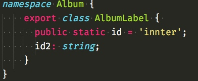

此时我们加一个示例属性。

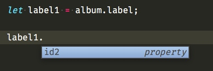

是不是就可以正常访问了呢。

从上面的例子我们可以看出，假如想让它指向的是一个带有构造器的类，而不是实例，我们可以用 typeof。

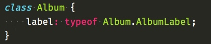


同样还可以给方法上面添加一些东西，比如静态属性。

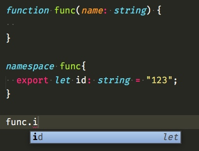

还可以跟枚举配合

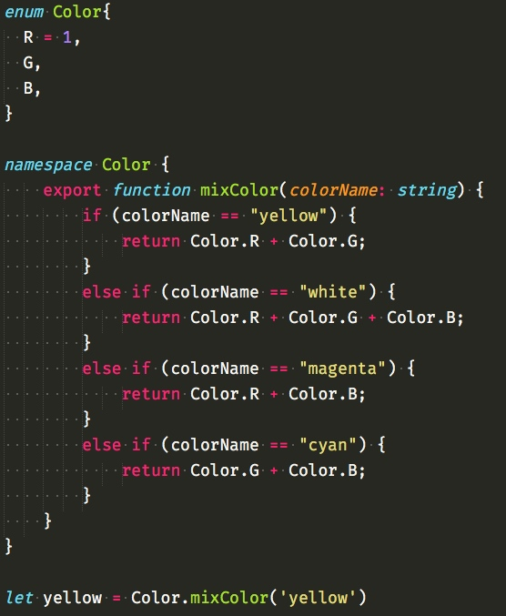

这里有一个缺陷就是得到的 yellow 是一个 number，得出来之后，就无法知道具体是由哪些颜色混合而成的了。

## 扩展一些类

新建 ob.ts 文件


```
export class Observable<T> {

}
```

新建 map.ts 文件

```
import { Observable } from "./ob";

declare module "./ob" {
    interface Observable<T> {
        map<U>(f: (x: T) => U): Observable<U>;
    }
}

Observable.prototype.map = function (f) {
    let rets = f();
    return new Observable<typeof rets>();
}

let o: Observable<number> = new Observable();
let newValue = o.map(x => x.toFixed());
```

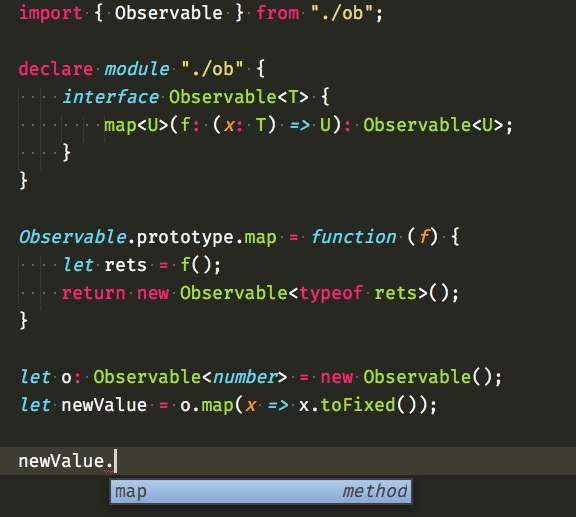

原理就是往原型上面挂载一些方法，其他细节，之前内容都有提到过，不懂的需要复习一下前面的知识。

温故而知新。

假如你想往全局上面扩展方法，你可以这样做。

把你想要扩展的写到`declare global`里面。

```
// observable.ts
export class Observable<T> {
    // ... still no implementation ...
}

declare global {
    interface Array<T> {
        toObservable(): Observable<T>;
    }
}

Array.prototype.toObservable = function () {
    // ...
}
```

## 识别全局变量

就像 JQuery 那样，在浏览器中全局就可以访问的对象。通常我们会使用 namespace，好处就是防止命名冲突。

通常全局变量在源码中会有如下特性

* 顶级的var语句或function声明
* 挂载变量到 window 上


声明可能会像这样

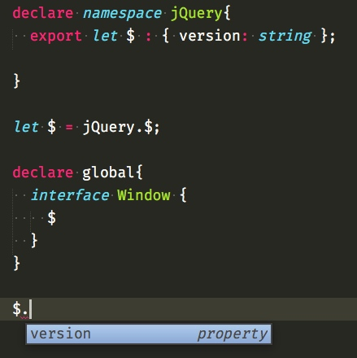

当然可能跟官方不一样，咱先暂时这样。

## 识别模块化库

所有需要 import require 的都是模块库。


假如依赖是的是全局库

```
/// <reference types="yourLib" />
```

一种方式是通过指令包含，假如我们每一个文件都写一个这个，这样会非常的烦，所以你可以去 tsconfig 里面去配置，分别是`types`指定文件，`typeRoots`指定目录，选择一样即可。

## 定义 declare

所有 d.ts 文件里面声明，都需要加上`declare`，d.ts 只能声明，不能有任何默认值。

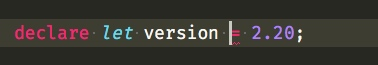

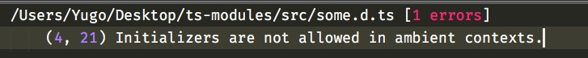

编译器告诉我们，该上下文不允许初始化。

定义一个全局变量 version 如下


```
declare let version : number;
```


定义一个全局函数


```
declare function func(name: string): number;
```

定义一个全局对象下面具有某些属性

之前在说 namespace 的时候，有提到过，其实 namespace 就是对象。

```
declare namespace someObj{
  export let name: string;
  export let age: number;
  export function sayHello(): void;
}
```


使用接口和函数重载

在定义文件里面已经可以使用接口，因为接口也是描述类型的一种。

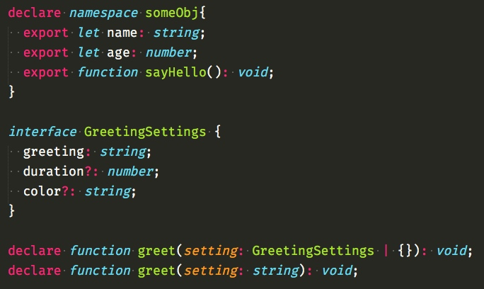

定义类

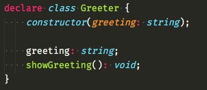

其实这些都不难，就是加上 declare，且只写描述类型不写具体实现而已。


## 回调的可选参数
对于定义回调的可选参数，有一点你必须要注意。

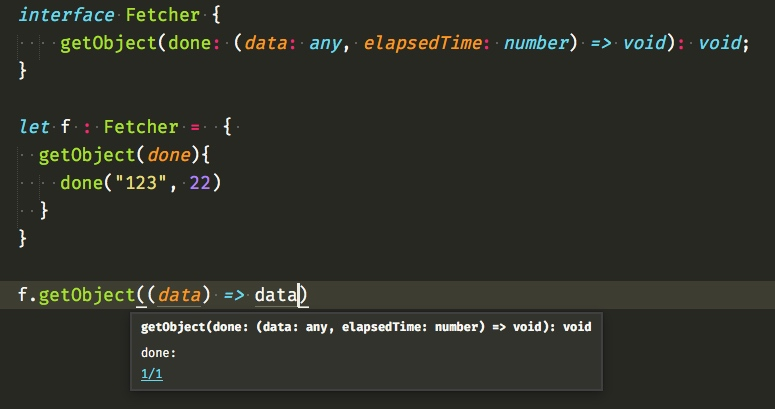

对于传入的回调 done 我们可以选择不要第二个参数，因为回调允许抛弃一些参数，这样是不会报错的，而假如我们在 getObject 方法里面少传一个参数就会报错。

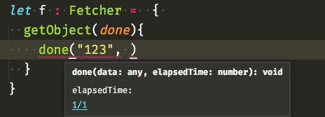


编译器告诉我们类型不匹配。

## 定义参数重载的注意事项

应该从小范围到大范围，如下。

```
declare function fn(x: HTMLDivElement): string;
declare function fn(x: HTMLElement): number;
declare function fn(x: any): any;
```

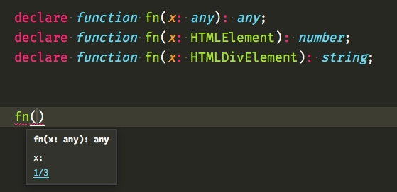

假如你这样写，对其他人来说，开发体验不友好，刚开始就搞那么大的新闻，而且 ts 匹配到第一个就直接调用了，也就是说这样写，基本上全调用的`(x:any)`。

## 类型合并的声明

我们之前是不是说过类型合并，我们可以用到这里来。


```
export var Bar: { a: Bar };
export interface Bar {
  count: number;
}
```

这里的 Bar 就合并成了 `var Bar = { a: Bar, count: number }`,

你可以认为 `interface Bar` 为该对象添加了一个 count 属性。

此时 Bar 可以当做类型，也就是接口所描述的那样，有一个 count

也可以当做对象。

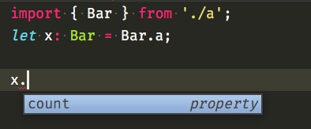

此时只有只有 count 属性，是因为它的类型是被 `interface Bar`描述的。

讲道理可以当类型，又可以当值，这种开发姿势非常魔性，不懂它的人只能吐血了，或许当你遇到什么变态的需求的时候，可能需要它。

## 关于导出

我不管你从哪知道的 `export = something` 语法，别用，你会发现我从来没有提到这个东西，是因为它已经快被淘汰了，尽可能的使用` export default something`。


为了更好的学习如何写好 d.ts 大家可以阅读这里的示例文件[地址](https://www.tslang.cn/docs/handbook/declaration-files/templates.html)


