新建` t.ts`文件

## 我们为什么需要泛型？

在前端框架发展的过程中，你一定听过组件化这种思维，大公司的程序员哥哥们，为了早日回家吃夜宵（通常下班都10点了），所以他们通常会想尽一切办法减少工作量（拿刀砍需求），或者提高工作效率（效率工具、可复用的组件）。

所以可以减少重复性的代码就叫组件，一直提取提取，提取到最后，就成了框架。

有一点我们非常清楚，`ts` 是静态类型，对于 `Array`类型的，代码编辑器会自动提示它可以访问的一些属性的方法，而` js`则不同，所有方法都需要你自己去记忆。

当我们需要写一个传入什么类型就得到什么类型的函数。

于是聪明的你可能给出这样的“万能”函数

```
function one(a: any) : any{
	return a;
}
```

好像你这个函数没有提示的功能，且我给你 `number`，但是你给的是 `any`，跟写原声的` js` 没有任何区别呀~

你说等会，让我改改，于是你可能又给出这样的函数。

其实`a as number`有点多余，去掉这个你会发现代码提示依旧会有，上一节最后的小练习里面其实有提到过。

```
function one(a: any) : any{
	if(typeof a === 'number') {
		let ret = (a as number)
		return ret ;
	}
	return a;
}
```

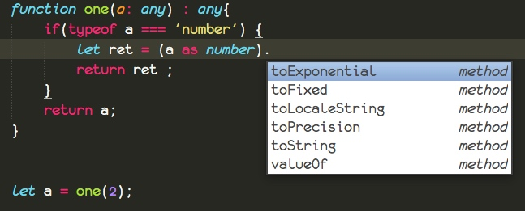

这还算不错的，尽管没有完全解决我们的问题，我们来想象一下最糟糕的情况，也就是下下策。

那就是为每一种类型都写一个方法，这样每一个方法的输入输出都是可以预测的，传入是啥类型，输出就是什么类型，而不是`any`。

可能有的人思维又发散一点，通过**重载**去解决这个问题。

我只能说你们都非常棒，思维都很活跃，世界需要你们这样的人才。

## 那什么才是最优的做法呢？
> 或者说有没有一种方法在调用的时候再指定类型呢？

你肯定已经猜到了，那就是本节的主题泛型，代码的组件化，

其实代码也非常的简单，比起你写很多声明要好很多，不过因为我们这个方法是运行的时候才指定类型，而且`<T>`是可以多种类型，所以还是需要你自己去适配，通过 `typeof`去检测的。

```
function one<T>(a: T) : T{
	return a;
}

let a1 = one<number>(1)

let a2 = one(520)
```

当你去查看他们的函数类型的时候，你会发现比较有意思的事情。

这个你可能你不会觉得奇怪。
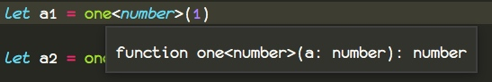

那么看看这个，当时我就惊呆了。

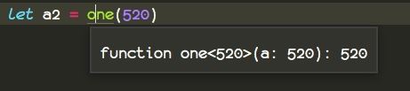

也就是说描述`T`是什么类型的时候，你可以在`<number>`描述它是一个 `number`类型，同样也可以这样描述描述`(a: T)` 对应`（520）`， `T` 就是 `520`的类型。

当你想要这样去写函数的时候，编辑器霸道的拒绝了你，说了一句，这是我的方言，不要以为你会说方言就可以跟我装老乡，对不起，我不认。

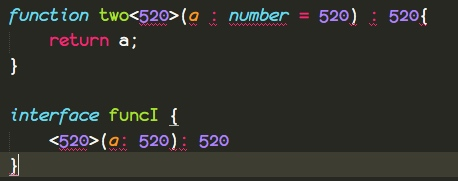

编译器其实非常的智能，能不让你写的东西，绝对不然绝对不让你多写，尽管编译器把你的类型翻译成了他的方言了。

能更具体的，它就更具体，相比较`number`和`520`来说，哪个更具体？

## 泛型数组

有的时候，我们需要传入一个某个类型`T`的数组。

对于描述数组有2种写法，所以这里也有2种写法


```
function two<T>(a: T[]) : T{
	return a[0];
}

function three<T>(a: Array<T>) : T{
	return a[0];
}
```

对于函数，是不是还有匿名函数用变量保存的形式呀？

```
let two2 : <T>(a : T[]) => T = function (a) {
	return a[0];
}
```

只需要把`<T>`写`()`前面就好了，其他的根匿名函数的描述基本一致。

同样我们用接口来描述某个泛型方法

```
interface funcI {
	<T>(a: T[]) : T
}

let two3 : funcI = two2

let two4 : { <T>(a: T[]) : T } = two2
```

等于，是一个非常有意思的名词，他的符号叫`=`，在数学意义上面，就是俩者具有相同的辩证关系，而在现实世界中代表着类似事物，或者同一事物。

在学习编程的时候，老师有的时候会叫你忘掉`=`，把它认为成赋值。

我觉得你理解为复制还差不多，从某种意义上面来说它还是相等，你也可以理解为，赋值之后，他们是同一事物，所以相等。

其实实际意义的相等与编程里面的`=`的差异就是，编程里面的`=`不支持前后替换，也就是`a = b`不能`b = a`.

```
因为
a = b
c = a

所以
b = c
```

而对于上面的例子

```
funcI 就等于

{
	<T>(a: T[]) : T
}
```

所以

```
let two3 : funcI
```

就可以替换为

```ts
let two3 : { <T>(a: T[]) : T }
```

## 接口泛型

同时我们还可以这样玩，在声明的时候指定接口泛型里面的类型


```
interface someI<T>{
	(a : T) : T
}

let b : someI<number>
```

此时` b`一个就是一个 `(a: number) => number` 的匿名函数

## 类泛型

我们知道，泛型的作用就是在调用的时候，再限定某些值的类型。


```
class Person<T, U>{
	other: T
	age: U
}

let p = new Person<string,number>()
p.other = "good men"
p.age = 12
```

这样我们就可以在实例化的时候再指定`other`和 `age`的具体类型。

之前没有提到如何声明多个泛型，其实非常简单，用逗号隔开就行了。

> 假如我们明确指定泛型有些什么字段怎么办？

像这样通过 `extends` 关键字进行继承即可，这里是可以继承`interface`和`class`，从某种意义上面来说，就实现了我们前面提到的代码提示功能。

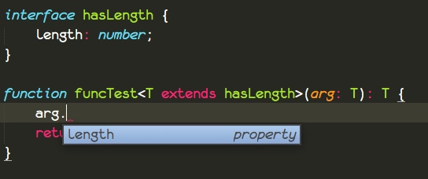


```
interface hasLength {
    length: number;
}

function funcTest<T extends hasLength>(arg: T): T {
    return arg;
}
```

泛型由于比较特殊，你可以把它理解为特殊的接口类型，所以可以继承接口，而 `class` 是不能继承接口的

亦或者说，通过接口来描述泛型。

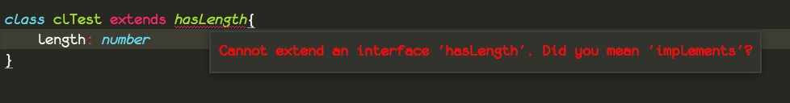

## 原型

继承必须提到原型，对于后端开发者可能对原型不太了解，这里我尽量把原型说的通俗易懂，且内容也足够深入。因为原型是 js 核心内容，反正这个原型被开发者各种玩，每个老司机对于原型的理解绝对不一般。

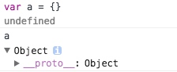


这里我们定义了一个`{}`，其实我们看到这个 `a` 是一个空的对象，上面什么实际属性都没有，但是我们可以看到一个`__proto__`属性，其实它就是我们说的原型。

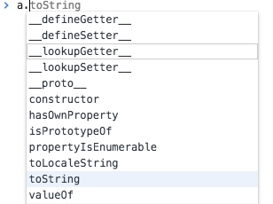

当我们通过`.`去调用它的方法的时候，我们可以发现明明我们没有定义这些方法，但是我们却可以访问这些方法。

同时我们输入`Object.prototype.` 就可以出现代码提示。

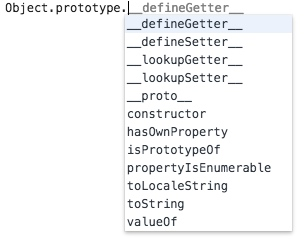

我们发现他们提示的方法都是一样的。

我不知道智慧的你有没有注意到`__proto__: Object` 其实这个`__proto__`其实就是 `Object`。

而`js`里面，当一个对象，找不到某些东西的时候，它会往它的`__proto__`对象上面去找，当然假如`__proto__`对象上面还有`__proto__`，它会一直找下去，所以就有了**原型链**这种说法。所以通过特性就实现继承。

这里我们深入一点。

`Object.prototype` 与 `a` 提示的方法一样，那么它们是否存在某种不可为外人所知的秘密呢？

你可能先想到它们是否相等呢？

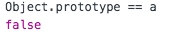

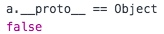


我想你是不是忘了什么，提示你一下`__proto__`，找不到的属性和方法怎么办？


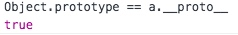

我们再来看看下面的

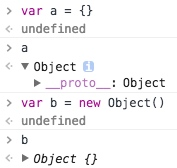

通过`{}`与`new Object`出来的对象是一样的。

其实通过`{}`新建的对象，叫做字面量方法创建对象。

它会被编译器转换为`new Object`的。

那么`new`究竟发生了什么事情呢？

之前我们是不是说过`new`会调用`constructor`

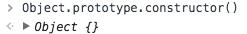


你是不是发现了什么！

其实还有一件事编译器做了的，那就是新创建的这个对象的`__proto__`等于`Object.prototype`。

我们梳理一下思路，`new A()`,首先通过`prototype.constructor`构造一个新的对象，然后把`A`对象的`prototype`赋值给新对象的`__proto__`。

同样也就是说`prototype`上面的属性和方法就是实例方法和变量。

## 深入的理解继承

先写我们的 ts 代码


```
class a {}

class b extends a{}
```

编译出来之后，这里我做了一些修改。

把以下代码写到一个`html`文档里面，我们通过 `chrome` 调试运行。

```
var __extends = (this && this.__extends) || function (d, b) {
    console.log(d)
    console.log(b)
    for (var p in b) {
        if (b.hasOwnProperty(p)) {
            console.log(p)
            d[p] = b[p]
        };
    }
    function __() { this.constructor = d; }
    d.prototype = b === null ? Object.create(b) : (__.prototype = b.prototype, new __());
};
var a = (function () {
    function a() {
    }
    a.sname = '1';
    return a;
}());
var b = (function (_super) {
    __extends(b, _super);
    function b() {
        return _super.apply(this, arguments) || this;
    }
    return b;
}(a));
```

这里我们一个一个的来说，慢慢来。

### 了解 Object.create

首先我们创建一个变量`a`，给它一个 name 属性，当做一个标识

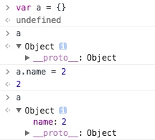

此时我们通过`create`来创建 b

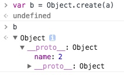

 我们发现`__proto__`指向了我们的`a`

 相当于，我们新建了一个对象，并且把`__proto__`指向了我们的`a`。

 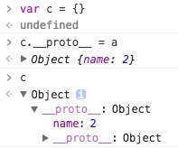

当我们传入 null 的时候。

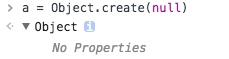


它便是一个真正意义上的空对象。

当然我们也可以把我们的`__proto__`赋值为 `null`，从下面的例子我们可以看出使用 `delete` 是没有任何作用的。


首先我们看`var __extends = (this && this.__extends) || function (d, b) {}`

`(this && this.__extends)`

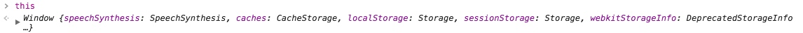


在控制台里面输入 `this`，之前我们也有说过 `this` 默认是 window，在浏览器环境中。

接下来我们看看 `&&` 运算符

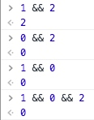

我们把 `&&` 想象成电线，`0`或者其他否定的值，比如`undefined`、`null`等，代表着断开，也就是断路了，假如断开了，就返回断开的时候的否定值。

假如全线通过，一路绿灯，那就返回最后一个。

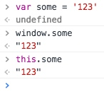

而我们在全局作用域下面通过`var`声明的变量会自动挂载到`window`下面，这样容易形成全局代码命名污染。

因为这里定义一个 a，那里又定义一个 a，js 解释器就不知道你要使用的是哪个 a。

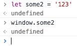

而`let`不会，这就是为什么我推荐你使用 `let`的原因之一。

`(this && this.__extends)` 这段先判断是否有 `this` 有再继续判断 `this` 上面是否已经有定义过了`__extends`，假如没有此时返回一个否定值，也就是断开了，这个否定值是`undefined`，假如定义过了，就直接返回`this.__extends`,于是此时`var __extends`就拿到了全局的`__extends`

当得到否定值的时候


```
undefined || function (d, b) {}
```


当遇到第一个正确的时候，就立刻返回当前的值，假如都不正确，那就放回最后一个否定值。

此时`var __extends `就是后面这个函数了。

此时我们进入函数`function (d, b) {}`内部逻辑, 用 ts 的代码来说就是`class d extends b`。


```
for (var p in b) {
   if (b.hasOwnProperty(p)) {
       console.log(p)
       d[p] = b[p]
   };
}
```

这一段代码，会遍历 b，所有属性，此时的属性是静态属性，你可以看到上面完整的代码里面的 a 类有`sname`静态属性，这里又有一个`console.log(p)`，它会打印到我们的控制，在控制台里面我们可以看到一个`sname`。

`b.hasOwnProperty` 会判断 p 是不是 b 自己的属性，它只会拷贝自己的属性，而不会拷贝原型链上面的。

```
function __() { this.constructor = d; }
```

这一段代码就是创建一个`__`函数，在原生 js，我们是通过函数来模拟类，而这个方法里面的 `this` 就等于 `__.prototype`，挂载在上面的变量就是实例变量。

而当我们去`new __()`的时候，会去调用`__.prototype.constructor`,也就是`this.constructor` 同样也就是 `d`.


```
d.prototype = b === null ? Object.create(b) : (__.prototype = b.prototype, new __());
```

这个首先判断`b === null?`，假如是空的话，`Object.create(null)`就直接是一个空对象，也就是 `d.prototype` 指向一个空对象。

而假如 b 不为空的话，那么他就是一个函数。

```
__.prototype = b.prototype, new __()
```

对于`,`，你可以这么理解，首先 a 被复制为1。之后`,`会返回最后一个表达式的值。也就是`b = a`

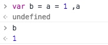


把 `b.prototype` 复制给 `__.prototype`，之后再 `new __()`

`new __()` 会去调用 `d` 函数，也就是`class d extends b`中的 `d`自己的逻辑。之后再返回一个对象`{__proto__: b.prototype}` 。这样 `d.prototype` 就等于返回的这个对象。

当我们 `new d()` 的时候新对象的`__proto__`指向`d.prototype`，这样就形成了原型链，当找不到方法的时候，会去找`__proto__`的`__proto__`,而这个`__proto__`就是我们`class d extends b`的 `b.prototype`，这样我们就可以访问到了 b 的实例方法。

```
function b() {
   return _super.apply(this, arguments) || this;
}
```

而这个`_super`就是`a`，这里就是调用 a 的函数，然后绑定一下`this`，假如没有 `_super.apply`就直接放回 `this`。

说实话，我自己都晕乎，我非常担心你们看不懂，已经讲的最细了，js 的原型指来指去的，连老司机都要翻，这就是为什么会出现`ts`与 `es` 的 `class`关键字。

这不是写程序，这是在走迷宫。

我们来梳理一下思路，保持有条理。

`class d extends b`

* 首先拷贝静态属性
* 构造一个新的__()函数，当`new __()`的时候，会先执行被继承函数`b`，这个函数通常会初始化一些变量比如`this.x = 'some'`之类的。
* 把`__`函数的原型指向 `b` 的原型，这样 new 出来的对象就可以访问 b 的示例方法

这样是不是就条理清晰了。思路很简单，但是代码解释起来就不敢恭维了。

关于`prototype`与`__proto__`的区别，请向上找到`new`调用的过程，new 其实是一种特殊的函数调用方式。


## 泛型继承类

```
class BeeKeeper {
    hasMask: boolean;
}

class ZooKeeper {
    nametag: string;
}

class Animal {
    numLegs: number;
}

class Bee extends Animal {
    keeper: BeeKeeper;
}

class Lion extends Animal {
    keeper: ZooKeeper;
}

function findKeeper<A extends Animal, K> (a: {new(): A;
    prototype: {keeper: K}}): K {

    return a.prototype.keeper;
}

findKeeper(Lion).nametag;
```

这里最核心的就是`a: {new(): A;prototype: {keeper: K}}`

我们慢慢来，分解开读，`new(): A`表示可以 `new` ，也就是实例化，并且它的返回值是 `A`泛型

`prototype: {keeper: K}` 描述原型，刚刚我们也提到了，这里指原型上面有一个`keeper`属性并且类型是 `K` 泛型。这里的原型上面的属性，其实就是实例属性。

```
function findKeeper<A extends Animal, K> (a: {new(): A;
    prototype: {keeper: K}}): K {

    return a.prototype.keeper;
}
```

整体的来读一下这个函数。

findKeeper 函数规定有2个泛型，泛型 A 集成 Animal 拥有 Animal 所有属性和方法，还有一个泛型 K，传入一个参数，规定这个参数是可以`new`关键字调用的，也就是说传入的应该是 `Class` 而不是实例，并且它必须有一个实例属性`keeper`，此时把`keeper`的类型标记为泛型 K，并且把泛型 K 的类型作为返回值的类型，函数内容就是返回原型链上的keeper 属性。

其实上面这段代码我们是没法运行，尽管没报错，因为 keeper 是实例属性，都没初始化，哪来的值。看看你能不能想什么办法让上面代码运行。

我这里给一份答案，把 keeper 改成静态的，而且讲道理不应该是每一个狮子都住一个狮子园，应该是所有共同的 keeper，所以说是所有实例狮子共享的住的地府，所以它更应该是静态的。

```
class BeeKeeper {
    hasMask: boolean;
}

class ZooKeeper {
    constructor(public nametag: string){

    }
}

class Animal {
    numLegs: number;
}

class Bee extends Animal {
    static keeper: BeeKeeper = new BeeKeeper();
}

class Lion extends Animal {
    static keeper: ZooKeeper = new ZooKeeper('zookeeper');
}

function findKeeper<A extends Animal, K> (a: {new(): A;
    keeper: K }): K {
    return a.keeper;
}

let a2 = findKeeper(Lion).nametag


console.log(a2);
```

你可能对


```
class ZooKeeper {
    constructor(public nametag: string){

    }
}
```

有困惑，其实它等于


```
class ZooKeeper {
	public nametag
    constructor(nametag: string){
    	this.nametag = nametag
    }
}
```

对于`{new(): A;keeper: K }`我们可以把它理解为`css`的内联样式，我们修改一下，改成接口泛型，接口名称`aInterface`就相当于我们`css`的`class`名称

```
interface aInterface<A,K>{
	new(): A;
	keeper: K;
}

function findKeeper<A extends Animal, K> (a: aInterface<A,K>): K {
    return a.keeper;
}
```

这样看起来精简多了，但是初学者看起来会马良的，因为这里面包含的信息量太大，包含了如何毁灭地球的计划。

## 总结

泛型可以看做特殊类型的接口，所以泛型可以继承接口，而类不行。

泛型拥有与接口相似的功劳，那就是描述类型，不过泛型可以延迟描述，等需要调用的时候再描述。

你自己还有什么要总结的呢？都自己舔到自己的笔记本上吧。

