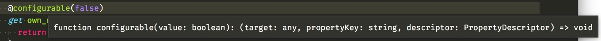
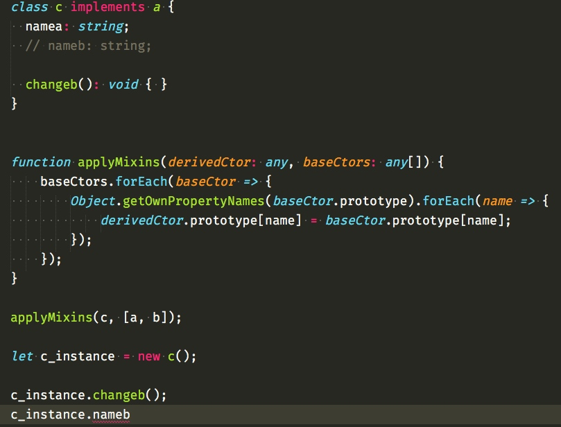

看过 angular2 的人基本都知道，它大量使用了装饰器，而装饰器还属于 ecmascript 的征集意愿的第一阶段。

使用装饰器，需要在 tsconfig.json 里面开启支持选项 experimentalDecorators


```
// tsconfig.json
"experimentalDecorators": true
```

装饰器基本可以对所有变量起作用，它的语法是 `@装饰器` ，这个装饰器必须是函数。

## 对类使用装饰器

代码 `main.ts`

```
function addAge(constructor: Function) {
  constructor.prototype.age = 18;
}

@addAge
class Hello{
  name: string;
  age: number;
  constructor() {
    console.log('hello');
    this.name = 'yugo';
  }
}

let hello = new Hello();

console.log(hello.age);
```

编译之后运行，得到的结果

```
$ node dist/main.js
hello
18
```

当装饰器作为修饰类的时候，会把构造器传递进去。

constructor.prototype.age 就是在每一个实例化对象上面添加一个 age 值

这里我们的 addAge 就添加了一个 age 值。

## 对方法使用装饰器


```
function addAge(constructor: Function) {
  constructor.prototype.age = 18;
}

function method(target: any, propertyKey: string, descriptor: PropertyDescriptor) {
   console.log(target);
   console.log("prop " + propertyKey);
   console.log("desc " + JSON.stringify(descriptor) + "\n\n");
};

@addAge
class Hello{
  name: string;
  age: number;
  constructor() {
    console.log('hello');
    this.name = 'yugo';
  }

  @method
  hello(){
    return 'instance method';
  }

  @method
  static shello(){
    return 'static method';
  }
}
```

我们得到的结果是


```
$ node dist/main.js
Hello { hello: [Function] }
prop hello
desc {"writable":true,"enumerable":true,"configurable":true}


{ [Function: Hello] shello: [Function] }
prop shello
desc {"writable":true,"enumerable":true,"configurable":true}
```

假如我们修饰的是 hello 这个实例方法，第一个参数将是原型对象，也就是 Hello.prototype。

假如是 shello 这个静态方法，则第一个参数是构造器 constructor。

第二个参数分别是属性名，第三个参数是属性修饰对象。

## setter 和 getter 使用装饰器


```
function addAge(constructor: Function) {
  constructor.prototype.age = 18;
}

function method(target: any, propertyKey: string, descriptor: PropertyDescriptor) {
   console.log(target);
   console.log(Hello.prototype);
   console.log("prop " + propertyKey);
   console.log("desc " + JSON.stringify(descriptor) + "\n\n");
};

function configurable(value: boolean) {
    return function (target: any, propertyKey: string, descriptor: PropertyDescriptor) {
        descriptor.configurable = value;
    };
}

@addAge
class Hello{
  name: string;
  age: number;
  constructor() {
    console.log('hello');
    this.name = 'yugo';
  }

  @method
  hello(){
    return 'instance method';
  }

  @method
  static shello(){
    return 'static method';
  }

  @configurable(false)
  get own_name(){
    return this.name;
  }
}
```

这里的作用就是让这个函数不可再配置

我们的装饰器就像这样 @configurable(false) 使用，我们发现这里多了一个()并且写的方法跟之前的也不一样的。

我们分开来看，（）代表函数调用，先进行函数调用 configurable(false) ，然后再把它的返回值作为装饰器调用。



可以看到它的返回值函数与我们的之前说的装饰器的函数参数类型一致。

一个函数返回一个函数叫做函数柯里化，也有的人喜欢叫它工厂函数。

有的时候，我们需要很多函数，但是这些函数就是里面的某一个值不一样而已，例如 加三函数、加二十函数，不一样的地方就是一个要加的数，假如我们都写一次，那势必会很麻烦。

所以我们就用一个函数返回一个函数，内层作用域可以访问外层作用域的原理（闭包），创建了人们常说的工厂函数。而需要传递进去的参数可以理解为规格。

在现实生活中就是，根据订单的规格要求工厂生成特定规格的产品。

而内层作用域可以访问外层作用域，当领导来视察了，地方的员工就会收到通知。所以地方员工是可以察觉外面的领导的。

而外层作用域不能访问内层作用域（闭包），也就是天高皇帝远，猴子称大王。总部哪管得到我们这小地方。

## 属性装饰器

跟上面使用一样，但是没有第三个参数，只有前面俩个。因为，此刻的属性还没有初始化，哪来的配置项。

## 装饰器运行的顺序


```
class C {
    @f()
    @g()
    method() {}
}
```

执行顺序为

* f()
* g()
* @g
* @f


## 其他高级用法

这里暂不进行赘述，因为只有开发库才可能用到。

更多详情请了解`reflect-metadata`这个库。

## 混合对象

大家叫他`Mixins`，其实原理非常简单，`implements`只会继承属性的类型，而不会继承实际的逻辑。

之所以需要声明属性，是因为在 ts 中只有声明过的属性，才可以被赋值。要不然会报错。

```
class a {
  namea: string;

}

class b {
  nameb: string;
  changeb() {
    this.nameb = 'changed';
  }
}

class c implements a, b {
  namea: string;
  nameb: string;

  changeb(): void { }
}

function applyMixins(derivedCtor: any, baseCtors: any[]) {
    baseCtors.forEach(baseCtor => {
        Object.getOwnPropertyNames(baseCtor.prototype).forEach(name => {
            derivedCtor.prototype[name] = baseCtor.prototype[name];
        });
    });
}

applyMixins(c, [a, b]);
```

这里的核心就是`applyMixins`，第一个参数是要混合的主体，第二个参数是要混入的对象数组，主要逻辑就是把原型链上面的方法拷贝到要混合的主体上面。



假如我们把 implements 的 b 去掉，保留在`applyMixins`中的 b。

此时尽管 js 运行起来能找到 nameb，但是在 ts 编译这个阶段是报错的。

有非常多的人这样跟我抱怨 ts，说我写 ts 总是报各种错误，让人烦躁。其实我想告诉你的是，计算机是不会骗人的，报错，说明你的逻辑不对，不符合规范，当然跟你没有认真阅读文档有一定的关系，当你真正理解了 ts 之后，你会发现，ts 就是后端转前端开发人员的天助神器。


