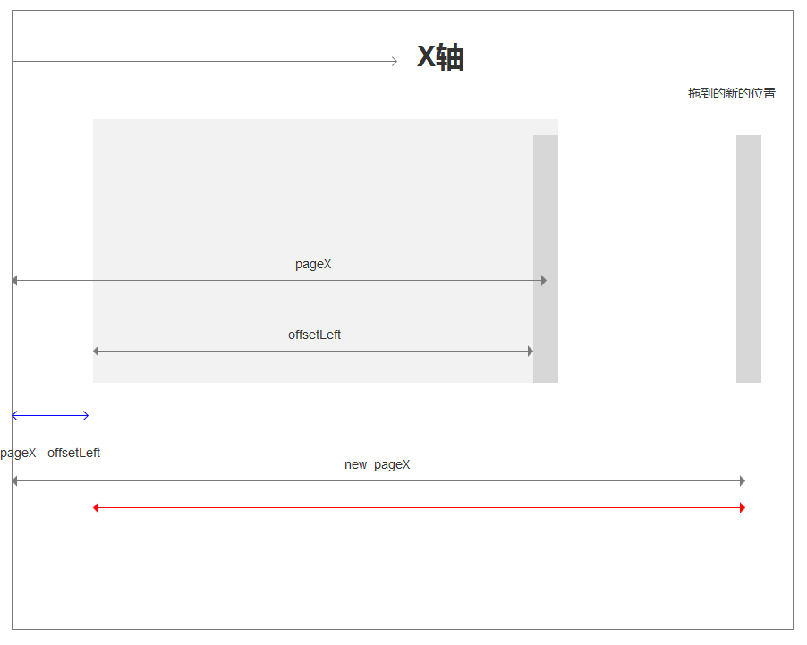

窗口大小，我们可以非常方便的使用`width`、`height`调整，但是如何知道 `width`和`height`是一个问题？

在 Window 操作系统中，假如我们想要缩放，我们通常会把鼠标移动到窗口的右边栏，和底部边栏，以及右下边栏。

而且在不同的边栏，鼠标呈现的样式也是不一样的。当我们在右边栏的时候我们可以通过`cursor: e-resize;`模拟鼠标样式。

在底部边栏我们可以通过`cursor: s-resize;`来模拟样式，当我们是右下的时候可以用过`cursor: nw-resize;`模拟鼠标样式。

首先我们设想一种比较理想的情况，可以调整的盒子的左上角刚好就是页面的左上角，也就是坐标系的0点，横向的是x轴，竖着的是y轴。

当我们点击右边栏的时候，开始记录开始的点，同时也是开始设置盒子宽度的时候，之后我们可以在文档上面再监听一下鼠标的位置，通过事件的e.pageX属性可以拿到横坐标，其实这里的e.pageX就是我们的拖拽好了的width。

当然这是比较理想的情况下，通常我们的盒子并不一定是在左上角，此时我们需要把盒子左上角的点给计算出来。



这里有张图，我们先看 x 轴上面的情况。当用户点击我们的右边栏的时候，当然这里的点击指的是`moursedown` 鼠标按下，因为在拖拽的过程中，我们鼠标是不会放开的。 此时我们就可以拿到事件 e.pageX 和 右边栏距离盒子最左边的距离 offsetLeft 。

他们俩个相减就得到了盒子左上角点的x轴的坐标。也就是我们蓝线的值。

当我们把这个左边栏拖到新的位置的时候，我们把新的 pageX 减去 蓝线的值，就可以得到红线的值，而这个红线，就刚好等于我们需要设置的值。


1. 首先准备 HTML

```html
    <div class="panel" id="resizeAble" >
        <h1>Hello Window</h1>
    </div>
```

2.准备 CSS 样式

```css
        .panel{
            position: relative;
            border: 1px solid #eee;
            width: 400px;
            height: 350px;
            margin: 100px;
            text-align: center;
        }

        .right-bar{
            width: 10px;
            height: 100%;
            position: absolute;
            right: 0;
            top: 0;
            cursor: e-resize;
        }

        .bottom-bar{
            height: 10px;
            width: 100%;
            position: absolute;
            bottom: 0;
            cursor: s-resize;
        }

        .right-bottom-bar{
            height: 20px;
            width: 20px;
            right: 0;
            bottom: 0;
            position: absolute;
            cursor: nw-resize;
        }
```


3.添加JS逻辑

首先添加控制栏

```js
        // 动态的添加控制栏
        function addControlSideBar(panel){
            const rightBar = document.createElement('div');
            const bottomBar = document.createElement('div');
            const rightBottomBar = document.createElement('div');

            rightBar.className = 'right-bar';
            bottomBar.className = 'bottom-bar';
            rightBottomBar.className = 'right-bottom-bar';

            let controlArray = [ rightBar, bottomBar, rightBottomBar] ;

            controlArray.forEach((i) => {
                i.draggable = false; // 禁用拖拽
                panel.appendChild(i)
            });

            return controlArray;
        }
```


之后为控制栏添加监听器

```js
        const panel = document.querySelector('#resizeAble');
        // 为控制栏添加监听
        function listenerControlSideBar(controlArray){
            controlArray.forEach((v, k) => {
                v.addEventListener('mousedown', setPanelStatus , false)
                v.addEventListener('selectstart', () => (false), false); // 禁止被选中

            })
        }

       let controlArray = addControlSideBar(panel);
       listenerControlSideBar(controlArray);
```

完成我们的 setPanelStatus 当用户点击我们的控制栏触发的回调函数。

```js

        var move_to_x, move_to_y; // 移动后的新坐标

        var timer; // 不停设置面板宽度和高度的定时器

        let min_width = 300;
        let min_height = 250; // 最小的宽度和高度

        // 实时监听鼠标的状态
        document.onmousemove = (e) => {
            move_to_x = e.pageX;
            move_to_y = e.pageY;
        }

         // 设置面板的状态
        function setPanelStatus(e){
            console.log(e);
            // 当鼠标按下那一刻执行这个函数
                let start_x = e.pageX - e.target.offsetLeft;
                let start_y = e.pageY - e.target.offsetTop;
                // (start_x, start,y) 盒子左上角的坐标值.

                // 此时只要我们不放鼠标，那么高度就会跟随 move_to_x， 和 move_to_y 一直设置。 这个一直设置，我们需要用一个定时器来实现。

                timer = setInterval(() => {
                    const width = Math.max(min_width, move_to_x - start_x);
                    const height = Math.max(min_height, move_to_y - start_y);

                    // 判断我们按下的是哪个控制栏，根据类别来设置宽和高
                    // 这里的 10 和 20 分别是 变量的宽度
                    switch(e.target.className){
                        case 'right-bar':
                            panel.style.width = width + 'px';
                            break;
                        case 'bottom-bar':;
                            panel.style.height = height + 'px';
                            break;
                        case 'right-bottom-bar':
                            panel.style.height = height + 'px';
                            panel.style.width = width + 'px';
                            break;
                    }
                }, 10)
        }
```


之后我们完成我们的当用户放开鼠标，取消继续设置宽度和高度的定时器

```js
        document.onmouseup = document.ondrag = (e) => { // ondrag 是拖拽时间，有的时候把边栏当做拖拽的时候，没有及时清除 timer 就会出现 bug
            clearInterval(timer);
            timer = null;
        }
```


有的时候，可能title 会被选中

```js
    panel.onselectstart = () => (false); // 禁止面板中被选中
```


OK，这样我们就完成了我们的逻辑。